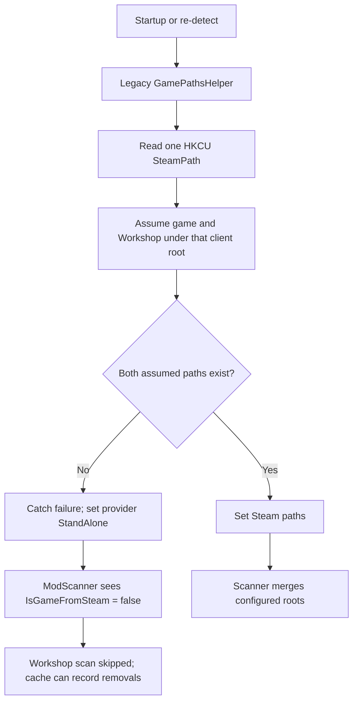

> Historical audit evidence migrated from the preserved documentation snapshot on 2026-08-02. This report retains its original scope, baseline, and limitations; it is not authoritative for current implementation behavior.

# CalradiaForge Source-State Deep Audit

Status: Current-source audit; build blocked

Audit date: 2026-07-15

Branch / commit: `dev-V0-14-CodeRefactor` / `be6c15d58cd758b249d9f4e4935d191ee0ed2af7`

Scope: Full solution structure and source state, with deep tracing of the Steam Workshop, game-detection, scan, cache, UI, modpack, test, and documentation boundaries.
Mode: Audit-only. No application source, project, test, or configuration files were changed.

## Executive Summary

The reported Steam Workshop issue is not a scanner enumeration defect. `ModScanner` can merge independent game and Workshop roots when it receives a Steam provider and valid paths. The live failure begins earlier: the active `GamePathsHelper` reads only the main Steam registry root, assumes Bannerlord and Workshop content live beneath that one root, and falls back to `StandAlone` when that assumption fails. `ModScanner` then skips Workshop entirely because its gate is `IsGameFromSteam`.

A substantial lower-level replacement (`ISteamClientRootProvider`, `SteamInstallationResolver`, KeyValues parser, result/status types, and fake-root tests) exists in Core, but it is orphaned. No live coordinator applies its result to `AppConfigSettings`. UI and tests already call the coordinator APIs that were intended to exist, so the solution cannot compile. The current 13 compiler errors are therefore an incomplete integration boundary, not a failing implementation test.

The immediate planning priority is to restore one Core-owned detection coordination path and make the solution compile. The necessary broader rewrite is then the scan-and-cache contract: the current scanner returns only a list, provides no per-root completeness/provenance status, and `ModService` rotates and overwrites cached state even after a partial scan. That is the system-level risk exposed by the Workshop defect.

## Audit Method And Evidence

- Inspected live source, projects, solution, refactor/architecture documentation, current tests, and recent Git history.
- Used three bounded read-only review tracks: Core detection/scanning, UI workflow, and build/test/repository state. Findings were consolidated and checked against the live branch.
- Ran `dotnet build source/CalradiaForge.slnx -c Debug --no-restore` and `dotnet build source/CalradiaForge.Core/CalradiaForge.Core.csproj -c Debug --no-restore`.
- Checked the working tree and whitespace with `git status --short` and `git diff --check`; no pre-existing or audit-created working-tree changes were present.

## Current Build Baseline

| Command | Result | Meaning |
|---|---|---|
| `dotnet build source/CalradiaForge.Core/CalradiaForge.Core.csproj -c Debug --no-restore` | Passed, 0 errors, 0 warnings | The Core project compiles, including the unintegrated Steam resolver. |
| `dotnet build source/CalradiaForge.slnx -c Debug --no-restore` | Failed: 13 errors, 348 warnings in this run | UI and test projects reference APIs/types absent from the public Core surface. The warning total varies with generated WPF build artifacts; recurring warnings include obsolete legacy logger use and `SevenZipWrapper` architecture mismatch. |
| `dotnet test source/CalradiaForge.slnx` | Not run as a current verdict | The test project cannot compile; a cached or historical test result would not validate `HEAD`. |

The 13 blocking errors are deterministic:

| Consumer | Missing Core surface | Evidence |
|---|---|---|
| `GamePathsHelperTests` and `SteamMultiLibraryNovusRegressionTests` | `GamePathsHelper.ResolveAndApplySteamGamePathsWithProvider` | `source/CalradiaForge.Tests/Core.Tests/Paths/GamePathsHelperTests.cs:25`, `source/CalradiaForge.Tests/Core.Tests/Modpacks/SteamMultiLibraryNovusRegressionTests.cs:18` |
| `GamePathsHelperTests` | `GamePathsHelper.TryRepairSteamProviderWithResolver` | `source/CalradiaForge.Tests/Core.Tests/Paths/GamePathsHelperTests.cs:194` |
| `SettingsPage` | `GamePlatformDetectionResult`, `GamePathsHelper.ApplyManualGameFolderSelection` | `source/CalradiaForge.UI/Pages/SettingsPage.xaml.cs:382` |
| `SettingsPage` | `GamePlatformDetectionResult`, `GamePathsHelper.RedetectGamePaths` | `source/CalradiaForge.UI/Pages/SettingsPage.xaml.cs:514` |

`GamePathsHelper` actually exposes only `TryAutoDetectGameFolder`, `GetModulesFolder`, and `GetSteamWorkshopFolder` (`source/CalradiaForge.Core/Infra/Paths/GamePathsHelper.cs:37`, `:166`, `:186`).

## Live Workshop Failure Chain

1. `TryAutoDetectGameFolder` calls `TryDetectSteam`; when it returns false, the helper sets `GameProvider.StandAlone` (`GamePathsHelper.cs:37-50`).
2. The legacy Steam implementation reads only `HKCU\\SOFTWARE\\Valve\\Steam\\SteamPath`, composes one game candidate under `steamapps/common`, and does not inspect registered libraries (`GamePathsHelper.cs:58-75`).
3. It sets provider/game paths before composing the Workshop path. A missing Workshop directory throws; the catch converts that to `false` (`GamePathsHelper.cs:77-100`). This leaves the game path but loses the Steam classification.
4. `ModScanner` scans the game root, but scans Workshop only when `config.IsGameFromSteam`; a `StandAlone` state logs a skip (`ModScanner.cs:20-53`).

This reproduces both reported classes of failure: Bannerlord in a non-client Steam library is never found, and a resolved Steam game with no detected Workshop folder can be downgraded to `StandAlone`.

## Findings

| ID | Severity | Finding | Current impact |
|---|---|---|---|
| F-01 | Critical | Steam resolver integration is incomplete and breaks the build. | No test execution or UI build is valid on `HEAD`; intended repair paths cannot be exercised. |
| F-02 | Critical | Live Steam detection is single-root and treats missing Workshop content as failed Steam detection. | Valid Steam installs can be classified as standalone, disabling Workshop discovery. |
| F-03 | High | Scan results have no root status, source provenance, or completeness contract. | UI cannot distinguish no mods, missing root, scan failure, or intentional skip; planning cannot safely add multi-root behavior. |
| F-04 | High | `ModService` rotates and overwrites cache before knowing whether a scan is complete. | A missing or inaccessible Workshop root can appear as legitimate removed modules and be persisted. |
| F-05 | High | Current documentation mixes planned/historical behavior with live behavior. | A plan based only on architecture/refactor docs would assume a completed fix that source does not execute. |
| F-06 | High | Detection and settings flows are static/page-bound rather than expressed as one replaceable Core workflow. | Manual selection, normal startup, explicit re-detection, warnings, and state repair cannot be tested or evolved consistently. |
| F-07 | Medium | Module discovery loses source identity and has shallow Workshop folder traversal. | Duplicate/conflicting module IDs and multiple modules in one Workshop item cannot be diagnosed or governed deterministically. |
| F-08 | Medium | Path/config helpers have divergent and weak contracts. | Workshop configuration can be unset or any existing directory; one helper resolves the game root instead of `Modules`. |
| F-09 | Medium | Test infrastructure is real but currently unavailable; UI tests remain only reserved folders. | The desired fake-root acceptance suite exists but cannot protect the rewrite until the integration seam compiles. |
| F-10 | Planning | Logging migration, static application access, no CI/lockfile, and package architecture warnings remain systemic constraints. | They should be sequenced around the rewrite, not silently absorbed into it. |
| F-11 | High | Load-order ownership is split between two pages and a mutable service collection. | Refresh, apply, edit, save, and launch can act on different snapshots after a Workshop/local change. |

### F-01 — Resolver exists, application coordinator does not

`SteamInstallationResolver` implements the hard parts: library discovery/deduplication, manifest validation, containment checks, Workshop precedence, and structured diagnostics (`source/CalradiaForge.Core/Infra/GamePlatform/Steam/SteamInstallationResolver.cs:30-89`, `:104-166`, `:331-413`). `SteamResolutionResult` distinguishes complete and Steam-without-Workshop resolution (`SteamResolutionResult.cs:5-57`). `GamePlatformDetectionResolver`, however, is an empty internal scaffold (`GamePlatformDetectionResolver.cs:3-6`), and `GamePathsHelper` never consumes the resolver.

History confirms this is an incomplete staged integration, not a live fully-wired resolver subsequently removed: commit `2b1d509` introduced the resolver package but did not wire `GamePathsHelper`; subsequent changes added UI/test calls to the absent APIs. No later Core/GamePaths integration change exists through `HEAD`.

### F-02 — The live detection policy conflates three independent facts

The current configuration uses one `GameProvider` value to stand in for all of the following:

- whether Bannerlord was recognized as a Steam installation;
- where the game is installed;
- whether a Workshop root is currently available.

Those facts must be independent. A valid Steam game without downloaded Workshop content is still Steam. A manually selected game can be matched to Steam metadata. A valid manual Workshop override should not force the game path to share the client root. The replacement resolver models these distinctions, but the active helper and config application path do not.

### F-03 and F-04 — Scanner/cache behavior is insufficient for a multi-root system

`ModScanner.ScanForModsAsync` returns `Task<List<ModuleModel>>` and logs failures/skips rather than returning root-level outcomes (`ModScanner.cs:20-53`, `:58-121`). It does not identify whether a module came from game or Workshop content, which library/workshop item produced it, whether roots were skipped, or whether the result is safe to commit.

`ModService.RefreshAsync` rotates the current cache before scanning, saves the returned list unconditionally, and infers removal only from module IDs (`ModService.cs:90-137`, `:169-201`). This means a partial scan can replace a complete cache and produce false removal state. The rewrite needs an explicit commit policy, not merely better detection.

### F-05 — Documentation has conflicting authority levels

The source of truth is the live code and build result. The following documents claim fully integrated behavior or passing verification and are not accurate for this commit:

| Document | Claim that is not current-source truth | Source-state correction |
|---|---|---|
| `docs/Architecture/Systems/PlatformAndPathDetection.md:3-33` | Resolver is applied by `GamePathsHelper`; settings/manual flows work. | Resolver is unreferenced by production code; listed Core file paths are also stale. |
| `docs/refactor/testing_strategy.md:70-84` | Multi-library discovery is implemented and covered. | The test intent is useful, but its public API dependencies do not compile. |
| `docs/audits/calradiaforge_steam_multilibrary_fix_verification_2026-07-15.md:3-84` | Fixed, 0 errors, 57 passing tests. | Historical verification target, not an executable current-HEAD result. |
| `docs/CHANGELOG.md:29` and `docs/MIGRATION_MAP.md:101-110` | Partial/incomplete integration is recorded. | These are the documents aligned with the present build failure. |

Do not revise historical reports as part of the source rewrite unless an approved documentation reconciliation task is opened. The eventual implementation plan should list these documents as requiring post-fix reconciliation.

### F-06 — UI ownership is correct in principle but not operationally isolated

`SettingsPage` directly owns path fields, dialogs, validation, re-detection messaging, provider visibility, and state refresh in a 682-line code-behind file. It calls the missing Core APIs at the manual-selection and redetection handlers (`SettingsPage.xaml.cs:382-388`, `:514-552`). Startup continues to call the legacy helper (`source/CalradiaForge.UI/App.xaml.cs:99-110`).

This is not a reason to move workflow logic into WPF. It is evidence that Core needs one result-bearing detection workflow, while UI should decide when to call it and map its explicit result/warnings to fields and toasts. The existing MVVM plan correctly identifies page extraction as staged work, not a one-pass rewrite (`docs/refactor/mvvm_refactor_plan.md:46-66`).

### F-07 — Discovery identity and traversal are too weak for deterministic rules

`ModuleModel` retains an install path but not an origin classification, Steam library, Workshop item ID, or scan-root reference (`source/CalradiaForge.Core/Models/ModulesModel.cs:28-49`). The scanner looks for one immediate `SubModule.xml`, or returns the first matching immediate child (`ModScanner.cs:96-121`). It neither deduplicates modules across roots nor captures collisions. A workshop-aware scan result must preserve source/provenance separately from the shared module domain model if adding fields to `ModuleModel` would create ownership coupling.

### F-08 — Existing path contracts need correction before reuse

- `AppConfigSettings.InitDefaults` does not seed `SteamWorkshopFolderPath`, although the property persists it (`AppConfigSettings.cs:58-72`, `:156-170`).
- `GamePathValidator.ValidateWorkshopFolder` accepts any existing directory; it does not validate expected Workshop content or represent richer state (`GamePathValidator.cs:120-140`).
- `GetSteamWorkshopFolder` throws for a valid Steam-without-Workshop configuration instead of returning a warning state (`GamePathsHelper.cs:186-205`).
- `GetModulesFolder` uses `Path.GetFullPath(appConfig.GameFolderPath, "Modules")`, which does not append `Modules` to a rooted game path. It can return the game root while `AppConfigSettings.ModulesDirectoryPath` correctly uses `Path.Combine` (`GamePathsHelper.cs:166-180`, `AppConfigSettings.cs:81-84`).

### F-11 — The modpack/load-order state has no single authority

`App` is a static service locator and eagerly creates the primary pages for the application lifetime (`source/CalradiaForge.UI/App.xaml.cs:20-61`, `source/CalradiaForge.UI/Views/MainWindow.xaml.cs:24-46`). `ModsPage` builds page-local available/load-order collections from a scan and periodically copies them into the mutable `ModpackService.CurrentLoadOrderEntries` (`ModsPage.xaml.cs:612-703`, `:1116-1121`). `ModpacksPage` can refresh `ModService`, but displays and saves the independent service snapshot without reconciling it to that refresh (`ModpacksPage.xaml.cs:192-217`, `:300-313`, `:667-707`).

This matters directly to Workshop work: an external deletion, a missing root, or a later scan can change installed modules while a stale load order remains saveable. Further, the Modpacks edit panel works on `EditableLoadOrder`, while Save overwrites the selected pack from the active Mods-page snapshot rather than those edits (`ModpacksPage.xaml.cs:359-429`, `:667-707`). The rewrite needs one Core-owned session/load-order snapshot/version that scan, apply, edit, save, and launch consume atomically.

`ModsPage` install completion also schedules an `async` dispatcher lambda through `Dispatcher.InvokeAsync` without unwrapping/awaiting that inner task (`ModsPage.xaml.cs:284-317`), while install start is fire-and-forget (`:881-934`). That is a secondary lifecycle/error-observation risk; make long-running workflow completion result-bearing and explicitly awaitable when the UI integration is rebuilt.

## System State Inventory

| Area | Live state | Keep / change boundary |
|---|---|---|
| Core project | Builds independently. Core is WPF-free. | Preserve Core ownership for resolution, validation, scanning, caching, and results. |
| Steam metadata resolver | Implemented but orphaned. | Reuse and test it; do not create a competing parser/resolver. |
| Game platform coordinator | Empty scaffold plus legacy static helper. | Create one Core-owned, result-bearing coordinator/application seam. |
| Steam registry access | Isolated by `ISteamClientRootProvider`. | Preserve the interface; register/inject it later through the approved composition plan. |
| Scanner | Merges configured lists but returns only modules. | Introduce a structured scan result and explicit source/root outcomes. |
| Cache/change detection | Atomic persistence exists, but refresh commits partial logical state. | Keep data-helper I/O ownership; gate rotation/commit on scan completeness policy. |
| Installer/extractor | Existing authoritative guarded pipeline. | Preserve it; Workshop discovery must not bypass `ModExtractor` or `ModInstaller`. |
| Modpacks/Novus | Depends on current scanned module IDs; has a regression test intended for split roots. | Use the scan-result contract to prevent false missing-module outcomes. |
| UI | WPF pages are code-behind-heavy; path UI is partially migrated to missing APIs. | UI decides when and presents outcomes; do not put resolution/scanning mechanics in UI. |
| Session/load order | Page-local lists and `ModpackService.CurrentLoadOrderEntries` are mutable, divergent snapshots. | Introduce one Core-owned session snapshot with an explicit version/commit policy before reconnecting save/apply/launch. |
| Tests | 53 Fact/Theory declarations; intended Steam fake-root suite is substantive but noncompiling. | Restore compile first, then treat current tests as acceptance contracts and add result/commit tests. |
| Nexus | Reserved project with no runtime integration to audit. | Keep Nexus networking/auth/downloader mechanics outside Core and out of this rewrite. |

## Recommended Rewrite Sequence

This is a sequencing recommendation derived from the audit, not implementation authorization.

### 0. Stabilize the integration boundary

1. Define the single Core contract that combines detection/provider classification, selected game/Workshop paths, diagnostics, and whether persisted state is safe to apply.
2. Implement the four missing `GamePathsHelper` integration operations, or replace them in one coherent API migration; do not leave a second competing static path.
3. Make normal startup, explicit re-detection, and manual-game selection call the same coordinator with intentionally different options.
4. Apply configuration atomically only after a successful decision; preserve Steam status without Workshop and clear stale Workshop state only on an intentional standalone decision.
5. Correct the `GetModulesFolder` contract or remove it in favor of the one correct configuration-derived path.

Exit criterion: solution builds; focused fake-root resolver, scanner, and Novus tests compile and execute.

### 1. Define the scan model and cache safety policy

1. Add a Core-owned scan result containing modules, per-root status/count/diagnostics, and an explicit completeness/commit recommendation.
2. Treat game root, selected Workshop root, unavailable Workshop, inaccessible root, parse failure, cancellation, and duplicate module IDs as distinguishable outcomes.
3. Specify deterministic precedence and collision behavior before persistence. Keep module provenance in a scan record/result rather than inserting Steam metadata into `ModuleModel` unless a wider model decision is approved.
4. Move cache rotation and `SaveCurrent` behind the result policy. An incomplete scan must not silently become the current snapshot or a removal event.

Exit criterion: tests prove full, degraded-but-approved, failed, cancelled, duplicate, and missing-Workshop refresh behavior without false cache removals.

### 2. Integrate UI without moving Core work into WPF

1. Map the coordinator/scan result to concise settings and mods-page states: detected, manual repair, Steam without Workshop, invalid manual override, local-only scan, Workshop scan failed, and no Workshop modules.
2. Establish one Core-owned installed-mod/load-order session snapshot. Apply, edit, save, import validation, and launch must observe the same version; a scan/install result must replace it atomically or report why it did not.
3. Keep candidate paths and technical diagnostics in local logs/result objects; show actionable, localized user text through the existing toast surface.
4. Extract settings/scan state incrementally into view models only after the Core contracts are stable. Do not make the Steam repair depend on a broad MVVM rewrite.

Exit criterion: manual WPF smoke tests cover startup, explicit re-detect, manual Steam repair, standalone selection, path visibility, warning/toast behavior, refresh, and a Novus import.

### 3. Reconcile evidence and broaden only after acceptance

1. Re-run Debug and Release solution builds; then focused and full tests.
2. Obtain owner smoke evidence from a real Steam client with separate libraries; fake roots are required automated coverage but do not prove the real registry/UI environment.
3. Update architecture, testing strategy, and verification artifacts to clearly separate implemented state from deferred scanner-result/MVVM/DI work.
4. Schedule logging/DI composition, page MVVM extraction, and CI/package-management decisions as separate scoped work. They are real risks but are not necessary to repair the immediate system boundary.

## Non-Negotiable Boundaries For Any Plan

- UI decides when; Core decides how. Keep Core free of WPF.
- Do not move Nexus networking, credentials, downloader mechanics, or transport into Core.
- Do not store Steam/Nexus metadata in `ModuleModel` without an explicit shared-model decision.
- Preserve `ModExtractor` and `ModInstaller` as the authoritative archive/install pipeline; scanner discovery is not an installer replacement.
- No automatic startup update checks, timed polling, or silent background scans are introduced by this rewrite.
- Do not claim a fix from resolver-only tests or historical audit reports. Current solution build, focused integration tests, full suite, and owner Steam smoke are distinct evidence gates.

## Verification Matrix For The Future Work

| Scenario | Required outcome |
|---|---|
| Steam client on C, Bannerlord/Workshop in D library | Steam classification; exact local + Workshop scan; safe cache commit. |
| Steam client on C, Bannerlord in D, valid Workshop override elsewhere | Manual override policy honored and provenance recorded. |
| Valid Steam game without Workshop directory | Provider remains Steam; local scan succeeds; recoverable warning; no false removal/cache corruption. |
| Manual game selection matching manifest-backed Steam install | Steam state and deterministic Workshop policy repaired. |
| Manual unmatched game selection | Explicit standalone result and stale Steam Workshop state cleared intentionally. |
| Missing/inaccessible game or Workshop root during refresh | Root-level diagnostic; no silent destructive cache commit. |
| Duplicate module ID across game/Workshop roots | Deterministic documented precedence or explicit conflict result. |
| Multiple modules under one Workshop published item | Defined traversal/selection rule and coverage. |
| Malformed VDF/manifest or traversal path | Safe diagnostic, no unintended path access, no provider corruption. |
| UI manual smoke | Settings paths/visibility/warnings, refresh, modpacks/Novus behavior, and toast messages match result states. |

## Conclusion

The repository is not at a blank-slate rewrite point. It already has a capable, testable Steam metadata resolver and scanner controls, plus a guarded install/extract pipeline that must be preserved. The system is blocked because the replacement detection layer lacks its coordinating application contract, and because the downstream scan/cache model cannot safely represent degraded multi-root results.

Plan the work as two linked but separate pieces: first complete the Core detection-to-configuration integration and regain a buildable test baseline; then design the structured scanning and cache-commit contract needed for a durable Workshop system. Treat the current “fixed” architecture/testing narrative as a target specification until the live branch meets its build and acceptance evidence.

