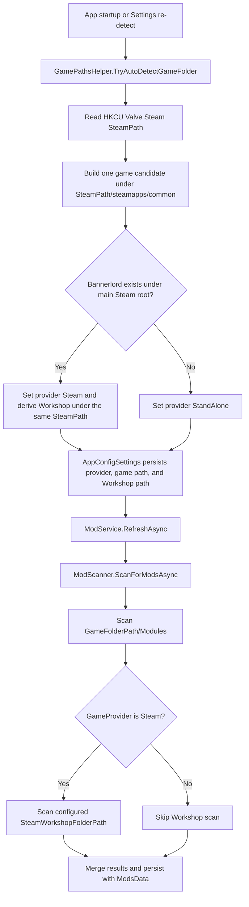

<!--
Historical evidence migrated from the preserved legacy documentation set.
This report retains its original claims for traceability; current source and current verification govern present behavior.
Original preserved path: read_only_old_docs/audits/calradiaforge_steam_multilibrary_scanner_diagnostic_2026-07-15.md
-->
# CalradiaForge Steam Multi-Library Mod Scanner Diagnostic

> Historical pre-fix snapshot. This report records the original failure analysis and configured-path scanner controls. It is superseded for current implementation status by `calradiaforge_steam_multilibrary_fix_verification_2026-07-15.md`; the original evidence below is intentionally preserved.

Status: Confirmed downstream failure state; production fix not implemented  
Report date: 2026-07-15  
Branch: `dev-V0-14-CodeRefactor`  
Reviewed commit: `798fc3d87d4fa2f9588f8d5b8c4cbb17b7161a75` plus the uncommitted diagnostic tests  
Scope: Steam/Bannerlord path detection, provider classification, Workshop scanning, and fake-root test evidence

## Executive Summary

CalradiaForge can scan Bannerlord modules and Steam Workshop modules from different directories when both paths are already configured and the game provider is `Steam`. The current `ModScanner` correctly returned 11 modules from a simulated split-root setup containing eight game modules under `D:/games/Bannerlord/Modules` and three Workshop modules under `C:/programs/steam/steamapps/workshop/content/261550`.

The reported bug occurs earlier in the workflow. Steam auto-detection reads the main Steam client path from the Windows registry and assumes Bannerlord is installed under that same Steam root. When Steam is under `C:` and Bannerlord is under a different `D:` location, detection does not search alternate Steam libraries, classifies the game as `StandAlone`, and leaves Workshop scanning disabled. The same simulated fixture then returns only the eight game modules even though the valid Workshop directory still exists.

The current evidence therefore points to Steam library discovery and provider classification, not module enumeration or result merging, as the root problem.

## Verified Diagnostic Scenario

The tests use temporary folders that preserve the requested logical layout without reading or writing real drives, Steam configuration, or the Windows registry:

```text
<temporary-root>/C/programs/steam/
  steamapps/workshop/content/261550/
    100001/Workshop.Mod.1/SubModule.xml
    100002/Workshop.Mod.2/SubModule.xml
    100003/Workshop.Mod.3/SubModule.xml

<temporary-root>/D/games/Bannerlord/
  Modules/
    Local.Mod.1/SubModule.xml
    ...
    Local.Mod.8/SubModule.xml
```

| Configuration passed to `ModScanner` | Local modules | Workshop modules | Total |
|---|---:|---:|---:|
| Provider `Steam`, valid D game root, valid C Workshop root | 8 | 3 | 11 |
| Provider `StandAlone`, valid D game root, valid C Workshop root | 8 | 0 | 8 |

The first row is a passing scanner control. The second row characterizes the downstream state caused by failed split-library Steam detection. Those two scanner tests do not directly execute registry-based auto-detection.

A follow-up auto-detection patch contract models a fake `C:/Program Files (x86)/Steam` client and `D:/SteamLibrary` containing `libraryfolders.vdf`, `appmanifest_261550.acf`, Bannerlord, and Workshop content. It is intentionally skipped because the current production code has no approved way to replace its real registry read. A temporary diagnostic seam used during investigation was reverted at the owner's request, so no production source change is retained.

## Current Application Workflow



### Current Split-Root Failure Sequence

1. Startup calls `GamePathsHelper.TryAutoDetectGameFolder` when the provider or game path is not initialized.
2. `TryDetectSteam` reads only `HKCU\SOFTWARE\Valve\Steam\SteamPath`, represented by `C:/programs/steam` in the diagnostic.
3. It checks only `C:/programs/steam/steamapps/common/Mount & Blade II Bannerlord`.
4. It does not inspect alternate Steam libraries or find the actual `D:/games/Bannerlord` installation.
5. Detection falls back to `GameProvider.StandAlone`.
6. Manually selecting the D game folder updates `GameFolderPath`, but does not change the provider back to `Steam`.
7. The Settings page hides the Workshop path section for `StandAlone`.
8. `ModScanner` scans `D:/games/Bannerlord/Modules`, but its `IsGameFromSteam` gate prevents scanning the existing C Workshop root.
9. The observed result is eight modules instead of the desired 11.

Related risk: Steam detection currently treats the game path and Workshop path as one all-or-nothing operation. If the game exists under the assumed main Steam root but the derived Workshop directory is absent, the Workshop check throws, detection returns false, and the provider can still fall back to `StandAlone`.

## Compact Source Reference

### Core Detection And Configuration

| File | Current responsibility | Relevance to the bug |
|---|---|---|
| `source/CalradiaForge.Core/Infra/Paths/GamePathsHelper.cs` | Startup platform detection and derived game/Workshop paths | Root defect: reads one Steam client root and assumes the game and Workshop are beneath it; no alternate-library discovery |
| `source/CalradiaForge.Core/Infra/Paths/GameProvider.cs` | Defines `Steam`, `EpicGames`, `StandAlone`, and initialization states | Incorrect `StandAlone` classification disables Workshop scanning |
| `source/CalradiaForge.Core/Infra/Config/AppConfig.cs` | JSON settings persistence | Stores the non-secret path/provider values selected by detection or Settings |
| `source/CalradiaForge.Core/Infra/Config/AppConfigSettings.cs` | Typed configuration facade | Derives `<GameFolderPath>/Modules`; exposes `IsGameFromSteam`; stores `SteamWorkshopFolderPath` |
| `source/CalradiaForge.Core/Infra/Paths/GamePathValidator.cs` | Validates manually selected game, executable, and Workshop locations | Used by Settings, but does not resolve Steam libraries or repair provider classification |

### Core Mod Scan Pipeline

| File | Current responsibility | Relevance to the bug |
|---|---|---|
| `source/CalradiaForge.Core/Infra/Mods/ModService.cs` | Coordinates refresh, backup rotation, scanning, change detection, and persistence | Passes the current `AppConfigSettings` directly to `ModScanner` |
| `source/CalradiaForge.Core/Infra/Mods/ModScanner.cs` | Scans the configured game Modules directory and, only for Steam, the configured Workshop directory | Correctly merges independent roots, but Workshop scanning is gated by provider classification |
| `source/CalradiaForge.Core/Infra/Mods/ModParser.cs` | Parses each discovered `SubModule.xml` into a module model | Working in both diagnostic roots; not implicated in path discovery |
| `source/CalradiaForge.Core/Infra/Mods/ModsData.cs` | Saves current scan results and backup snapshots | Receives the incomplete eight-module result after Workshop is skipped |
| `source/CalradiaForge.Core/Models/ModulesModel.cs` | Represents parsed modules and install paths | Used for the combined scanner result; should not store Steam/Nexus discovery metadata |

### UI Entry Points Affecting The Workflow

| File | Current responsibility | Relevance to the bug |
|---|---|---|
| `source/CalradiaForge.UI/App.xaml.cs` | Loads configuration and invokes auto-detection when paths are not initialized | Starts the flawed single-root detection workflow |
| `source/CalradiaForge.UI/Pages/SettingsPage.xaml.cs` | Manual path selection, re-detection, validation status, and platform-specific visibility | Selecting a game folder does not set the provider to Steam; `StandAlone` hides the Workshop selector |
| `source/CalradiaForge.UI/Pages/SettingsPage.xaml` | Displays game and Workshop path controls | Workshop controls depend on the provider visibility decision |

### Diagnostic Evidence

| File | Purpose |
|---|---|
| `source/CalradiaForge.Tests/Core.Tests/Mods/ModScannerTests.cs` | Contains the 11-module split-root control and the eight-module known-bug characterization |
| `source/CalradiaForge.Tests/Core.Tests/Paths/GamePathsHelperTests.cs` | Defines skipped same-root and alternate-library patch contracts without touching the real registry; activation awaits an approved injection boundary |
| `source/CalradiaForge.Tests/Core.Tests/Support/TestDirectory.cs` | Creates and removes isolated fake directory trees and valid module XML fixtures |
| `docs/refactor/testing_strategy.md` | Records the diagnostic result and explicitly states that multi-library auto-discovery is not fixed |

## External Steam Facts And Constraints

- Steam officially supports alternate game libraries on different drives through Storage Manager. Its documented default game layout is under a library's `steamapps/common` directory: [Steam Support - Moving a Steam Installation and Games](https://help.steampowered.com/en/faqs/view/4BD4-4528-6B2E-8327).
- Bannerlord's Steam App ID is `261550`: [Steam store page](https://store.steampowered.com/app/261550/Mount__Blade_II_Bannerlord/).
- Valve's supported Workshop interface can return the absolute installed folder for each item through `ISteamUGC::GetItemInstallInfo`: [ISteamUGC documentation](https://partner.steamgames.com/doc/api/ISteamUGC?language=english#GetItemInstallInfo).
- Valve's public documentation does not guarantee that Workshop content remains under the main C Steam installation when its game is installed on D. The reported C/D split should be treated as a robustness scenario, not as Steam's only canonical layout.
- `libraryfolders.vdf` and `appmanifest_261550.acf` are commonly used local Steam metadata inputs, but Valve does not document them as a stable third-party API contract. A solution based on them needs defensive parsing, fallback behavior, and tests.

## Requirements For A Proposed Solution

Any proposed fix should preserve these project constraints:

- UI decides when; Core decides how.
- Steam/game path resolution remains in WPF-free `CalradiaForge.Core` code.
- Do not require a real Steam installation, real registry changes, or network access in tests.
- Preserve manual game and Workshop path selection.
- Do not store Steam metadata in `ModuleModel`.
- Do not add startup polling or background scans.
- Do not claim the issue fixed until fake-root resolver tests and scanner integration tests pass.

A useful solution proposal should answer:

1. What testable abstraction should own registry access, Steam library enumeration, app-manifest lookup, filesystem checks, and candidate selection?
2. Should the resolver parse Steam metadata, use Steamworks item-install APIs, use both as layered strategies, or avoid a new runtime dependency?
3. How should it identify the Bannerlord library and its `steamapps/common` install directory when Steam is installed elsewhere?
4. Should Workshop resolution prefer the Bannerlord library, inspect every Steam library for `steamapps/workshop/content/261550`, preserve a manual override first, or merge multiple valid candidates?
5. How should Steam provider classification be retained when the game is manually selected or found outside the main client root?
6. How should missing Workshop content differ from failed Steam detection so a valid Steam game is not misclassified as `StandAlone`?
7. What structured result and diagnostic fields should report client root, library roots, game candidates, Workshop candidates, selected paths, skip reasons, and per-root counts?

## Recommended Fix Verification Matrix

| Scenario | Expected result |
|---|---|
| Main Steam root C; Bannerlord and Workshop in a D Steam library | Steam detected; 11 modules |
| Main Steam root C; Bannerlord on D; requested Workshop robustness root on C | Steam detected; all selected valid roots scanned; 11 modules |
| Game and Workshop both under main Steam root | Existing behavior preserved; 11 modules for the same fixture |
| Valid Steam game but no Workshop directory | Provider remains Steam; eight local modules plus a structured no-Workshop warning |
| Manual D game path and manual C Workshop override | Provider/settings permit both paths; 11 modules |
| Multiple Workshop candidates | Deterministic documented precedence or merge behavior; no duplicate module results |
| Malformed or missing Steam metadata | Safe fallback with actionable diagnostics; no real-path test dependency |

The eventual resolver integration test should start from fake Steam client/library inputs, produce the provider and selected roots, invoke the real `ModScanner`, and assert the final exact set of 11 module IDs. The existing scanner-only tests should remain as controls.

## Current Verification And Status

- Focused split-root diagnostic tests: 2 passed, 0 failed.
- Focused auto-detection boundary tests (Debug): 0 failed, 0 passed, 2 skipped as designed.
- Full Debug test suite: 37 passed, 0 failed, 2 skipped.
- Full Release test suite: 37 passed, 0 failed, 2 skipped; build emitted existing warnings.
- Production source changed by this diagnostic: none; the temporary internal Steam-path-provider seam was reverted at the owner's request.
- Bug status: confirmed downstream and narrowed to detection/provider classification; not fixed.
- `docs/CHANGELOG.md`: not updated.
- `docs/MIGRATION_MAP.md`: not updated.

