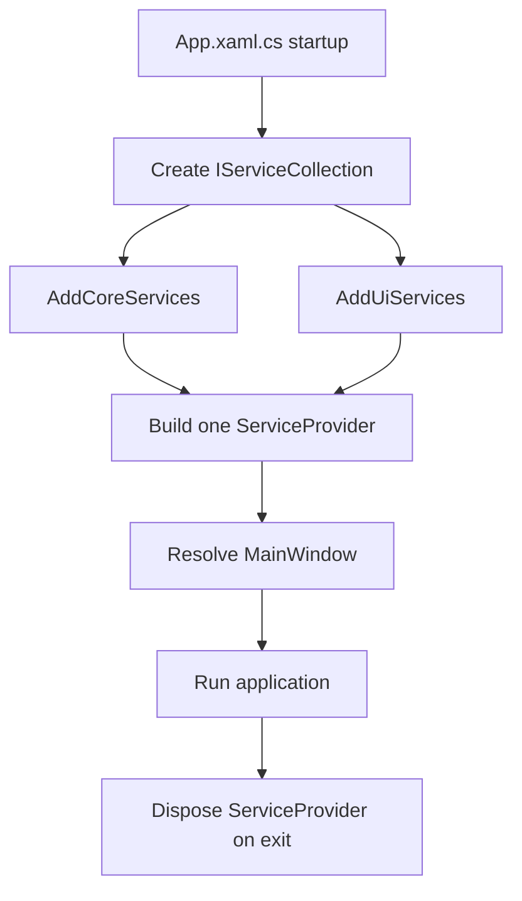

# Dependency Injection Plan

## Purpose

Replace static application service construction and access over time with explicit composition using `Microsoft.Extensions.DependencyInjection`, while preserving the UI/Core/Nexus boundaries and staging legacy logger call-site migration after the DI foundation is verified.

This document defines the locked Phase 6.A composition model. It is a planned architecture and does not claim that DI is implemented in the current source tree.

## Current Source Observations

- `App.xaml.cs` initializes services manually and exposes static properties such as `AppSettingsInstance`, `ModService`, `ModInstaller`, `ModpackService`, `GameLauncher`, `Toasts`, and `Translator`.
- Core services already accept important dependencies explicitly, such as `ModService(AppConfigSettings, ModsData)` and `ModInstaller(AppConfigSettings)`.
- Pages currently retrieve services through static `App.*` access.
- `App.xaml` currently uses `StartupUri` for `MainWindow` construction.
- `SerilogLoggerFactory` currently exposes `Create()`, not `Build()`. The current method performs cleanup, creates a logger, and returns it without retaining the instance; current startup does not resolve or assign this factory/logger through DI.
- The current sink targets `CalradiaForge_Latest.log` with infinite rolling, `shared: false`, asynchronous output, and no explicit `fileSizeLimitBytes` or `rollOnFileSizeLimit` setting. Current cleanup is invoked per `Create()` call, not once at application startup.
- Current `App.OnExit` requests installer cancellation but does not await fire-and-forget install work before shutdown. This plan must not describe current shutdown as quiescent.
- `CalradiaForge.Nexus` is a reserved boundary and should gain registrations only when Nexus services exist.

## Locked Composition Model

The application will use one `IServiceCollection` and one application-level `ServiceProvider` for the process lifetime.



Required rules:

- `App.xaml.cs` is the application composition root.
- Configuration bootstrap occurs before registrations that require loaded settings.
- Startup creates one `IServiceCollection`.
- `AddCoreServices(...)` and `AddUiServices(...)` contribute registrations to that same collection.
- Startup builds exactly one application-level `ServiceProvider`.
- The provider resolves `MainWindow` and its constructor dependencies.
- Provider disposal occurs during application shutdown.
- Separate Core and UI providers are prohibited because they can duplicate singleton instances and split application state.
- The root provider must not become a hidden service locator used by arbitrary pages, controls, or Core services.

## Registration Ownership

Core and UI registration modules are separate, but they operate on the same collection.

### Core Registration Ownership

Core registration may own:

- Configuration and typed settings.
- Serilog infrastructure and the shared logger.
- Core application services and stateful data helpers.
- Core infrastructure and platform-abstraction implementations that belong in Core.

Core registration must remain WPF-free. It must not register windows, pages, ViewModels, dialogs, toast services, or other WPF-specific types.

### UI Registration Ownership

UI registration owns:

- `MainWindow` and other windows.
- Pages and ViewModels.
- Dialog and file-picker services.
- Toast, navigation, and other UI-only services.
- WPF-specific platform implementations.

### Nexus Registration Ownership

`CalradiaForge.Nexus` remains a separate boundary. Future Nexus services may contribute a Nexus-owned registration module when implementation exists. Nexus authentication, networking, API calls, downloader mechanics, and transport must not move into Core.

## App.xaml.cs Responsibility

`App.xaml.cs` remains responsible for orchestration rather than individual service construction:

1. Load and bootstrap configuration.
2. Create the one `IServiceCollection`.
3. Call Core and UI registration methods.
4. Build the one `ServiceProvider`.
5. Resolve and show `MainWindow`.
6. Preserve startup exception handling and diagnostics.
7. Dispose the provider during shutdown.

When DI-resolved startup becomes active, remove or replace `StartupUri` in `App.xaml`. WPF must not construct a second unmanaged `MainWindow` instance. Migrated windows, pages, controls, and ViewModels should receive dependencies through constructors instead of reading static `App.*` service properties.

## Serilog Relationship

`SerilogLoggerFactory` is planned as an application singleton. The current source exposes non-retaining `Create()`; `Build()` is only a possible future naming/contract target. Phase 6.A must explicitly decide whether the factory owns and disposes the retained logger or whether DI owns disposal of the logger returned by the factory. Either model must yield one shared logger and exactly one disposal path.

```text
App.xaml.cs
  -> AddCoreServices()
      -> SerilogLoggerFactory singleton
           -> planned Build()/current Create()
               -> shared Serilog.ILogger singleton
```

Required behavior:

- Register `SerilogLoggerFactory` once as a singleton.
- Register the shared `Serilog.ILogger` once as a singleton resolved through the factory's single retained result after the final contract is chosen.
- Do not call `Create()`/`Build()` repeatedly, create loggers from multiple registration factories, build logger instances through separate providers, or hide logger construction outside the composition root.
- Choose and document one disposal owner: factory-owned disposal or DI/provider-owned disposal. Prohibit both, and do not rely on `Serilog.Log.CloseAndFlush()` unless the shared instance is intentionally assigned to `Serilog.Log.Logger` and no direct disposal path remains.
- Perform retention cleanup once during startup before opening the active file. The current per-factory cleanup is an observation to replace, not a lifecycle guarantee.
- On shutdown, stop new logging-producing work, request cancellation, await or confirm active workflow completion, dispose/stop log-producing services, close the logger exactly once, confirm the active handle is released, attempt archive, and then dispose remaining provider-owned resources according to the selected ownership model.
- The archive helper contract must return false for no active file, an unresolvable collision, or move/access failure; it must never overwrite an existing archive, must use collision-safe deterministic naming, and must preserve the active file when archiving fails.
- Phase 6.A establishes construction and lifetime.
- Phase 6.B migrates legacy logger call sites in controlled batches after the Serilog foundation and DI composition are verified.

## Initial Lifetime Direction

| Service category | Initial lifetime |
|---|---|
| `AppConfig`, `AppConfigSettings`, `SerilogLoggerFactory`, shared `Serilog.ILogger` | Singleton |
| Stateful Core application services and app-scoped data helpers | Singleton |
| Platform adapters without per-operation state | Singleton |
| Toast and other app-wide UI services | Singleton |
| Windows, pages, and ViewModels | Transient unless preserved state requires a documented exception |
| Operation-specific state or future scoped workflows | Explicitly designed later; do not introduce scopes without a demonstrated lifecycle need |

Any lifetime exception must document state ownership, state-retention behavior, thread-safety, disposal ownership, navigation implications, and why the default lifetime is unsuitable. Lifetime changes must not be made solely to improve synthetic benchmark output.

## Logger Lifecycle Decision Register

The following decisions remain intentionally unresolved until implementation review:

- Whether the factory retains and disposes the logger or DI retains and disposes the logger returned by the factory.
- Whether the shared logger is assigned to global `Serilog.Log.Logger` or remains directly DI-owned and disposed.
- The exact provider/logger disposal order after logging-producing workflows are quiescent.
- The archive filename timestamp/sequence format and collision strategy.
- Whether the retention setting means file count or file age, and how existing active/archived files are excluded.
- Whether the active file retains the Serilog default approximate size limit, uses explicit size rolling, or adopts another owner-approved policy.

No unresolved option is an implemented architecture decision.

## Logger Lifecycle Verification Cases

Phase 6.A implementation must cover one factory invocation, one logger identity, cleanup once and before sink open, no duplicate providers, DI/global ownership consistency, shutdown quiescence, exactly-once close/disposal, active-handle release before rename, no-overwrite archive collisions, no-file behavior, access/move failure preservation, and provider disposal without a second logger close. Phase 6.B should review migrated callers and structured properties so credential-owning components do not intentionally pass credentials or authentication material to logs.

## Steam And Bannerlord Path Adapter Planning

Phase 5 production detection integrates `ISteamClientRootProvider`, `ISteamInstallationResolver`, `SteamInstallationResolver`, and the related Steam metadata types through `GamePlatformDetectionResolver` and `GameDetectionService`. Phase 6.A later registers these finalized dependencies and the existing notification queue rather than redesigning them or creating competing adapters.

Adapter planning should support:

- Steam client install path detection separately from Steam library root discovery.
- Bannerlord install detection separately from the selected Workshop content root.
- Multiple Steam library roots.
- Workshop candidate composition under `steamapps/workshop/content/261550`.
- Workshop content under the Bannerlord library root even when Steam is installed elsewhere.
- The Phase 5 manual Workshop rule: valid startup reuse leaves an existing setting untouched, automatic detection replaces or clears it, and manual game selection clears it without auto-resolution.
- Fakeable path providers and fake filesystem roots for tests.
- Windows-specific registry and filesystem probing behind adapters.
- Core remaining WPF-free.

## Phased Implementation

| Phase | Work | Verification |
|---|---|---|
| 6.A | Add the approved DI package; create Core and UI registration modules; compose one collection and one provider; resolve `MainWindow`; transition away from `StartupUri`; establish lifetimes, logger ownership, startup cleanup, shutdown quiescence, exact-once close, archive, disposal, and test replacements. Consume Phase 5 platform dependencies without redesigning them. | Build; startup/shutdown smoke test; singleton identity; factory count; cleanup timing; handle release; archive collision/failure; constructor resolution; duplicate-window check; provider disposal; Core boundary; dependency substitution. |
| 6.B | Migrate legacy logger call sites in staged batches after the Phase 2 Serilog foundation and Phase 6.A composition are verified, including caller and structured-property review. | Build; logging smoke tests; formatter/minimum-level checks; equivalent-behavior review; caller credential-boundary review. |

## Performance Verification Relationship

Later performance phases should measure this architecture rather than redesign it for synthetic results. Applicable measurements include:

- Registration and provider-build cost.
- Representative first-resolution and repeated-resolution cost.
- Accidental duplicate provider or singleton creation.
- Repeated logger construction.
- Startup work that can safely be deferred.
- Disposal and lifetime leaks.
- Transient UI construction churn where navigation creates measurable repeated work.
- Static `App` access or ad hoc provider resolution that bypasses the intended graph.

Correctness checks for one provider, singleton identity, DI-resolved `MainWindow`, and provider disposal are not substitutes for timing benchmarks.

## Guardrails

- Do not create separate Core and UI service providers.
- Do not build a provider inside a registration module.
- Do not use the provider as a hidden service locator.
- Do not register WPF types from Core.
- Do not retain `StartupUri` when `MainWindow` is resolved and shown through DI.
- Do not register multiple independently built `Serilog.ILogger` instances, repeat factory creation, or introduce multiple close/disposal paths.
- Do not change a service lifetime without documenting the required rationale.
- Do not move Nexus networking, authentication, downloader mechanics, or transport into Core.
- Do not add Host Builder complexity without a documented reason and separate approval.
- Do not treat `Microsoft.Extensions.Logging.ILogger<T>` as the current logging target.
- Do not use DI to rewrite services only for style.

## Verification Expectations

- `dotnet build source/CalradiaForge.slnx` succeeds.
- Startup uses one `IServiceCollection` and one application-level `ServiceProvider`.
- `AddCoreServices(...)` and `AddUiServices(...)` contribute to the same collection.
- `MainWindow` is resolved exactly once through DI when DI startup is active.
- WPF does not also construct `MainWindow` through `StartupUri`.
- Intended singleton services resolve to the same instance for all consumers.
- The planned factory contract supplies one retained shared `Serilog.ILogger` instance; current source exposes non-retaining `Create()` and must not be documented as already migrated.
- Cleanup occurs once before active-file open; shutdown quiesces log-producing work, closes exactly once, releases the active handle before archive, never overwrites on collision, preserves the active file on archive failure, and disposes the provider without a second logger close.
- Migrated consumers use constructor injection rather than static `App.*` access.
- Tests can replace key services and adapters.
- Core remains WPF-free.

## Future Documentation Cross-References

Accepted composition and platform-adapter decisions should later be migrated into canonical architecture, platform/path-detection, testing, UI/MVVM, and logging documentation. This plan remains a staging artifact until those decisions are accepted and implemented.

## Open Questions

- Which platform adapters should be implemented first: dialogs, explorer/URL launch, registry/game detection, or filesystem?
- Phase 5 owns Workshop precedence: Bannerlord library first, then one deterministic alternate fallback with valid Workshop-manifest evidence preferred, otherwise no Workshop path.
- Phase 5 owns manual Workshop behavior: valid startup reuse preserves the existing value, automatic detection replaces or clears it, and manual game selection clears it without auto-resolution.
- Which specific UI services require preserved state rather than the transient default?

## Out Of Scope

- Full Host Builder migration unless separately approved.
- A generic service-locator abstraction.
- Rewriting services only to satisfy DI style.
- Moving WPF references into Core.
- Moving networking, authentication, downloader mechanics, or Nexus transport into Core.
