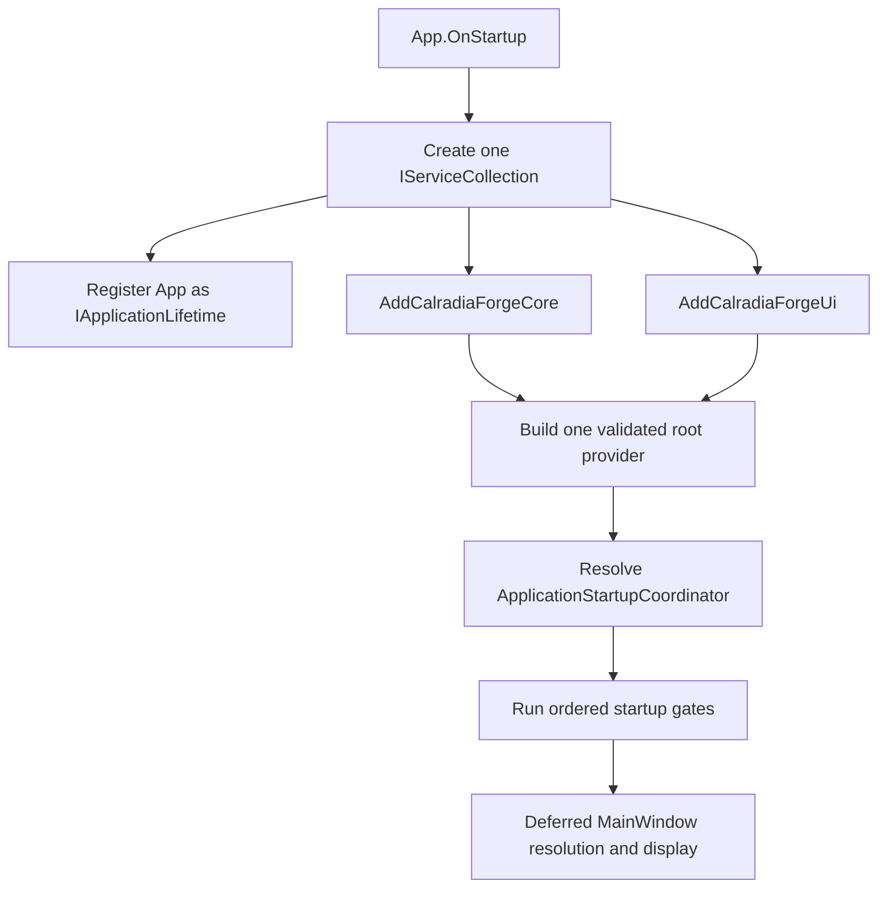

# Dependency Injection Plan

## Purpose

Replace static application service construction and access over time with explicit composition using `Microsoft.Extensions.DependencyInjection`, while preserving the UI/Core/Nexus boundaries and staging legacy logger call-site migration after the DI foundation is verified.

This document records the implemented Phase 6.B composition and lifecycle
baseline. Phase 6.A supplied `ModPipelineManager`, and Phase 6.C migrated normal
legacy logger callers. Historical phase design detail below is retained as
rationale, not as a claim that the baseline remains future work.

## Current Source Observations

- `App` builds and owns one validated provider, resolves `ApplicationStartupCoordinator`, and uses the implemented startup/shutdown coordinator contracts.
- Core/UI registrations share that provider; Core has no WPF registrations and primary pages are retained singleton UI services.
- Provider-owned Serilog is the normal runtime logger and `EmergencyStartupLogWriter` is the narrow pre-operational fallback.
- `ModPipelineManager` is registered as the Core operation and install
  notification-source boundary. `ToastService`, the application-lifetime
  `InstallNotificationPresenter`, and retained `LauncherPage` are registered in
  UI, while `MainWindow` remains the global toast host.
- `CalradiaForge.Nexus` remains reserved until Nexus-owned services exist.

## Implemented Phase 6.B Composition Model

Phase 6.A established `ModPipelineManager`; Phase 6.B built one application graph
around that boundary. The architectural rule remains:

```text
DI owns object construction and dependency delivery.
ApplicationStartupCoordinator owns ordered startup behavior.
ApplicationShutdownCoordinator owns ordered quiescence and persistence behavior.
App owns the root provider and final WPF/process lifecycle.
```

`App.OnStartup` is the sole WPF startup entry. Remove `StartupUri` when this model activates. `App.xaml.cs` does not manually construct or load normal services, pages, or `MainWindow`.



Only `App` calls `BuildServiceProvider()`, exactly once, with validation in all builds:

```csharp
new ServiceProviderOptions
{
    ValidateOnBuild = true,
    ValidateScopes = true
}
```

Core and UI never build or return another provider. Registration modules never resolve during registration. No temporary provider, global `App.Services`, service locator, or custom WPF scope is permitted. Core may reference DI abstractions, but remains WPF-free.

## Registration Ownership

### Core Registration Ownership

Core registration contributes only Core services and infrastructure to the shared collection, including configuration/settings, Phase 5 services, `ModPipelineManager`, persistence/data helpers, and the shared Serilog factory/instance. It must not register WPF windows, pages, dialogs, navigation, toast controls, or UI coordinators.

### UI Registration Ownership

UI registration contributes WPF windows/pages, dialog services, toast/navigation/shell services, `ApplicationStartupCoordinator`, `ApplicationShutdownCoordinator`, `StartupNotificationDrainCoordinator`, and the deferred typed `MainWindow` factory/provider.

### Nexus Registration Ownership

`CalradiaForge.Nexus` remains a separate boundary. Future Nexus auth, networking, API, downloader, and transport registrations remain Nexus-owned and do not move into Core.

## Lifetime Policy

Use singleton by default for application-wide state and infrastructure. Strong singleton defaults include `ConfigFileManager`, `AppSettings`, `LoggingSettings`, `ModPipelineManager`, retained mod state, Phase 5 detection services, the startup notification queue, translation services, toast/navigation/shell services, `ApplicationStartupCoordinator`, `ApplicationShutdownCoordinator`, `StartupNotificationDrainCoordinator`, `MainWindow`, each retained primary page, and the shared Serilog logger.

Use transients only for genuinely short-lived operation-local objects with no shared mutable state, event ownership, workflow ownership, or shutdown responsibility. Dialog-service contracts are singleton, but each invocation creates a fresh WPF dialog window. Do not add custom scopes.

## Preserve Current Page Lifetime

Resolve one singleton `MainWindow`, construct each primary page once through DI, and retain/reuse those page instances. Constructor injection replaces static `App.*` service access while preserving current code-behind, page-owned state, `DataContext`, bindings, navigation refresh, and `Loaded`/`Unloaded` behavior. Do not add transient navigation pages, navigation scopes, a page catalog, or broad ViewModel extraction; those belong to Phase 8.

Legitimate WPF framework statics remain allowed: `Application.Current.Dispatcher`, `Application.Current.Shutdown()`, `Application.Current.Resources`, and `Application.Current.MainWindow`. Do not add static compatibility service properties. The general legacy `Logger.Instance` was removed in implemented Phase 6.C.

## Implemented Phase 7 Notification Presenter

Phase 7 registers a singleton application-lifetime UI install-notification
presenter and explicitly activates it from ordered startup before shell
resolution. It observes only manager-published, UI-neutral progress/results;
it neither admits, schedules, cancels, nor awaits pipeline work. It owns no Core
registration and does not change retained page lifetime. `ToastService` remains a
generic renderer and `MainWindow` remains the host. A broader typed coordinator
is deferred to a future Nexus cycle.

## Settings Bootstrap And Naming

Planned names and responsibilities are:

| Current source | Phase 6.B target | Responsibility |
|---|---|---|
| `AppConfig` | `ConfigFileManager` | Low-level custom JSON path/load/save manager. |
| `AppConfigSettings` | `AppSettings` | Application-facing typed non-secret settings object. |
| `AppConfigSettings.DebugMode` | `LoggingSettings.DebugMode` | Separate persisted early logging preference. |
| Configurable retention setting | No replacement | Archived-log retention is fixed at seven days. |

For each settings object: provide its path and applicable instance/type through `ConfigFileManager`; load a valid existing object; otherwise create an empty object for missing, empty, or malformed content; let that object populate its property defaults; save it through the same manager; persist later property changes through the manager. Malformed JSON regenerates defaults without backup. Unsupported filesystem/device/access failures may enter fatal startup handling.

Do not add a central defaults initializer, generic `InitializeDefaults()` DI factories, a second current-settings copy, `LoggingSessionState`, `DebugModeAtStartup`, a pending-restart flag, alternate storage/in-memory mode, or a generic Host/configuration stack.

## Logger Bootstrap And Ownership

```text
ConfigFileManager loads LoggingSettings
→ LoggingSettings.DebugMode is available
→ startup log-file lifecycle runs
→ one Serilog logger is constructed
→ the same logger is assigned to Serilog.Log.Logger
→ ApplicationStartupCoordinator may execute Log.* calls
```

`ApplicationStartupCoordinator` depends explicitly on `Serilog.ILogger` so resolving it forces activation. `App` does not separately resolve the logger. Bootstrap configuration cannot depend on the final logger.

One DI singleton factory creates the shared logger and assigns the same instance globally. Global `Log.*` is the normal post-bootstrap API and explicit exception to the no-global-services rule. `App` owns the provider; DI owns the logger; provider disposal is the sole normal close. No second pipeline, consumer disposal, separate `Log.CloseAndFlush()`, or post-disposal logging is allowed.

At startup, `LoggingSettings.DebugMode` selects Debug or Information for the entire process. Changes persist immediately and prompt for restart in both directions. Accept uses the app-owned restart pipeline; decline keeps the persisted value and current logger unchanged until next start. No runtime switching or rollback is permitted.

## Startup-Only Log File Lifecycle

Shutdown quiesces the app, disposes the provider/logger, and leaves `CalradiaForge_Latest.log` available. It does not archive, rename, move, truncate, or delete `Latest`.

At next startup, before opening the new logger: no-op if `Latest` is absent; otherwise use last-write time with creation-time fallback and rename to `CalradiaForge_yyyy-MM-dd_HH-mm.log`; use minute precision, no suffix, and no overwrite. Collision/rename failure is nonfatal, leaves existing archives untouched, and records only best-effort pre-Serilog diagnostics. Attempt to truncate/overwrite `Latest`; if that fails, allow append-compatible sink opening. Final logger initialization failure enters bootstrap-failure handling. Do not invent recovery filenames.

After archive handling and before opening the sink, delete archived CalradiaForge logs older than seven days. Exclude `Latest`; ignore missing files and individual deletion failures.

## Startup Coordinator And Deferred Shell

Use one DI-resolved `ApplicationStartupCoordinator` and a narrow typed deferred `MainWindow` factory/provider. Do not constructor-inject `MainWindow` into the coordinator.

The locked order is:

1. `App` creates the collection, registers its `IApplicationLifetime`, calls Core/UI registration, and builds the validated provider.
2. Resolve `ApplicationStartupCoordinator`; settings and logging dependencies activate first.
3. Log startup and initialize translation infrastructure.
4. Run first-launch language selection.
5. Run the EULA gate.
6. Run Phase 5 game detection/configuration validation.
7. Run Phase 6.A mod-pipeline initialization.
8. Load/validate modpack state against the accepted snapshot.
9. Start the notification drain waiting for UI readiness.
10. Resolve `MainWindow` and retained pages for the first time.
11. Assign `Application.Current.MainWindow` and show it.
12. `MainWindow.Loaded` signals toast-host readiness.
13. Drain queued startup notifications FIFO.

EULA rejection or fatal startup must not resolve/show the shell. Constructors capture dependencies; explicit methods perform behavior except for the locked settings object load/default/save flow.

## Startup Notifications And Dialogs

Keep one Core-safe `StartupNotificationQueue` singleton and add one UI `StartupNotificationDrainCoordinator` singleton. The drain coordinator owns its one-time task, readiness wait, cancellation, Core-to-UI mapping, errors, and completion. `MainWindow` only signals readiness. Use FIFO with no polling, arbitrary delay, or dedicated thread; release waiters/subscriptions when complete.

Use singleton application-level dialog services for language selection, EULA, shutdown confirmation, restart confirmation, delayed-shutdown `Continue Waiting / Exit Anyway`, and similar modal workflows. Each call creates a fresh dialog window. Coordinators depend on narrow contracts, not concrete windows or the root provider.

## App-Owned Lifecycle And Explicit Async Shutdown

The existing WPF `App` implements and registers a narrow lifecycle interface:

```csharp
public interface IApplicationLifetime
{
    Task RequestShutdownAsync(ShutdownReason reason);
    Task RequestRestartAsync(RestartReason reason);
}

services.AddSingleton<IApplicationLifetime>(this);
```

DI does not construct or dispose `App`. The interface exposes no provider, windows, settings, logger internals, or general service access.

Use `ShutdownMode = OnExplicitShutdown`. `MainWindow` close is intercepted and never disposes the provider. Normal close confirms before commitment; Cancel cancels the close, while OK enters one guarded irreversible shutdown path.

The ordered path stops new workflow admission, requests cancellation, awaits Phase 6.A quiescence, stops notification draining, persists authorized state, returns to `App`, asynchronously disposes the provider/logger once, leaves `Latest`, and calls WPF shutdown. `OnExit` is fallback-only. Known lifecycle owners are explicit constructor dependencies; no generic participant registry, exit-event cleanup architecture, or disposal-as-quiescence shortcut is allowed.

Interactive shutdown has a 15-second cooperative budget. If work remains, offer another bounded 15-second `Continue Waiting` interval or controlled best-effort `Exit Anyway`. Do not wait indefinitely without renewed choice and do not use `Environment.Exit`, process kill, or fire-and-forget shutdown. Fatal/noninteractive paths use bounded best effort without the prompt. Collect failures so one stage does not skip unrelated safe work.

Restart uses the same confirmation/quiescence/persistence/disposal path and starts the current executable only after provider disposal and file release. Launch failure after disposal still exits the old app.

## Global Exception Policy

`App.xaml.cs` owns global subscriptions and the top-level startup boundary. Before provider/logger availability, use transitional best-effort diagnostics; when the provider exists, route fatal startup failure through controlled shutdown and never show the shell. Dispatcher exceptions are fatal and may be marked handled only long enough to log/present and shut down without resuming. Unobserved task exceptions are logged, observed, and continue by default, while app-owned tasks remain explicitly awaited. AppDomain termination uses best-effort logging/cleanup only when safe and does not assume interactive timeout prompts.

## Phase 6.B Transitional Logger Boundary

Do not broadly migrate `Logger.Instance` callers or create the final emergency writer in Phase 6.B. Phase 6.C migrates normal callers, removes the general-purpose legacy logger, and introduces `EmergencyStartupLogWriter`. No public release occurs between inconsistent transitional subphases.

## Steam And Bannerlord Path Adapter Planning

Phase 5 production detection integrates `ISteamClientRootProvider`, `ISteamInstallationResolver`, `SteamInstallationResolver`, and related Steam metadata through `GamePlatformDetectionResolver` and `GameDetectionService`. Implemented Phase 6.A consumes that finalized behavior through `ModPipelineManager`; Phase 6.B registers the finalized services and notification queue. Neither phase redesigns detection or creates competing adapters.

Adapter planning should support:

- Steam client install path detection separately from Steam library root discovery.
- Bannerlord install detection separately from the selected Workshop content root.
- Multiple Steam library roots.
- Workshop candidate composition under `steamapps/workshop/content/261550`.
- Workshop content under the Bannerlord library root even when Steam is installed elsewhere.
- The Phase 5 manual Workshop rule: valid startup reuse leaves an existing setting untouched, automatic detection replaces or clears it, and manual game selection clears it without auto-resolution.
- Fakeable path providers and fake filesystem roots for tests.
- Windows-specific registry and filesystem probing behind adapters.
- Core remaining WPF-free.

## Phased Implementation

| Phase | Work | Verification |
|---|---|---|
| 6.A | Implemented: Core `ModPipelineManager`, accepted snapshot, commit gating, and awaitable quiescence. | Focused Core pipeline/snapshot/quiescence tests; Phase 5 regression. |
| 6.B | Implemented: one validated provider, settings/bootstrap, startup/shutdown, retained lifetimes, Serilog, dialogs, and exception handling. | Composition, UI startup, settings/logging, lifecycle, full-suite, Core-boundary, and manual WPF verification. |
| 6.C | Implemented: normal legacy callers migrated, general logger retired, and `EmergencyStartupLogWriter` added. | Batch builds/tests, caller inventory, output/bootstrap/lifecycle tests, full regression. |

## Performance Verification Relationship

Later performance phases should measure this architecture rather than redesign it for synthetic results. Applicable measurements include:

- Registration and provider-build cost.
- Representative first-resolution and repeated-resolution cost.
- Accidental duplicate provider or singleton creation.
- Repeated logger construction.
- Startup work that can safely be deferred.
- Disposal and lifetime leaks.
- Retained shell/page construction cost and later Phase 8 navigation lifetime alternatives where separately approved.
- Static `App` access or ad hoc provider resolution that bypasses the intended graph.

Correctness checks for one provider, singleton identity, startup-coordinator/deferred `MainWindow` resolution, and provider disposal are not substitutes for timing benchmarks.

## Guardrails

- Do not create separate Core and UI service providers.
- Do not build a provider inside a registration module.
- Do not use the provider as a hidden service locator.
- Do not register WPF types from Core.
- Do not retain `StartupUri` when `MainWindow` is resolved and shown through DI.
- Do not let `App` resolve/show `MainWindow` directly; resolve `ApplicationStartupCoordinator` and preserve its gates and deferred shell construction.
- Do not add custom scopes or make retained windows/pages transient in Phase 6.B.
- Do not register multiple independently built `Serilog.ILogger` instances, repeat factory creation, or introduce multiple close/disposal paths.
- Do not change a service lifetime without documenting the required rationale.
- Do not move Nexus networking, authentication, downloader mechanics, or transport into Core.
- Do not add Host Builder complexity without a documented reason and separate approval.
- Do not treat `Microsoft.Extensions.Logging.ILogger<T>` as the current logging target.
- Do not use DI to rewrite services only for style.

## Verification Expectations

- `dotnet build source/CalradiaForge.slnx` succeeds.
- `App.OnStartup` uses one `IServiceCollection` and one validated application-level `ServiceProvider`.
- `AddCalradiaForgeCore(...)` and `AddCalradiaForgeUi(...)` contribute to the same collection.
- `ApplicationStartupCoordinator` is the initial resolved root; `MainWindow` and retained pages resolve exactly once after language/EULA, Phase 5, Phase 6.A, modpack, and notification-drain gates.
- WPF does not also construct `MainWindow` through `StartupUri`.
- Intended singleton services resolve to the same instance for all consumers.
- The planned factory contract supplies one retained shared `Serilog.ILogger` instance; current source exposes non-retaining `Create()` and must not be documented as already migrated.
- Previous `Latest` archives only at startup using last-write/creation fallback, minute precision, no suffix, and no overwrite; seven-day cleanup excludes `Latest`; shutdown quiesces work, provider disposal closes once, and leaves `Latest` available.
- Missing/empty/malformed settings follow the object-based default/save flow; `LoggingSettings.DebugMode` precedes logger creation; debug changes persist and prompt restart in both directions.
- Dialog services create fresh windows; startup notifications wait and drain FIFO after readiness.
- Guarded confirmation, bounded timeout choices, controlled restart, and classified global exceptions follow the locked Phase 6.B contract.
- Migrated consumers use constructor injection rather than static `App.*` access.
- Tests can replace key services and adapters.
- Core remains WPF-free.

## Future Documentation Cross-References

Accepted composition and platform-adapter decisions should later be migrated into canonical architecture, platform/path-detection, testing, UI/MVVM, and logging documentation. This plan remains a staging artifact until those decisions are accepted and implemented.

## Open Questions

- Which platform adapters should be implemented first: dialogs, explorer/URL launch, registry/game detection, or filesystem?

## Out Of Scope

- Full Host Builder migration unless separately approved.
- A generic service-locator abstraction.
- Rewriting services only to satisfy DI style.
- Moving WPF references into Core.
- Moving networking, authentication, downloader mechanics, or Nexus transport into Core.

The complete implementation contract is [Phase 6.B locked decisions](phase_6b_di_and_lifecycle_locked_decisions_2026-07-21.md).
