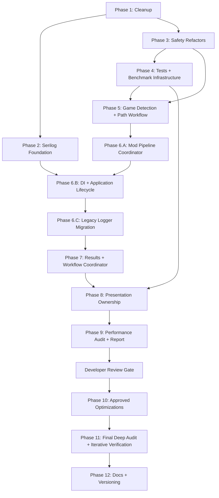

# CalradiaForge Refactor Master Plan

Status: planned
Scope: documentation and implementation planning only. This plan does not authorize source-code implementation by itself.

## Purpose

This document defines the phased refactor plan for the next CalradiaForge beta cycle. The goal is to reduce risk before larger architecture work by sequencing cleanup, logging, persistence safety, installer safety, behavioral tests, benchmark infrastructure, dependency injection, workflow coordination, MVVM extraction, report-first performance review, approved optimization, final verification, and version/documentation cleanup into controlled work orders.

## Source Of Truth

Use this priority when planning or implementing any phase:

1. Existing source code
2. Current source/tests and canonical architecture; the Phase 6 ledgers are historical locked-decision records, not current-source descriptions
3. Newest applicable source-state and completion audits
4. Existing unrelated valid refactor content
5. Architecture documents in `docs/Architecture`
6. This master plan as the phase-sequence and navigation entry point

If this plan conflicts with source code or locked architecture docs, stop and document the mismatch before editing code.

## Locked Decisions Summary

| Area | Locked decision |
|---|---|
| Layering | UI decides when. Core decides how. Nexus/Core decide how for Nexus-specific work. |
| Core boundary | `CalradiaForge.Core` must remain WPF-free. |
| Nexus boundary | Nexus auth, networking, API calls, downloader mechanics, and transport code belong in `CalradiaForge.Nexus`. |
| Nexus timing | Nexus remains a v1.0 target, but experimental or SSO-gated functionality may ship before full approval. |
| Nexus API strategy | Do not redesign Nexus API strategy here. Existing Nexus architecture docs remain source of truth. |
| AppConfig | `AppConfig` is ordinary JSON settings persistence, not a credential manager. Nexus credentials must remain in the Nexus credential boundary rather than in `AppConfig` or ordinary metadata. |
| Credentials | Nexus credentials must use DPAPI CurrentUser and be decrypted only during explicit Nexus operation scope. |
| Installer authority | `ModInstaller` and `ModExtractor` remain the authoritative archive install pipeline. Do not bypass them. |
| Archive safety | Add module identity preflight and grow toward fuller archive validation in phases. |
| BLSE safety | Use strict BLSE filename/folder allowlist validation; approved BLSE files may be overwritten directly. |
| Persistence | Use atomic writes, backup recovery for important JSON, and graceful corrupt-file handling. |
| Logging | Phase 6.B creates one DI-owned Serilog logger, assigns the same instance to global `Log.Logger`, archives the prior `Latest` only at next startup, applies fixed seven-day retention, leaves `Latest` after shutdown, and uses provider disposal as the sole normal close. Phase 6.C migrates normal legacy callers and adds the narrow emergency startup writer. The logger performs no automatic secret/path filtering; callers must not intentionally supply credentials or authentication material. |
| Testing | Add a tiered test strategy, starting with Core unit tests and file-system-heavy integration tests, then establish benchmark infrastructure and evidence rules before the final audit. |
| Platform APIs | Keep the app Windows-first, but isolate Windows-specific APIs behind explicit adapters where practical. |
| DI | Use `Microsoft.Extensions.DependencyInjection`; defer Host Builder unless later justified. |
| DI composition | Phase 6.B uses one collection and one validated provider built/owned by `App`; `App` resolves `ApplicationStartupCoordinator`, which preserves startup gates and uses deferred typed `MainWindow` resolution with retained singleton pages. |
| Performance | Phase 4 establishes benchmark infrastructure and provisional baselines; Phase 9 audits without production edits; Phase 10 implements approved findings; Phase 11 performs bounded final verification; Phase 12 closes documentation/versioning. |
| Results | Use workflow-specific result types. Phase 7 implements one install-specific result and explicitly excludes generic `Result<T>`. |
| Mod-pipeline coordination | Implemented Phase 6.A baseline: Core `ModPipelineManager` owns completeness, commit gating, accepted snapshots, startup/refresh reuse, admission, cancellation, and quiescence. |
| Phase 7 scope | Implemented install outcomes, application notifications, and Phase 8 naming foundation; no new coordinator, scheduler, MVVM implementation, or Nexus implementation. |
| Phase 8 direction | Staged presentation-ownership extraction, not a full-UI-purity rewrite. See the [Phase 8 locked decisions](phase_8_locked_decisions_2026-07-29.md). |
| UI state | ViewModels will use explicit busy/status/error/cancel/current-operation/result state while preserving manager and presenter ownership. |
| Toasts | Preserve the existing Toast System for user-visible operation notifications. |
| MVVM | Use explicit, bounded ViewModels and retain `MainWindow` as the narrow shell. |
| Versioning | Use `MAJOR.MINOR.PATCH[-prerelease]`; before v1.0 use `0.MILESTONE.PATCH[-prerelease]`. |
| Version source | `Directory.Build.props` should become the central public app version source of truth. |
| Excluded from this plan | New Nexus runtime implementation, v1.0 polish, unrelated feature work, automatic update checks, timed polling. |

## Locked Decision Details

These summaries make the master plan a sequence/navigation entry point. The three detailed Phase 6 ledgers remain the complete implementation contracts and must not be replaced by these summaries.

### Nexus Timing And Feature Gating

- Nexus remains in v1.0 scope and is not deferred because SSO approval is pending.
- Experimental Nexus builds may exist before full approval.
- SSO/auth-dependent features must be disabled, mocked, gated, or clearly marked experimental until approval is complete.
- Nexus experimental features should be disabled by default unless intentionally enabled for beta/dev testing.
- Nexus UI may exist before full approval, but experimental actions must be clearly labeled.
- Auth-dependent Nexus gates must remain separate from non-auth planning or metadata features.
- Logs, status messages, and toasts should clearly mark Nexus actions as experimental, unavailable, or waiting on approval.
- Existing Nexus architecture/API strategy docs remain source of truth; this plan must not redesign REST/GraphQL/API abstraction decisions.

### Versioning Specifics

- Use `MAJOR.MINOR.PATCH[-prerelease]`.
- Do not use build metadata for now.
- Before v1.0, use `0.MILESTONE.PATCH[-prerelease]`.
- Patch numbers are intentional released revisions, not raw commit counters.
- Public app version is authoritative for GitHub releases, Nexus Mods releases, changelog entries, app UI display, release artifacts, and installer/package names when applicable.
- Experimental Nexus labels should follow the pattern `v0.13.0-experimental.nexus.1`.
- Experimental Nexus release titles should follow the pattern `CalradiaForge v0.13.0-experimental.nexus.1 - Nexus API Experimental Release`.

### Secret And Logging Specifics

- Automatic secret redaction, secret sanitization, path masking, and secret-pattern filtering are not part of the logging pipeline.
- The custom Serilog formatter is a presentation-format template, not a security component; it renders event values without rewriting them.
- Logging callers must supply appropriate diagnostic data and must not intentionally pass credentials, authentication material, or secret-bearing URLs to the logger.
- Full relevant local filesystem paths may appear in local logs. Any future log export, telemetry, or shared-diagnostic feature requires a separate approved data-handling policy.
- `AppConfig` is not a credential manager. Nexus credentials remain in a purpose-built Nexus credential component using DPAPI CurrentUser storage and operation-scoped decryption.
- The current factory exposes `Create()`, does not retain the created logger, uses the active `CalradiaForge_Latest.log` path, and performs custom cleanup. These are current observations, not the final Phase 6.B logger-lifecycle contract.
- Current source has a `RetainedFileCount`/age-semantics mismatch. Phase 6.B resolves the future policy by removing configurable retention and using fixed seven-day archive retention.
- `retainedFileCountLimit: default` currently passes a null Serilog file-count limit, and the active sink has no explicit file-size limit. Neither behavior is a locked retention decision.
- Approved Phase 2 Serilog packages are `Serilog`, `Serilog.Sinks.File`, `Serilog.Sinks.Async`, `Serilog.Exceptions`, and `Serilog.Enrichers.Thread`, with `Serilog.Sinks.Debug` referenced only in Debug builds using a conditional `PackageReference` and `#if DEBUG` sink configuration.
- `Serilog.Sinks.Debug` is not required for Debug-level events; Release/Public Release builds may still write Debug-level events to rolling file logs when runtime DebugMode is enabled.
- Do not add `Serilog.Sinks.Console`, `Serilog.Settings.Configuration`, `Microsoft.Extensions.Configuration.Json`, `Serilog.Extensions.Logging`, or `Serilog.Extensions.Hosting` as part of Phase 2.

### Archive And Installer Safety Specifics

- Use a custom hybrid installer safety policy that preserves Bannerlord-specific mod-loading needs while improving safety.
- Exact overwrite, backup, validation, and confirmation rules are not fully locked and need later owner review.
- Module identity preflight should inspect archive openability, module folder name, `SubModule.xml`, mod id/name, version if available, valid Bannerlord module shape, and official/reserved target folders.
- BLSE install/update may directly overwrite approved BLSE files after strict filename/folder allowlist validation.
- BLSE logging should record accepted, skipped, blocked, and overwritten files.
- User-facing status/toast messages should clearly explain blocked unsafe BLSE files.

## Tracked Owner Additions

### Phase 7 Page Rename Foundation

The owner locked a behavior-preserving `ModsPage` -> `LauncherPage` rename and
the visible **Launcher** navigation label for Phase 7. It updates XAML/CLR,
DI/navigation, localization, tests, comments, and documentation while reserving
`ModsPage` for future mod management. It does not rename valid mod-domain types
or create the future page. The detailed inventory is
[the Phase 7 rename checklist](ui_page_rename_review_checklist.md).

### Documentation Alignment Report Integration

The owner has produced `docs/audits/calradiaforge_docs_alignment_report_07-08-26.md`, which recommends aligning CalradiaForge documentation with the OniForge documentation model at the organizational and decision-control level. Refactor documents remain active planning artifacts and must not become canonical architecture automatically.

As refactor phases produce accepted decisions, migrate only stable decisions into canonical architecture docs, application-system docs, data/persistence docs, development/testing docs, ADRs, changelog entries, or release notes. Do not copy speculative planning text into canonical architecture, and do not perform the full documentation rebuild from the report as part of this master-plan update.

### Serilog Logger Lifecycle Follow-Up - 2026-07-12

The current follow-up review records that `SerilogLoggerFactory` is an instance service whose current public method is `Create()`. It receives `AppConfigSettings`, uses `AppPaths.LogsFilePath` (`CalradiaForge_Latest.log`), performs custom cleanup, configures an infinite active file sink, and returns a logger without retaining it. The current source does not yet prove one application-owned logger instance or safe shutdown ownership.

Phase 6.B constructs one DI-owned logger after `LoggingSettings.DebugMode`, assigns it to global `Serilog.Log.Logger`, and relies on provider disposal as the sole normal close. Shutdown quiesces work, disposes the provider/logger once, and leaves `CalradiaForge_Latest.log` available. The next startup archives the previous `Latest` by last-write time with creation-time fallback, minute precision, no suffix, and no overwrite, then applies fixed seven-day retention. Phase 6.C separately owns caller migration and `EmergencyStartupLogWriter`. Only the active-file size/rolling policy remains a bounded logger-file choice.

## Phase Order

| Phase | Name | Primary outcome |
|---:|---|---|
| 1 | Cleanup And Low-Risk Consistency Fixes | Reduce noise before deeper refactors. |
| 2 | Serilog Infrastructure Foundation | Establish structured logging and neutral formatting while keeping the legacy logger compatibility path in place; no application lifecycle ownership is claimed. The former redaction infrastructure is historical and superseded. |
| 3 | Small Safety Refactors | Harden compact high-risk areas: BLSE, archive preflight, persistence. |
| 4 | Initial Tests And Performance Benchmark Infrastructure Around Changed Risky Areas | Add behavioral protection plus reusable benchmark and measurement infrastructure. |
| 5 | Game Platform Detection And Path Workflow Rewrite | Implemented Core-owned detection workflow and multi-library Steam resolution; owner real-Steam/WPF smoke remains a release gate. |
| 6.A | Mod Pipeline Manager Foundation | Implemented: bounded Core workflow, accepted snapshot, commit policy, admission, and quiescence. |
| 6.B | Dependency Injection And Application Lifecycle Foundation | Implemented: one-provider composition, retained UI, WPF lifecycle, and shared Serilog lifecycle. |
| 6.C | Legacy Logger Call-Site Migration | Implemented: normal callers migrated and the narrow pre-Serilog emergency writer retained. |
| 7 | Install Outcomes, Application Notifications, And Phase 8 Naming Foundation | Implemented: narrow install result/progress, notification presenter, manager reconciliation, and Launcher rename. |
| 8 | Staged Presentation-Ownership Extraction | 8.A foundation; unified 8.B Launcher/Modpacks/Settings extraction; 8.C shell cleanup; 8.D verification; conditional 8.E fixes. |
| 9 | Performance Audit And Report Generation | Produce an evidence-backed post-refactor performance report without production-code edits. |
| 10 | Approved Performance Optimization Implementation | Implement only explicitly approved `PERF-NNN` findings and compare before/after evidence. |
| 11 | Final Post-Refactor Deep Audit And Iterative Verification | Complete bounded verification and justified corrections. |
| 12 | Final Documentation And Versioning Cleanup For Next Beta | Align release documentation with the final verified implementation. |

## Phase Overview Matrix

| Phase | Depends on | Main work slices | Deliverables | Verification |
|---:|---|---|---|---|
| 1 | None | Cleanup, naming, stale comments, low-risk warnings | Deferred-risk notes; clean build | `dotnet build source/CalradiaForge.slnx` |
| 2 | Phase 1 preferred | Serilog infrastructure, active-file configuration, custom cleanup, neutral formatting, source context, scanner diagnostics planning | Logging foundation implemented; no application lifecycle ownership claimed; legacy logger compatibility preserved; former redaction infrastructure superseded | Build; log creation; formatter output checks |
| 3 | Phase 1 preferred; Phase 2 helpful | BLSE allowlist, archive preflight, atomic JSON writes, scanner/path-resolution investigation | Safer install/persistence behavior; scanner issue confirmed, deferred, or fixed only by explicit scoped work | Build; BLSE/archive/persistence smoke checks |
| 4 | Phase 3 initial changes | Core tests, persistence tests, archive/BLSE tests, modpack workflow tests, fake Steam library scanner tests, benchmark fixtures/harness, measurement and analyzer readiness | Test project, benchmark infrastructure, isolated fixtures, and provisional baseline labels | Build; `dotnet test`; approved Release benchmark command |
| 5 | Phases 3 and 4 preferred | Resolver/workflow integration, Steam split-library resolution, manual configuration, startup queue, minimum scan safety | Production design, test evidence, and owner smoke record | Builds; focused/full tests; owner smoke |
| 6.A | Phase 5 | Coordinator seam, structured scan result, completeness/commit policy, accepted snapshot, active-work quiescence | Core-owned pipeline foundation; existing low-level owners preserved | Focused Core scan/cache/snapshot/quiescence tests |
| 6.B | Phases 2 and 6.A | One provider, registrations/lifetimes, target settings objects, logger bootstrap, startup/shutdown/restart | DI/lifecycle foundation; provider-owned logger lifecycle | Build; composition, archive, lifecycle, and WPF smoke tests |
| 6.C | Phase 6.B | Legacy logger inventory/migration, structured Serilog calls, emergency bootstrap writer | Legacy logger retired after zero normal callers | Build; batch logging/bootstrap/regression tests |
| 7 | Phases 2, 3, and 6.A-6.C | Install-specific terminal result, manager-relayed progress, Core reconciliation, UI presenter, Launcher rename | Narrow Phase 7 contract and stable Phase 8 handoff | Build; targeted deterministic tests; documentation audit |
| 8 | Phases 6.B, 6.C, and 7 | 8.A foundation; unified 8.B stateful ViewModels; 8.C narrow shell cleanup; 8.D verification; conditional 8.E | Verified presentation-ownership extraction without duplicate Core/presenter ownership | Focused tests; Debug/Release verification; evidence-graded runtime observation |
| 9 | Phases 4-8 settled | Release benchmarks, allocations, analyzers, architecture/performance inspection, classified findings, dated audit report | Authoritative post-Phase-8 baseline and pending developer decisions | Build; tests; Release benchmarks; analyzers; report review |
| 10 | Phase 9 developer decisions | Approved finding IDs, small optimization batches, regression tests, comparable before/after benchmarks, report updates | Approved changes and finding dispositions | Build; tests; benchmarks; reviewer pass; manual inspection |
| 11 | Phase 10 settled | Full verification loop, architecture inspection, manual WPF smoke checks, narrowly scoped corrective changes | Final verification, limitations, and updated audit report | Build; tests; benchmarks; analyzers; architecture review; smoke tests |
| 12 | Phase 11 settled | Version source, changelog, release docs, final alignment, accepted performance handoff | Release-ready docs and version consistency | Build; UI version check; docs review |

## Phase Dependency Map



## Phase Deliverables Checklist

- [X] Phase 1: Low-risk cleanup completed or deferred with notes; build passes. (Completed)
- [X] Phase 2: Serilog infrastructure, current custom cleanup, source context, neutral formatting, and approved package usage are implemented while the legacy logger and all callers remain. Final retention/lifecycle behavior belongs to Phase 6.B. (Completed)
- [X] Phase 3: The implementation/reviewer pass completed the decision-safe archive and persistence slices; owner-gated BLSE, reserved-folder, named-modpack recovery, normal-upgrade policy, and flat-archive target naming/blocking remain explicitly deferred.
- [X] Phase 4: Core tests and reusable performance benchmark infrastructure exist; correctness tests and benchmarks are separated; provisional baselines are labeled.
- [X] Phase 5: Resolver/workflow integration, Steam split-library behavior, manual configuration, startup queue, scanner safety, test migration, and automated verification are complete; owner real-Steam/WPF smoke remains pending before release acceptance.
- [X] Phase 6.A: Core `ModPipelineManager` makes scan completeness/commit decisions, publishes an accepted snapshot, and exposes active-work quiescence.
- [X] Phase 6.B: One validated provider owns composition, settings/bootstrap, the Serilog lifecycle, and controlled WPF startup/shutdown/restart.
- [X] Phase 6.C: Legacy logger callers migrated in verified batches; the general logger retired and `EmergencyStartupLogWriter` is the only pre-Serilog fallback.
- [X] Phase 7: Locked install outcomes, application notifications, Core reconciliation, and Launcher naming foundation are implemented and verified.
- [ ] Phase 8: Approved future staged presentation-ownership extraction is not yet implemented.
- [ ] Phase 9: A post-refactor performance audit report exists with authoritative baselines, classified findings, and pending developer decisions; no production optimization was performed.
- [ ] Phase 9 developer gate: Every proposed optimization is approved, modified, rejected, deferred, marked needs-more-evidence, or out of scope before Phase 10 begins.
- [ ] Phase 10: Only approved performance findings are implemented; tests and comparable before/after benchmarks are recorded; ineffective or harmful changes are reverted or explicitly dispositioned.
- [ ] Phase 11: The full relevant test, benchmark, analyzer, architecture, and manual-smoke verification loop satisfies the practical stopping criteria.
- [ ] Phase 12: Versioning, changelog, release documentation, performance report status, and documentation-alignment handoff match the final verified implementation.
- [X] Steam Workshop detection/path issue: Phase 5 implemented and automatically verified the multi-library workflow; owner real-Steam/WPF smoke remains pending before release acceptance.
- [X] UI page rename used the owner-approved Phase 7 rename map before the
  behavior-preserving `.xaml` rename; automated checks pass and owner visual
  inspection remains pending.
- [ ] Documentation alignment report decisions are handed off without making refactor plans canonical architecture by default.

## Global Codex Guardrails

- Do not implement source changes from this plan unless a later task explicitly asks for implementation.
- Keep each implementation task scoped to one phase or one clearly bounded slice of a phase.
- Do not bundle MVVM, DI, logging, persistence, and installer safety into one uncontrolled change set.
- Preserve `CalradiaForge.Core` as WPF-free.
- Preserve Nexus networking/auth/downloader ownership in `CalradiaForge.Nexus`.
- Keep secrets out of `AppConfig`.
- Do not store Nexus metadata in `ModuleModel`.
- Do not add startup update checks, timed polling, silent scans, or background Nexus polling.
- Do not bypass `ModInstaller` or `ModExtractor`.
- Do not rename UI page `.xaml` files unless the owner has provided an explicit approved rename map.
- Do not change major/minor versions without owner approval.
- Update relevant docs whenever architecture behavior changes.
- Do not migrate legacy logger call sites before Phase 6.C.
- Do not add unapproved Serilog packages or dev-only sinks to Release/Public Release artifacts.
- Do not create separate Core and UI service providers; preserve one collection and one application provider.
- Do not use the root provider as a hidden service locator or register WPF types from Core.
- Do not retain `StartupUri` when Phase 6.B activates. `App` resolves `ApplicationStartupCoordinator`; the coordinator uses deferred typed shell resolution after startup gates.
- Do not alter DI lifetimes or duplicate Serilog construction solely to improve benchmark output.
- Do not create multiple logger instances, repeat factory creation, or introduce multiple logger disposal paths.
- Quiesce workflows before provider/logger disposal. Shutdown leaves `Latest`; only the next startup archives it.
- Preserve fixed seven-day retention, last-write/creation fallback, minute timestamp, no suffix, and no overwrite. The active-file size/roll policy remains the only bounded file-policy choice.
- Do not introduce automatic secret/path filtering or generic key-name blocking as part of a later phase.
- Provider disposal is the sole normal logger close path. Do not add `Log.CloseAndFlush()` or consumer disposal, and do not assume the current active file is size-unlimited.
- Do not perform production-code optimization during the Phase 9 performance audit/report phase.
- Do not implement a performance finding without explicit developer approval.
- Do not claim a performance improvement without comparable before/after evidence when measurement is practical.
- Do not weaken correctness, validation, archive safety, persistence safety, logging, cancellation, cleanup, or architecture boundaries to improve a benchmark.
- Do not treat one stopwatch result, Debug execution, or an incomparable third-party baseline as proof.
- Do not add benchmark/analyzer packages, blocking thresholds, or large fixtures without explicit approval.
- Do not pursue theoretical micro-optimizations indefinitely; use Phase 11 practical stopping criteria.

## Phase 1 - Cleanup And Low-Risk Consistency Fixes

| Work-order field | Detail |
|---|---|
| Purpose | Reduce codebase noise before deeper refactors so later diffs are easier to review. |
| Included work | Naming and spelling cleanup; stale comments; low-risk warning cleanup; README/changelog/TODO consistency notes; safe dead-code review only where behavior is clearly unused; record the Steam Workshop scanner/path-resolution report as a known issue; add a deferred UI page rename review checkpoint. |
| Excluded work | MVVM rewrite, DI conversion, installer behavior changes, Nexus implementation, large file moves, ownership changes, or UI page `.xaml` renames. |
| Affected areas | `source/CalradiaForge.Core`, `source/CalradiaForge.UI`, `docs/`, and project metadata only when cleanup is low-risk. |
| Implementation notes | Prefer small mechanical changes. Avoid behavior changes unless the behavior is obviously broken and separately verified. For Steam Workshop scanning, identify current scanner/path-resolution classes and methods without changing behavior. For UI page names, create or update a review checklist only; do not invent rename targets. |
| Dependency ordering | Run before large refactors. Risky cleanup should wait until Phase 4 coverage exists. |
| Do before | Read current architecture docs and audit notes. Check build warnings and identify low-risk items. |
| Do after | Record deferred cleanup that requires tests or owner confirmation, including Steam Workshop path-resolution follow-up and any UI page rename candidates needing owner review. |
| Exit criteria | Obvious typo/stale-comment cleanup is complete or tracked; no architecture boundary changes were introduced; the then-unresolved Workshop issue was handed to the later Phase 5 task; build still succeeds. |
| Risk notes | Renames may affect XAML bindings or reflection-like usage. UI page `.xaml` renames are deferred until an owner-approved rename map exists. Small cleanup can still change install, launch, scanner, or persistence behavior. |
| Verification | `dotnet build source/CalradiaForge.slnx`; manual smoke check if UI-bound names or bindings change. |
| Codex guardrails | Do not refactor unrelated systems. Stop before behavior changes in high-risk workflows. |
| Documentation updates | Update architecture docs only if cleanup corrects stale documented names or responsibilities. Keep `docs/refactor/ui_page_rename_review_checklist.md` as a checklist/template, not a completed rename plan. |

### Deferred Owner Checkpoint - UI Page Rename Review

Before broad MVVM extraction or future Nexus UI work begins, create a short owner-review document that inventories current UI pages, current page names, code-behind names, navigation references, and proposed rename candidates. Do not perform any rename until the owner approves an explicit rename map.

## Phase 2 - Serilog Infrastructure Foundation

| Work-order field | Detail |
|---|---|
| Purpose | Build the Serilog infrastructure foundation inside the existing Core logging folder while keeping the current custom `Logger` class and all existing logger call sites in place for later migration. Phase 2 does not establish application startup or shutdown ownership. |
| Included work | New Serilog infrastructure files under `source/CalradiaForge.Core/Infra/Logging/`; setup/factory/configuration methods needed for later migration; rolling file sink using `Serilog.Sinks.File`; async sink using `Serilog.Sinks.Async`; thread enrichment using `Serilog.Enrichers.Thread`; exception enrichment using `Serilog.Exceptions`; Debug-build-only debug sink using conditional `Serilog.Sinks.Debug`; retention/archive helpers or planning; neutral text formatting; a short legacy/deprecated compatibility summary in the old `Logger` file. |
| Excluded work | Rewriting existing logger call sites; removing the old `Logger` file; routing existing Core/UI callers to the new Serilog caller methods; initializing the new logger service through WPF singleton startup before DI composition exists; injecting Serilog into every service; moving to `Microsoft.Extensions.Logging.ILogger<T>`; adding extra logging/configuration package dependencies; adding `Serilog.Sinks.Console`; replacing the existing custom app config JSON manager; full dependency injection conversion; Host Builder adoption; logging raw secrets; Nexus auth implementation; telemetry or remote logging. |
| Affected areas | New Serilog logging infrastructure in `source/CalradiaForge.Core/Infra/Logging/`, the existing legacy `Logger` file summary/comment only, future logging plumbing, approved package usage, and debug-mode settings. |
| Implementation notes | Keep the current custom `Logger` API working and leave all current `Logger.Instance` call sites in Core and UI untouched. Build the new Serilog foundation first so later call-site migration can happen in Phase 6.C after 6.B establishes the lifecycle. Do not initialize the new Serilog service through the WPF app service startup path until 6.B. Runtime DebugMode must still be able to write Debug-level events to production-approved file logs in Release/Public Release builds; `Serilog.Sinks.Debug` is only for Visual Studio/debugger output in Debug builds. Normal debug logs should call `Log.Debug(...)` after migration. Guard only expensive diagnostic construction. The formatter renders applicable event values and does not inspect, mask, redact, or sanitize them. The current factory uses an infinite active `CalradiaForge_Latest.log` and custom cleanup; Phase 2 records that fact but does not claim final retention or logger lifecycle ownership. Plan structured diagnostic events for Steam/Bannerlord path resolution: detected platform, detected Steam client path if available, discovered Steam library roots, Bannerlord install path, resolved Workshop path candidates, selected Workshop path, scanner result counts, and skipped/missing candidate reasons. |
| Dependency ordering | Should precede Nexus auth implementation and broader result/workflow logging. Must be complete before Phase 6.C call-site migration. |
| Do before | Confirm the approved package set already added to `CalradiaForge.Core`. Identify current logger behavior that must be preserved. Identify the existing Core logging folder as the only location for new Serilog infrastructure files. |
| Do after | Keep the legacy logger compatibility path and all current call sites in place until Phase 6.C verification confirms equivalent Serilog behavior, then remove obsolete custom logger paths only as part of the staged call-site migration. |
| Exit criteria | Serilog infrastructure exists in the Core logging folder, approved package usage is respected, Release/Public Release builds exclude the Debug sink package/configuration, and the current custom logger plus all existing call sites still function as the compatibility path. No later Phase 6.B startup, ownership, close, or archive behavior is implied. |
| Risk notes | Broad call-site changes can obscure failures. Caller-supplied credentials or authentication material could still be written if a caller intentionally supplies them, so credential-owning components must keep those values out of ordinary logging. |
| Verification | Build succeeds; Release/Public Release build does not reference/configure `Serilog.Sinks.Debug`; Debug build conditionally compiles the Debug sink; any isolated Serilog factory/configuration smoke checks pass where practical; formatter output is inspected without requiring WPF UI navigation. |
| Codex guardrails | Do not add Nexus credentials or auth flow. Do not store logging secrets in `AppConfig`. Do not add unapproved logging packages. Do not add `Serilog.Sinks.Console`. Do not migrate existing logger call sites in Phase 2. Do not remove the legacy `Logger` file. |
| Documentation updates | Update `docs/Architecture/Systems/Logging.md`, `docs/refactor/logging_policy.md`, and cross-reference the secret-boundary policy. |

### Approved Phase 2 Package Set

Phase 2 must use the package set already added to `CalradiaForge.Core`:

```xml
<ItemGroup>
    <PackageReference Include="Serilog" Version="4.3.1" />
    <PackageReference Include="Serilog.Sinks.File" Version="7.0.0" />
    <PackageReference Include="Serilog.Sinks.Async" Version="2.1.0" />
    <PackageReference Include="Serilog.Exceptions" Version="8.4.0" />
    <PackageReference Include="Serilog.Enrichers.Thread" Version="4.0.0" />
</ItemGroup>

<ItemGroup Condition="'$(Configuration)' == 'Debug'">
    <PackageReference Include="Serilog.Sinks.Debug" Version="3.0.0" PrivateAssets="all" />
</ItemGroup>
```

`Serilog.Sinks.Debug` is a development-only sink for Visual Studio/debugger output. It must not be referenced or configured in Release/Public Release artifacts. It is not required for Debug-level log events; runtime DebugMode in Release/Public Release builds must still write Debug-level events to production-approved sinks such as rolling file logs.

Do not add `Serilog.Sinks.Console`, `Serilog.Settings.Configuration`, `Microsoft.Extensions.Configuration.Json`, `Serilog.Extensions.Logging`, or `Serilog.Extensions.Hosting` in Phase 2.

### Phase 2 Legacy Logger Preservation Rule

Phase 2 must preserve the old logger implementation as a compatibility path. Codex may add a short legacy/deprecated compatibility summary to the existing `Logger` file, but must not remove that file and must not alter existing logger call sites across Core or UI. Those call sites are intentionally preserved so Phase 6.C can inventory and migrate them after Phase 6.B establishes dependency injection and the final logger lifecycle.

## Phase 3 - Small Safety Refactors

| Work-order field | Detail |
|---|---|
| Purpose | Improve compact, high-value safety areas before larger architecture changes. |
| Included work | BLSE allowlist validation; module identity preflight; simple archive containment planning; atomic JSON writes; backup recovery for important JSON; reserved/official module folder protection planning; targeted Steam Workshop scanner/path-resolution stabilization if scoped and verifiable. |
| Excluded work | Full installer policy finalization if Bannerlord-specific constraints need owner review; full archive security scanner; full persistence migration framework; Nexus download implementation. |
| Affected areas | `ModInstaller`, `ModExtractor`, `BLSEInstaller`, `ModsData`, `ModpackData`, `AppConfig`, last-used load order persistence, and future Nexus metadata policy. |
| Implementation notes | Keep install authority in `ModInstaller`/`ModExtractor`. Preflight reports archive openability, module folder name, `SubModule.xml`, mod id/name, version when available, valid module shape, and reserved/official folder targeting before destructive install steps. BLSE may overwrite approved files after allowlist validation; accepted, skipped, blocked, and overwritten files must be logged and blocked files must be surfaced through status/toasts. For Steam Workshop scanning, do not assume Workshop content is under the main Steam client install folder; prefer resolving Steam library roots first, then checking valid `steamapps/workshop/content/261550` candidates. |
| Dependency ordering | Precedes Nexus downloads and broad MVVM work. Should precede or pair with tests for changed areas. |
| Do before | Identify official/reserved module folders. Confirm current persistence ownership. Document Bannerlord-specific installer constraints needing review. Confirm whether end-user Steam Workshop setup details are known before treating scanner work as a fix. |
| Do after | Add tests in Phase 4 and update archive/persistence docs. Preserve existing successful scanner behavior for users whose current setup works. |
| Exit criteria | Safety rules are implemented or explicitly deferred; `AppConfig` remains non-secret; targeted persistence writes are safer; installer authority remains unchanged. |
| Risk notes | Overly strict preflight can block valid mod layouts. Persistence recovery can prefer stale data if ordering is wrong. Steam Workshop path changes can regress users whose current library layout already scans successfully. |
| Verification | Build succeeds; manual normal archive and BLSE smoke tests; corrupt JSON recovery behavior verified; blocked unsafe inputs produce user-visible status/logs; scanner/path behavior is verified only if this phase explicitly implements a scoped fix. |
| Codex guardrails | Do not bypass `ModInstaller` or `ModExtractor`. Stop and ask if overwrite policy would alter expected Bannerlord mod loading behavior. |
| Documentation updates | Update `archive_installer_safety_policy.md`, `persistence_policy.md`, `docs/Architecture/Systems/ModManagement.md`, and `docs/Architecture/Systems/Configuration.md`. |

### Steam Workshop Scanner Safety Candidate

The Bug was Confirmed and will be implemented in phase 5 plan.

The Phase 3 investigation confirmed the old single-library failure. Phase 5 later implemented and automatically verified the repair; see the [detailed Phase 5 record](game_platform_detection_and_path_workflow_plan.md). Phase 6.A owns the bounded scanner completeness/commit/snapshot foundation. Phase 7 adds only the install-specific result, progress, reconciliation, and notification contract; it does not generalize scanner results.

## Phase 4 - Initial Tests And Performance Benchmark Infrastructure Around Changed Risky Areas

| Work-order field | Detail |
|---|---|
| Purpose | Add focused behavioral protection for high-risk Core workflows and establish reusable benchmark, analyzer, fixture, allocation, and baseline infrastructure for later performance phases. |
| Included work | Core unit/regression tests; persistence, parser, archive, BLSE, modpack, logging, scanner/path, result, and integration-style filesystem tests; approved benchmark project or harness; representative datasets; Release benchmark commands; allocation and environment reporting; provisional baseline capture; SevenZipWrapper source/methodology review. |
| Excluded work | Final performance conclusions against code that later phases will change; speculative production optimization; fragile exact-duration unit tests; broad WPF UI automation; unapproved analyzer/benchmark packages; real Steam or Bannerlord dependencies. |
| Affected areas | Test and benchmark projects, solution/build documentation, fixture data, test helpers, result conventions, and performance-sensitive Core workflows. |
| Implementation notes | Separate correctness tests from benchmarks. Use Release builds, warmup, repeated iterations, isolated temporary directories, controlled fixtures, environment metadata, and explicit provisional-baseline labels. The authoritative post-refactor baseline is captured in Phase 9 after Phase 8 settles. |
| Dependency ordering | Follows initial Phase 3 changes. Creates infrastructure before DI, logger migration, workflow coordination, and MVVM work; it does not perform the decisive final audit. |
| Do before | Select test and benchmark frameworks only with approval; inspect solution/project naming; identify legal fixtures; locate existing SevenZipWrapper benchmark evidence and metadata. |
| Do after | Expand tests and benchmarks as Phases 5-7 change workflows while preserving comparability and methodology records. |
| Exit criteria | Meaningful tests run; approved benchmark infrastructure runs representative Release cases; fixtures are deterministic and isolated; analyzer/measurement commands are documented; provisional baselines are clearly labeled; no production optimization was performed merely to improve Phase 4 results. |
| Risk notes | Filesystem and startup timings are environment-sensitive. Large fixtures can increase repository cost. Poor thresholds can create flaky CI. Benchmark scaffolding can encode unstable implementation details. |
| Verification | `dotnet build source/CalradiaForge.slnx`; `dotnet test source/CalradiaForge.slnx`; approved Release benchmark command; clean-workspace fixture validation. |
| Codex guardrails | Do not require real user paths, Steam, Bannerlord, Nexus credentials, or network access. Do not add timing assertions to normal tests. Do not add packages, analyzers, blocking thresholds, or speculative production optimizations without approval. |
| Documentation updates | Expand `testing_strategy.md`; add and cross-reference `performance_audit_and_optimization_policy.md`; update contributor/build docs only when commands or CI change. |

### Steam Workshop Scanner Test Scenarios

Use fake temp directories to cover Steam client installed on one root while Bannerlord is under another Steam library root, multiple Steam library roots, Workshop content under the Bannerlord library root, missing Workshop content, Workshop content with no valid modules, and manual override behavior if supported.

## Phase 5 - Game Platform Detection And Path Workflow Rewrite

| Work-order field | Detail |
|---|---|
| Purpose | Replace the legacy helper-owned game detection with the now-implemented Core-owned platform detection and path workflow. |
| Included work | Reuse the orphaned Steam resolver; correct multi-library Steam detection; separate Steam game success from Workshop availability; direct settings commits; startup/re-detection/manual paths; separate manual Workshop configuration; optional BLSE enrichment; startup notification queue; caller migration; helper removal; minimum scanner/cache safety; test migration and verification. |
| Dependencies | Current source-state audit; Phase 3/4 evidence preferred. Phase 6.A consumes the finalized platform dependencies rather than redesigning them. |
| High-level order | Audit current contracts; update provider/resolver/workflow; migrate callers; remove the helper; apply minimum safety; build; migrate/add tests; run focused/full tests; obtain owner split-library smoke evidence; align documentation. |
| Exit criteria | Steam split-library and no-Workshop cases are correct, manual configuration is bounded, queue behavior is proven, production builds and tests pass, and owner smoke evidence is recorded or an exception is documented. |
| Exclusions | Full DI/logger migration, broad adapter or MVVM redesign, generic detection results, scanner/cache redesign, Nexus, installer/extractor changes, secret redaction/sanitization, and real-world gated-platform support claims. |
| Detailed authority | [Game Platform Detection and Path Workflow Plan](game_platform_detection_and_path_workflow_plan.md) |

## Phase 6 - Mod Pipeline, Application Lifecycle, And Legacy Logging

Phase 6.A, 6.B, and 6.C are implemented baselines. The detailed work-order text
below is retained for historical sequencing/rationale and must not override
current source, canonical architecture, or the historical-ledger status notes.

Phase 6 is split in locked order: 6.A establishes only the mod-pipeline foundation; 6.B then owns DI, lifecycle, settings bootstrap, and final log-file ownership; 6.C migrates normal legacy logger callers. The detailed ledgers below are the implementation authority; current source remains pre-Phase-6.

### Phase 6.A - Mod Pipeline Coordinator Foundation

| Work-order field | Detail |
|---|---|
| Purpose | Historical Phase 6.A record: establish the now-implemented Core `ModPipelineManager` before DI registers and lifecycle-manages it. |
| Dependencies | Implemented Phase 5 platform/path behavior; current scanner/cache/installer/modpack source; Phase 4 regression infrastructure. |
| Included work | Workflow-specific structured result; local/Workshop completeness; commit authorization; cache-rotation gating; atomic accepted snapshot/version; startup and refresh reuse; deterministic admission/cancellation/completion/quiescence. |
| Excluded work | DI/provider construction, WPF startup/static access, logger lifecycle/callers, broad result hierarchy, MVVM, installer/extractor/rollback redesign, Nexus, Phase 5 redesign, and unrelated optimization/UI work. |
| Implementation order | Audit current owners; define result and completeness/commit policy; add coordinator seam; gate rotation/save; publish accepted snapshot; route startup and refresh; add active-work stop/cancel/quiescence; add focused tests; build/full tests; record deviations/later work. |
| Exit criteria | One coordinator owns sequencing; startup/refresh use it; rejected work cannot replace accepted state; rotation is gated; accepted state is coherent; 6.B can stop/cancel/await work; Core remains WPF-free; no DI/logger scope leaks. |
| Verification | Complete/incomplete root cases; invalid/cancel/failure no-commit; deterministic duplicates; previous snapshot/cache preservation; modpack accepted-snapshot use; single-operation admission; idempotent stop; cancellation/quiescence; Phase 5 regression; build/full tests. |
| Documentation handoff | [Historical Phase 6.A contract](phase_6a_mod_pipeline_coordinator_locked_decisions_2026-07-21.md). Move only behavior proven by source/tests into canonical architecture. |

### Phase 6.B - Dependency Injection And Application Lifecycle Foundation

| Work-order field | Detail |
|---|---|
| Purpose | Establish one validated provider and app-owned settings, startup, shell, logging, shutdown, restart, and exception lifecycle around the 6.A coordinator. |
| Dependencies | Phase 2 Serilog infrastructure; completed Phase 6.A; implemented Phase 5 services; current WPF/config/logging source. |
| Included work | One collection/provider; Core/UI modules; provider validation; singleton retained shell/pages; `ConfigFileManager`/`AppSettings`/`LoggingSettings`; startup coordinator and deferred shell; notification drain; dialog services; one global DI logger; startup-only archive; fixed seven-day retention; `IApplicationLifetime`; bounded async shutdown/restart; classified exceptions. |
| Excluded work | Broad legacy caller migration/final emergency writer, Host Builder, `ILogger<T>`, Serilog hosting/config packages, custom scopes, service locator, transient navigation/full MVVM, detection/pipeline redesign, Nexus, and unrelated installer work. |
| Implementation order | Finalize service/lifetime matrix; add DI package/modules; implement settings split/object flow; implement logger bootstrap/file lifecycle; add startup/dialog/drain coordinators; remove `StartupUri`; migrate approved static access while retaining pages; implement lifetime/shutdown/restart/exceptions; integrate 6.A quiescence; add tests and manual WPF smoke. |
| Exit criteria | One validated provider owns the graph; startup is coordinator-driven; shell/pages retain one-instance behavior; target settings exist; one global logger closes only through provider disposal; startup archival/retention work; controlled shutdown/restart/exceptions work; 6.A quiescence integrates; legacy callers remain deferred to 6.C. |
| Verification | Composition/root resolution; UI gates/retained pages/fresh dialogs/FIFO drain; settings recovery and DebugMode restart; startup archive/collision/failure/fixed retention; shutdown/restart/timeouts/quiescence/exceptions; build/full tests/Core boundary; complete manual WPF smoke matrix. |
| Documentation handoff | [Historical Phase 6.B contract](phase_6b_di_and_lifecycle_locked_decisions_2026-07-21.md). Implemented source and automated validation establish the baseline; phase-appropriate runtime evidence remains separately scoped. |

### Phase 6.C - Legacy Logger Call-Site Migration

| Work-order field | Detail |
|---|---|
| Purpose | Migrate every normal `Logger.Instance` caller to the one shared global Serilog pipeline, remove the general legacy logger, and retain only an error-only emergency startup writer. |
| Dependencies | Completed 6.A and 6.B; one global DI logger; provider-only disposal; settled `Latest` lifecycle; passing startup/shutdown/restart tests. |
| Included work | Complete caller inventory; narrow migration batches; structured `Log.*`; justified-only debug guards; bootstrap timing review; legacy logger removal after zero callers; `EmergencyStartupLogWriter`; one-close-path proof. |
| Excluded work | DI/lifecycle/settings redesign, runtime level switching, configurable retention/archive redesign, central redaction/sanitization, broad workflow/pipeline/MVVM/Nexus work, and unrelated optimization. |
| Implementation order | Inventory callers; migrate Core helpers/config/Phase 5/6.A/install/UI/App batches; build/test/output-review each batch; add emergency writer; prove zero normal callers; remove the general logger and obsolete tests; run full regression/manual log smoke. |
| Exit criteria | All normal callers use `Log.*`; structured/exception behavior is preserved; redundant guards are gone; the general legacy logger is removed; emergency writer is the only pre-Serilog fallback; provider disposal remains the sole close; full tests/manual checks pass. |
| Verification | Zero-reference inventory; Information/Debug output; structured properties/exceptions; UI/Core shared sink; bootstrap failures/emergency writer/no-success file; one close/no post-disposal logging; `Latest` lifecycle/restart; build/full tests/Core boundary. |
| Documentation handoff | [Complete Phase 6.C contract](phase_6c_legacy_logger_migration_locked_decisions_2026-07-21.md). Release and canonical docs follow only verified final behavior. |

### Steam Workshop Path Adapter Planning

Phase 5 implemented the Steam-boundary integration. Implemented Phase 6.A consumes finalized configuration through `ModPipelineManager`; Phase 6.B registers the finalized resolver, workflow, notification queue, and dependencies in the sole provider without redesigning Phase 5 behavior.

### Performance Planning Cross-References

- Phase 2: Later audit logging allocations, disabled-level work, neutral formatting, enrichment, and sink behavior without weakening required diagnostics.
- Phase 3: Preserve stable archive, persistence, configuration, and scanner boundaries and fixtures for Phase 4 measurement; do not add instrumentation that changes safety behavior.
- Phase 6.B: Later audit provider/logger construction, startup archive/retention, enrichment, async sink behavior, quiescent disposal, and retained UI lifecycle.
- Phase 6.C: Later audit migrated message templates, caller-supplied properties, and justified expensive diagnostic guards.
- Phase 7: Preserve progress, cancellation, result construction, cleanup, and coordinator semantics while allowing workflow overhead to be measured.
- Phase 8: Include UI-thread responsiveness and startup/manual smoke observations in later audit scope; do not create fragile wall-clock UI unit tests.

## Phase 7 - Install Outcomes, Application Notifications, And Phase 8 Naming Foundation

| Work-order field | Detail |
|---|---|
| Status | Implemented and automatically verified; owner WPF runtime inspection and approval remain pending. |
| Purpose | Implement the owner-locked install-specific outcome, application notification, manager reconciliation, and stable page-naming prerequisites for Phase 8. Owner runtime inspection is historical evidence, not a separate Phase 7 closeout gate. |
| Included work | Non-null `ModInstallOperationResult`; manager-relayed transient progress and immutable terminal result; manager-owned DLL unblock and internal scan/commit reconciliation; explicitly activated UI presenter; `ModsPage` -> `LauncherPage` rename. |
| Excluded work | Generic `Result<T>`, new workflow coordinator/scheduler/event bus, WPF in Core, duplicated installer/extractor mechanics, MVVM extraction, Nexus APIs/queues/future ModsPage. |
| Affected areas | `ModPipelineManager`, install summary/error propagation, Modules DLL unblocking, accepted-snapshot reconciliation, app-lifetime install notifications, Launcher page identity/navigation/localization, DI, and focused tests. |
| Implementation notes | `ModInstallOperationResult` carries one of eight terminal statuses, stable diagnostic codes, summary/unblock/reconciliation data, and the exact accepted snapshot. Immutable progress carries operation/archive correlation. The manager builds on—rather than replaces—the 6.A completeness, commit, accepted-snapshot, startup/refresh, and quiescence contract. |
| Dependency ordering | Follows completed 6.A–6.C and safety/logging foundations. Precedes or coordinates with MVVM extraction. |
| Do before | Completed: the locked decision ledger narrowed standardization to the install workflow and preserved existing owners. |
| Do after | Move temporary launcher presentation reconciliation and operation state to `LauncherViewModel` or an approved presentation owner in Phase 8. |
| Exit criteria | High-risk workflows beyond the 6.A foundation have clearer result contracts; install completion/failure/cancellation paths are observable; UI can show busy/status/error/result state consistently without duplicating coordinator ownership. |
| Risk notes | Over-standardizing too early can add ceremony. Coordinator may duplicate service responsibilities if boundaries are unclear. |
| Verification | Debug and Release restore/build/test plus focused Core/UI/rename tests and static architecture checks are required. Owner manual install success/failure/cancel/navigation/toast inspection remains the acceptance gate for runtime presentation. |
| Codex guardrails | Keep Core WPF-free. Keep installer/extractor mechanics in their owners. Do not add a second admission owner, a generic result abstraction, or a Nexus implementation. |
| Documentation updates | Canonical and supporting Phase 7 documentation is reconciled to the implemented endpoint. The [Phase 7 migration map](phase_7_migration_map.md) remains a planning artifact and is not updated during the source implementation workflow. |

### Locked Phase 7 execution boundary

`ModPipelineManager` remains the single Core owner of admission, cancellation,
operation identity, accepted snapshots, required reconciliation, and quiescence.
The admitted pipeline is validate/admit, installer work, summary, Modules DLL
unblocking, internal scan/commit reconciliation, terminal result, and release.
Public `RefreshAsync` must not be recursively admitted from install. The
installer semaphore is defensive only; manager-admitted installer refusal is an
invariant failure. Cancellation retains a partial summary where applicable,
performs bounded consistency finalization, and does not imply rollback.

The presenter owns one opaque operation-notification handle and the correlated
progress-to-terminal lifecycle. It rejects stale progress and owns standalone
pre-admission notices. Final user notification waits until the temporary
`LauncherPage` presentation reconciliation reports semantic completion.

## Phase 8 - Staged Presentation-Ownership Extraction

Phase 8 is approved future work governed by the [Phase 8 locked decisions](phase_8_locked_decisions_2026-07-29.md). It moves selected presentation ownership from retained WPF pages to independently testable ViewModels; it is not a purity rewrite, page rename, navigation framework, Core rewrite, visual redesign, Nexus work, or performance-optimization phase.

| Phase | Work order and exit boundary |
|---|---|
| 8.A - MVVM Foundation | Add only bounded explicit `CommunityToolkit.Mvvm` primitives, lifecycle, narrow dispatcher, DI conventions, and focused deterministic tests. No workflow extraction. |
| 8.B - Unified Stateful Workflow Extraction | One unified phase, internally ordered Launcher, Modpacks, then Settings. Add all three required ViewModels and remove superseded page-owned workflow logic; do not create B subphases. |
| 8.C - Shell, Navigation, and Cleanup | Keep `MainWindow` as the narrow retained-page shell; integrate awaited lifecycle navigation and remove temporary proxies, visibility-driven workflow activation, and obsolete workflow-owning code-behind. |
| 8.D - Robust Automated and Human-Driven Runtime Verification | Run comprehensive deterministic hardening, clean Debug/Release checks, and owner-driven Visual Studio runtime observation with an evidence-graded audit. |
| 8.E - Conditional Defect Correction and Revalidation | Run only for validated Phase 8.D production defects; it is not an automatic cleanup or enhancement phase. |

### Phase 8 Locked Architecture Rules

- Retain `LauncherPage`; add `LauncherViewModel`; keep Launcher-based internal identifiers; visible navigation text is **Home**. Do not create `LauncherView`, rename pages again, or create `FaqViewModel`/`MainWindowViewModel` by default.
- Use explicit `ObservableObject`, `RelayCommand`, and `AsyncRelayCommand` members only. Do not use toolkit generators, Messenger, toolkit navigation, a locator, event bus, or a generic scheduler.
- Retain singleton pages and add singleton ViewModels. Constructor injection and one-time `DataContext` assignment follow `InitializeComponent()`; navigation does not replace either instance.
- Initialization is one-time and awaitable; activation is repeatable and deterministic; deactivation is UI-local and does not cancel Core work or dispose a singleton ViewModel. UI-bound state uses a narrow awaited UI dispatcher while Core stays dispatcher-free.
- ViewModels may use `ICollectionView` where it materially improves binding or filtering, but never controls, pages, windows, dialogs, visual-tree types, or Gong drag/drop interfaces.
- `ModPipelineManager` retains admission, cancellation, reconciliation, terminal classification, and quiescence. The presenter retains correlated toast ownership. `LauncherViewModel` consumes results, applies the accepted snapshot through the dispatcher, reapplies the selected modpack, recalculates state, reports semantic completion exactly once, and only then permits presenter terminal notification.
- `MainWindow` selects retained pages and owns narrow navigation/lifecycle ordering, not workflow refresh, persistence, collections, cancellation, or service resolution. Picker/folder/shell interfaces are introduced only for a concrete workflow; code-behind remains limited to WPF mechanics and narrow event forwarding.

### Phase 8 Verification And Documentation Boundary

Tests in 8.A-C are focused and deterministic; no arbitrary delays or wall-clock assertions are permitted. Phase 8.D owns full Debug and Release verification plus human-driven Visual Studio evidence. Automated tests do not prove interactive WPF behavior; runtime scenarios are classified as Directly Observed, Corroborated, Inconclusive, Blocked, or Fail.

This preimplementation pass updates refactor planning only. Canonical/regular architecture, sitemap, changelog, migration map, and release documentation update only after verified implementation and accepted 8.D/8.E evidence. Phase 9 owns the authoritative post-Phase-8 performance baseline; Phase 12 owns version and release alignment.

## Phase 9 - Performance Audit And Report Generation

| Work-order field | Detail |
|---|---|
| Purpose | Audit the completed substantive refactor for measurable and plausible performance inefficiencies and produce a prioritized evidence-backed report before production optimization. |
| Included work | Release benchmarks; allocation measurements; approved analyzers; startup and one-provider DI composition review; singleton identity/lifetime/disposal checks; logger factory count, active-sink startup, startup archive/fixed-retention scaling, neutral formatter cost, async sink behavior, provider-owned flush/close, shutdown races, file-size behavior, and allocations; filesystem, scanning, parsing, modpack, extraction, persistence, logging, async/concurrency, collection, and memory review; controlled SevenZipWrapper comparison; finding classification; dated report generation; focused test/benchmark additions needed to gather evidence. |
| Excluded work | Production-code optimization; behavior changes; validation removal; speculative refactors presented as performance fixes; automatic transition into Phase 10. |
| Affected areas | Completed Core and UI-sensitive workflows, test/benchmark projects, analyzer configuration, and `docs/audits/calradiaforge_performance_audit_YYYY-MM-DD.md`. |
| Implementation notes | Run correctness verification before profiling conclusions. Record environment, build, commit, branch, fixture identity, cache conditions, warmup, iterations, variance, and allocations where supported. Treat named implementation examples as hypotheses, not presumed defects. |
| Dependency ordering | Follows Phase 8 and depends on Phase 4 infrastructure. The audited code must be settled or explicitly deferred. Precedes Phase 10. |
| Do before | Confirm Phases 2-8 are settled or explicitly deferred; run applicable correctness tests; select the exact dated report path; record environment; validate SevenZipWrapper comparability. |
| Do after | Stop for developer review. Record approval, rejection, deferral, modification, out-of-scope, or evidence requests for every proposed production optimization. |
| Exit criteria | The report and authoritative post-Phase-8 baselines are complete; findings are classified and prioritized; no production code was changed; every proposed production change remains pending an explicit developer decision. |
| Risk notes | Filesystem and startup results are noisy; correlation can be mistaken for causation; third-party benchmark values can be incomparable; audit scope can expand into endless micro-optimization without stopping criteria. |
| Verification | Build; applicable tests; approved Release benchmarks; analyzer execution; report cross-check against raw results and source inspection. |
| Codex guardrails | Do not edit production code. Do not claim speedups without evidence. Do not subtract unrelated SevenZipWrapper values. Do not weaken safety or logging. Stop for developer review after the report. |
| Documentation updates | Create or update the exact dated audit report and methodology documentation only as needed; do not update the migration map for documentation-only audit work. |

### Phase 9 Developer Decision Gate

Every proposed finding must receive an explicit owner status before Phase 10 begins: `Approved`, `Approved With Modification`, `Rejected`, `Deferred`, `Needs More Evidence`, or `Out Of Scope`. Findings remain `Pending Developer Review` until decided. Phase 9 must not silently transition into production-code changes.

## Phase 10 - Approved Performance Optimization Implementation

| Work-order field | Detail |
|---|---|
| Purpose | Implement only explicitly approved performance finding IDs, preserve behavior and safety, and verify each change with tests and comparable before/after measurements. |
| Included work | Approved `PERF-NNN` findings; small production-change batches; affected regression tests and benchmarks; before/after comparisons; allocation results; audit-report status updates; reversion or disposition of ineffective, harmful, inconclusive, blocked, rejected, or deferred work; reviewer/fix passes. Logger lifecycle or sink changes require finding-specific approval. |
| Excluded work | Unapproved findings; speculative cleanup; unrelated architecture changes; validation removal; safety weakening; benchmark-only changes presented as user-visible gains; changelog or migration-map work before owner inspection. |
| Affected areas | Only source, test, benchmark, fixture, and documentation files required by approved finding IDs. |
| Implementation notes | Create an explicit approved-finding scope before editing. Preserve behavior unless a separate change is approved. Compare against the Phase 9 baseline under comparable archive, dataset, machine, runtime, build, warmup, iteration, cache, and destination conditions. |
| Dependency ordering | Follows the Phase 9 developer decision gate. Precedes Phase 11. |
| Do before | Read the approved report and feedback; validate baselines and verification methods; assign small non-overlapping batches. |
| Do after | Update finding outcomes; run reviewer/fix passes; stop for manual owner inspection before changelog and migration-map workflows. |
| Exit criteria | Only approved findings were implemented; affected tests pass; benchmarks were rerun; outcomes and limitations are documented; harmful changes are reverted or escalated; owner inspection gate is reached. |
| Risk notes | Multiple changes can invalidate attribution; environment variance can hide effects; micro-optimizations can obscure clear code or trade correctness for speed. |
| Verification | Build; applicable unit/integration/ViewModel tests; affected Release benchmarks; allocation comparison; manual smoke tests for affected UI-sensitive workflows; report cross-check. |
| Codex guardrails | Do not implement unapproved findings. Do not change behavior, safety, validation, logging, or ownership boundaries without approval. Do not keep complexity without evidence. Stop before changelog and migration-map work. |
| Documentation updates | Update the same audit report with implementation status, measured outcomes, reverts, unresolved findings, and limitations. Follow the shared closeout workflow after owner approval. |

## Phase 11 - Final Post-Refactor Deep Audit And Iterative Verification

| Work-order field | Detail |
|---|---|
| Purpose | Verify the complete refactor and approved optimization implementation through the relevant build, test, benchmark, analyzer, architecture, and manual-smoke workflow, then correct only justified failures or regressions. |
| Included work | Full relevant solution builds and tests; Release benchmarks; allocation/scaling review; approved analyzers; logger ownership, shutdown/provider-close, retained-`Latest`, and next-startup archival/retention inspection; architecture and ownership inspection; manual WPF smoke checks; root-cause investigation; narrowly scoped corrective changes; repeated verification; final report completion. |
| Excluded work | Endless theoretical optimization; unrelated feature work; unapproved architecture redesign; broad cleanup not required by a verified issue; silently expanding Phase 10 scope. |
| Affected areas | Finalized solution, tests, benchmarks, analyzers, architecture documentation, and the same performance audit report. |
| Implementation notes | Use the loop: run, record, investigate, correct, rerun, compare, repeat. Completion is practical and evidence-based, not mathematical perfection. New opportunities outside approved scope become deferred findings. |
| Dependency ordering | Follows Phase 10 and precedes Phase 12. |
| Do before | Confirm report statuses, baseline references, commands, environment, and approved scope. |
| Do after | Finalize report outcomes and limitations; hand the verified implementation state to Phase 12. |
| Exit criteria | Required tests pass or accepted exceptions are documented; no approved finding remains unresolved without disposition; benchmark regressions are explained; architecture boundaries remain intact; practical stopping criteria are satisfied. |
| Risk notes | Final audit scope can expand indefinitely; environment noise can create false regressions; corrective changes can create new interactions unless narrow and rerun. |
| Verification | Complete relevant build/test suite; approved full Release benchmark suite; analyzers; architecture review; manual UI-sensitive smoke tests. |
| Codex guardrails | Do not chase theoretical micro-optimizations indefinitely. Do not add unrelated work. Do not weaken behavior or safety. Require evidence and scope justification for each correction. |
| Documentation updates | Complete final verification, limitations, rejected/deferred findings, and benchmark outcome sections in the same audit report; prepare accepted decisions for Phase 12. |

### Phase 11 Practical Stopping Criteria

Phase 11 is complete when required tests pass or approved exceptions are documented, externally observable behavior is preserved unless approved otherwise, no approved finding remains unresolved without disposition, no benchmark regression remains unexplained, approved analyzer findings are resolved or documented, architecture boundaries remain intact, and remaining theoretical micro-optimizations do not justify additional complexity, risk, or audit time.

“Complete” does not mean mathematically optimal code or zero possible micro-optimizations.

## Phase 12 - Final Documentation And Versioning Cleanup For Next Beta

| Work-order field | Detail |
|---|---|
| Purpose | Prepare the next beta release from the final verified implementation by aligning documentation, version source of truth, changelog, release title patterns, user-facing version display, and performance handoff. |
| Included work | Documentation updates from completed phases; final audit status; accepted optimization summary; final benchmark and verification summary; remaining performance limitations; documentation alignment handoff; `Directory.Build.props` planning/implementation when explicitly requested; remove conflicting project versions; UI version display from assembly metadata; changelog/release-note alignment; experimental Nexus prerelease label guidance; Phase 5 detection/path verification status. |
| Excluded work | v1.0 release polish; new Nexus implementation; major/minor version bump without owner approval; rewriting old changelog history unless approved. |
| Affected areas | `Directory.Build.props`, `.csproj` files, UI version display code, `docs/CHANGELOG.md`, release notes drafts, GitHub/Nexus release title conventions, and refactor docs. |
| Implementation notes | Public app version is authoritative. Assembly versions should inherit the app version by default. Docs/internal-only changes usually do not require app version bumps. Treat refactor docs as planning artifacts; migrate only accepted stable decisions into canonical docs, ADRs, changelog entries, or release notes. Phase 5 automated detection/path verification may be documented, while owner real-Steam/WPF smoke remains an explicit release-acceptance gate until completed. |
| Dependency ordering | Runs after Phase 11 technical verification. May be drafted earlier, but final alignment belongs after the final verified state. |
| Do before | Confirm Phase 11 completion, final audit outcomes, approved target version, and current version values across docs, project files, UI, and release notes. |
| Do after | Verify displayed version and release artifacts use the same value. Mark deferred topics clearly. Complete documentation handoff for accepted decisions only. |
| Exit criteria | Version source of truth is documented and consistent; changelog and release documentation describe only implemented and verified changes; rejected/deferred/inconclusive/reverted findings remain accurately classified; accepted decisions have canonical handoff targets. |
| Risk notes | Accidental public version bump; changelog/project metadata drift; describing planned work as shipped; letting planning or audit text become canonical architecture without owner acceptance. |
| Verification | Build succeeds; UI displays expected version; project metadata and changelog agree; release title follows approved pattern. |
| Codex guardrails | Ask before changing major/minor version values. Do not describe unimplemented Nexus features, pending owner real-Steam/WPF smoke, or unverified performance findings as completed. |
| Documentation updates | Update `versioning_policy.md`; update `docs/CHANGELOG.md` only when release scope is confirmed; update architecture docs for implemented changes; use `docs/refactor/documentation_alignment_handoff_checklist.md` to track future documentation migration. |

#### Documentation Alignment Handoff

At the end of each refactor phase, identify which decisions are now accepted behavior and need migration into the future CalradiaForge documentation structure recommended by `docs/audits/calradiaforge_docs_alignment_report_07-08-26.md`. Do not copy full planning text into canonical docs. Convert final decisions into concise architecture, system, data/persistence, testing, ADR, changelog, or release-note updates.

#### Phase 5 Steam Workshop Release Documentation

Phase 5 implemented and automatically verified the Steam multi-library detection/path repair. Release documentation may state that evidence accurately, including that the root cause was library discovery/path resolution rather than Bannerlord AppID `261550`. Do not claim owner real-Steam/WPF smoke verification until it is actually recorded.

## Out Of Scope For This Master Plan

- New Nexus runtime implementation.
- Nexus GraphQL/API v2 foundation.
- Startup update checks.
- Timed Nexus polling.
- Silent background scans.
- Storing credentials in `AppConfig`.
- Moving WPF references into Core.
- Replacing `ModInstaller` or `ModExtractor` as the install authority.
- v1.0 final polish.

## Supporting Documents

| Document | Purpose |
|---|---|
| `docs/refactor/testing_strategy.md` | Tiered testing, benchmark infrastructure, fixture, baseline, measurement, and verification strategy. |
| `docs/refactor/persistence_policy.md` | Atomic writes, backups, recovery, schema/version guidance. |
| `docs/refactor/security_and_secret_boundary.md` | Secret handling, DPAPI, AppConfig non-secret boundary, and caller credential responsibility. |
| `docs/refactor/archive_installer_safety_policy.md` | Archive preflight, overwrite safety, BLSE allowlist, reserved folders. |
| `docs/refactor/versioning_policy.md` | Public app version policy and release title conventions. |
| `docs/refactor/logging_policy.md` | Serilog, retention, structured logging, neutral formatting, and caller credential responsibility. |
| `docs/refactor/dependency_injection_plan.md` | DI registration, lifetimes, adapters, test replacement. |
| `docs/refactor/phase_6a_mod_pipeline_coordinator_locked_decisions_2026-07-21.md` | Detailed Phase 6.A coordinator contract. |
| `docs/refactor/phase_6b_di_and_lifecycle_locked_decisions_2026-07-21.md` | Detailed Phase 6.B DI, lifecycle, settings, and logger contract. |
| `docs/refactor/phase_6c_legacy_logger_migration_locked_decisions_2026-07-21.md` | Detailed Phase 6.C logger-migration and emergency-writer contract. |
| `docs/refactor/performance_audit_and_optimization_policy.md` | Performance evidence rules, benchmark methodology, SevenZipWrapper comparison, finding lifecycle, optimization guardrails, report structure, and reusable audit/implementation prompts. |
| `docs/refactor/task_execution_optimization_policy.md` | Reusable task execution guidance for capability selection, reasoning effort, parallelization, task scope, and runtime compatibility. |
| `docs/audits/calradiaforge_performance_audit_YYYY-MM-DD.md` | Dated Phase 9 audit report, developer decisions, Phase 10 outcomes, and Phase 11 final verification results. |
| `docs/refactor/result_and_workflow_policy.md` | Workflow-specific result types and coordinator model. |
| `docs/refactor/phase_8_locked_decisions_2026-07-29.md` | Owner-approved future Phase 8 structure, boundaries, lifetime, lifecycle, verification, and documentation rules. |
| `docs/refactor/mvvm_refactor_plan.md` | Approved future presentation-ownership extraction sequence and ViewModel conventions. |
| `docs/refactor/ui_page_rename_review_checklist.md` | Owner-review template for possible future UI page `.xaml` renames. |
| `docs/refactor/documentation_alignment_handoff_checklist.md` | Checklist for migrating accepted refactor decisions into canonical docs, ADRs, changelog entries, or release notes. |

## Shared Implementation Phase Closeout Workflow

Unless a phase-specific instruction or the owner explicitly changes the sequence:

1. Complete implementation within the approved phase scope.
2. Run required build, test, benchmark, analyzer, and smoke verification.
3. Complete reviewer and correction passes.
4. Report changed files, completed work, deferred items, risks, and verification results.
5. Stop for manual developer inspection and approval before changelog or migration-map work.
6. After developer approval, the owner commits and pushes the accepted source endpoint to `origin` so source bookkeeping has one immutable comparison target.
7. By default, complete one documentation-only closeout that updates and validates `docs/CHANGELOG.md` first and then updates and validates `docs/MIGRATION_MAP.md` from that same accepted source endpoint. The changelog must cover every completed source-code change in the build, including phase work and manually made source changes, and the migration map must map every committed source-code change in the comparison range.
8. Stop so the owner can review, commit, and push the changelog and migration-map edits together. Do not publish automatically unless the owner explicitly requests it.
9. Stop on any mismatch between the relevant Git diff and the build-version changelog section, including a source-code change that lacks build-version documentation.

Documentation-only planning or audit work does not receive a migration-map source section under the current code-only policy.

## Pasteable Codex Implementation Prompt

Use these prompts when starting a later implementation task for one phase or a clearly bounded phase slice:

```text
Implement Phase x from `docs/refactor/refactor_master_plan.md` for CalradiaForge.

This workflow is for source implementation, supporting documentation changes, verification, and implementation closeout only.

Do not update `docs/CHANGELOG.md` or `docs/MIGRATION_MAP.md` during this workflow.

Before editing:
- Read the Phase x section in `docs/refactor/refactor_master_plan.md`.
- Read the supporting documents in `docs/refactor` that apply to Phase x.
- Read and follow `docs/refactor/task_execution_optimization_policy.md`.
- Read the relevant files under `docs/Architecture`.
- Read the existing source files named by the phase and supporting documentation.
- Treat the current source codebase as the implementation source of truth where it conflicts with stale assumptions in planning documents.
- Use the phase requirements, accepted architecture rules, and current implementation together to determine the exact required source changes.
- For an applicable Phase 2, 6.B, or 6.C logging slice:
  - inspect the current logger source under `source/CalradiaForge.Core/Infra/Logging/` before editing,
  - inspect all existing logger initialization and call sites that could be affected,
  - read the applicable Phase 6 ledger when the slice is 6.B or 6.C.

Scope determination:
- Build a concrete implementation checklist from the Phase x section, applicable supporting documents, architecture constraints, and current source.
- Identify:
  - required deliverables,
  - explicitly excluded work,
  - dependencies,
  - affected source files,
  - affected supporting documentation,
  - required verification commands,
  - owner decisions or approvals already recorded in the documentation.
- Do not expand the phase merely because adjacent work would be convenient.
- When documentation is ambiguous, prefer the narrowest interpretation consistent with the accepted architecture and current user instructions.
- Report material contradictions before implementing a change that would require guessing an architectural decision.

Subagent workflow:
- The main agent may use subagents only when the phase is large enough, risky enough, or parallel enough to justify decomposition.
- If subagents are used:
  - assign each subagent a clear, non-overlapping scope,
  - identify the exact files or concerns owned by each assignment,
  - instruct each subagent not to revert, overwrite, or modify unrelated work,
  - instruct each subagent to preserve changes made by other agents or by the owner,
  - require each subagent to report files reviewed, files changed, verification performed, unresolved concerns, and any detected scope conflicts.
- Wait for all implementation subagents to finish before finalizing the phase.
- After implementation subagents finish, create a reviewer subagent to compare the completed implementation against:
  - the current Phase x requirements,
  - supporting refactor documentation,
  - applicable architecture rules,
  - current user instructions,
  - the approved scope,
  - current project constraints,
  - the actual source diff.
- The reviewer must look for:
  - missing required work,
  - regressions,
  - incomplete integrations,
  - stale or contradictory documentation,
  - temporary implementation artifacts,
  - accidental unrelated edits,
  - scope drift,
  - unverified behavior,
  - unsupported completion claims.
- If the reviewer finds issues:
  - record each finding,
  - assign narrowly scoped follow-up work to an appropriate subagent, or
  - complete the fix locally when the change is small, isolated, and low risk.
- Repeat reviewer and fix passes until:
  - no required findings remain, or
  - remaining items are explicitly documented as deferred, blocked, excluded, or requiring owner approval.
- Include all subagent assignments, reviewer findings, follow-up work, deferred items, and verification outcomes in the final implementation report.

Task execution optimization:
- Follow `docs/refactor/task_execution_optimization_policy.md` throughout:
  - planning,
  - file discovery,
  - task decomposition,
  - implementation,
  - verification,
  - reviewer workflows,
  - final reporting.
- When runtime capabilities differ from the policy, preserve the intent of the policy using the closest supported behavior.
- Do not skip required review or verification merely because an exact workflow mechanism is unavailable.

Implementation constraints:
- Keep all changes scoped to Phase X or an explicitly requested Phase X slice.
- Do not implement excluded, deferred, or future-phase work.
- Preserve UI/Core/Nexus layering.
- Keep `CalradiaForge.Core` free of WPF references.
- Keep Nexus authentication, networking, API calls, downloader mechanics, and transport inside `CalradiaForge.Nexus`.
- Do not use `AppConfig` as a credential manager.
- Do not persist Nexus credentials through `AppConfig`.
- Do not add startup update checks, timed polling, silent scans, or background Nexus polling.
- Do not store Nexus metadata in `ModuleModel`.
- Do not bypass `ModInstaller` or `ModExtractor`.
- Do not rename UI page `.xaml` files without an owner-approved rename map.
- Do not claim the Steam Workshop scanner or path-resolution issue is fixed unless this phase both implements and verifies that fix.
- Keep refactor plans as planning artifacts until accepted decisions are migrated into canonical documentation or ADRs.
- Do not change major or minor application version numbers without owner approval.
- Update supporting documentation only when the implemented behavior or architecture changes require it.
- Do not update `docs/CHANGELOG.md` during this implementation workflow.
- Do not update `docs/MIGRATION_MAP.md` during this implementation workflow.

Conditional Phase 2 logging constraints (apply only when Phase X is Phase 2):
- Create new Serilog infrastructure only under:
  - `source/CalradiaForge.Core/Infra/Logging/`
- Preserve the existing `Logger` file unless the phase explicitly identifies an owner-approved modification.
- Preserve all existing logger call sites.
- Do not perform a broad logger-call-site migration as part of this phase unless explicitly required.
- Do not initialize the new Serilog service through WPF singleton startup before the dependency-injection composition phase.
- Use only the approved Serilog package set listed in `docs/refactor/logging_policy.md`.
- Keep `Serilog.Sinks.Debug` limited to Debug builds.
- Do not add `Serilog.Sinks.Console`.
- Do not introduce secret-redaction or sanitization infrastructure unless a current owner instruction explicitly restores that requirement.
- Keep any approved logger text-format template isolated and manually editable as required by the current logging documentation.

Source-editing discipline:
- Preserve unrelated owner changes already present in the working tree.
- Do not revert files merely to simplify the implementation diff.
- Do not perform broad formatting, renaming, namespace cleanup, or modernization unrelated to Phase X.
- Do not leave placeholder code, commented-out replacement implementations, temporary debug output, or abandoned experimental files.
- Do not suppress warnings merely to make verification pass unless suppression is explicitly justified by project policy.
- Do not fabricate missing APIs, requirements, test results, or architectural decisions.

Verification:
- Run every verification command listed for Phase X whenever practical.
- Run additional targeted verification when required by the actual changes.
- At minimum, evaluate:
  - project or solution restore,
  - compilation,
  - relevant automated tests,
  - architecture or dependency constraints,
  - package references,
  - Debug and Release configuration differences where applicable,
  - affected logger initialization and disposal behavior,
  - any phase-specific manual inspection requirements.
- Verify the actual diff for unintended files or scope drift.
- If a verification command cannot be run:
  - identify the exact command,
  - explain why it could not be run,
  - state what alternative validation was performed,
  - do not report the unavailable verification as passed.
- Do not claim behavior was verified through runtime execution when only static inspection or compilation was performed.

Implementation closeout:
- Follow the `Shared Implementation Phase Closeout Workflow` defined in the current refactor documentation.
- Complete all implementation verification and reviewer/fix passes before preparing the final report.
- Do not perform changelog work as part of this closeout.
- Do not perform migration-map work as part of this closeout.
- Leave source commit and push decisions to the owner unless the user explicitly requests Git publication in the current task.

Final implementation report:
- Report:
  - completed deliverables,
  - exact source files changed,
  - supporting documentation changed,
  - source files reviewed,
  - documentation reviewed,
  - verification commands and outcomes,
  - reviewer findings,
  - fixes made after review,
  - deferred or excluded items,
  - unresolved risks,
  - owner actions still required.
- Clearly identify every accepted source-code change that the combined changelog and migration-map closeout must document.
- Provide a concise implementation summary suitable for comparison against the Git diff during changelog and migration-map closeout.
- State explicitly that:
  - `docs/CHANGELOG.md` was not updated,
  - `docs/MIGRATION_MAP.md` was not updated,
  - the owner must manually inspect and approve the implementation,
  - after owner approval, the owner commits/pushes the accepted source endpoint, then the combined changelog and migration-map closeout prepares both documentation files for one later owner review, commit, and push.
```

### Phase X Combined Changelog and Migration-Map Closeout Workflow

```text
Complete the combined Phase x changelog and migration-map closeout workflow for CalradiaForge.

This workflow is documentation-only.

Before this documentation closeout, the accepted Phase x source-code changes have already been:
- manually inspected by the owner,
- approved by the owner,
- committed and pushed to the configured `origin` branch.

Update and validate `docs/CHANGELOG.md` first, then update and validate `docs/MIGRATION_MAP.md` from the same accepted source endpoint in this workflow. Then stop so the owner can review, commit, and push both documentation edits together.

Source-code read-only rule:
- Treat all source-code files as read-only throughout this workflow.
- Do not modify implementation files.
- Do not fix implementation defects during this workflow.
- Do not modify project files, package references, tests, configuration files, or generated source.
- The only files that may be edited are:
  - `docs/CHANGELOG.md`,
  - `docs/MIGRATION_MAP.md`.
- Other documentation may be read for context but must not be edited unless the user explicitly expands the scope.

Before editing:
- Read the Phase x section in `docs/refactor/refactor_master_plan.md`.
- Read the supporting Phase x documents under `docs/refactor`.
- Read `docs/refactor/versioning_policy.md`.
- Read `docs/refactor/task_execution_optimization_policy.md`.
- Read the `Shared Implementation Phase Closeout Workflow`.
- Read the relevant files under `docs/Architecture`.
- Read the current `docs/CHANGELOG.md` during either stage.
- Before editing the migration map, read the metadata block and latest version section in `docs/MIGRATION_MAP.md`.
- Read the final Phase x implementation report when it is available.
- During the changelog stage, inspect the exact owner-approved committed source diff needed to reconstruct the accepted implementation.
- During the migration-map stage, inspect the committed Git history and source-code diff for the same accepted source endpoint.
- Read affected source files only as necessary to accurately document accepted changes.

Repository preflight:
- Record:
  - the current branch,
  - the current `HEAD` commit ID,
  - the configured upstream branch,
  - the upstream commit ID,
  - the working-tree status.
- Identify the exact owner-approved, committed source endpoint before editing either documentation file. Uncommitted, unrelated, or ambiguous source changes are a blocker.
- Verify that the accepted source changes are committed and pushed to `origin`, that current `HEAD` is the accepted documented source state, and that the working tree contains no uncommitted source changes. The new changelog draft does not need an intermediate commit before migration-map editing.
- Do not pull, merge, rebase, reset, amend, cherry-pick, or otherwise alter Git history.
- Documentation changes already present in the working tree may be preserved when they are part of this requested workflow.
- If source changes cannot be distinguished from the owner-approved changelog scope:
  - report the ambiguity,
  - stop the changelog stage before editing.
- If uncommitted source-code changes are present when this combined closeout begins:
  - report them,
  - stop before editing either documentation file.
- If local `HEAD` contains accepted source commits that have not been pushed to the configured `origin` branch when this combined closeout begins:
  - report the discrepancy,
  - stop before editing,
  - do not push automatically unless the owner explicitly requests it.

Task execution optimization:
- Follow `docs/refactor/task_execution_optimization_policy.md` throughout:
  - documentation review,
  - Git diff analysis,
  - changelog compilation,
  - migration-map compilation,
  - verification,
  - final reporting.
- When runtime capabilities differ from the policy, follow its intent using the closest supported behavior.

Subagent workflow:
- The main agent may use subagents when the Git comparison range or source-change set is large enough to justify parallel analysis.
- If subagents are used:
  - assign non-overlapping file groups or implementation areas,
  - keep all source files read-only,
  - instruct subagents not to modify any files,
  - require structured reports identifying changed files, symbols, behavior, and corresponding changelog or migration-map coverage.
- During the combined closeout, use a reviewer subagent when practical to compare the committed owner-approved source diff, target changelog section, new migration-map section, migration-map metadata, implementation evidence, and Phase x constraints.
- Resolve documentation omissions or inaccuracies before finalizing.
- Do not use reviewer findings as permission to change source code.

Changelog workflow:
- Complete the changelog update and validation first within the combined closeout.
- Use the following as evidence:
  - the exact owner-approved source-code diff,
  - the final implementation report,
  - Phase x requirements,
  - applicable supporting documentation,
  - affected source files,
  - verification results recorded during implementation.
- Git history, the owner-approved source state, and implementation evidence are authoritative for what was actually implemented.
- Do not document planned, deferred, experimental, rejected, or incomplete work as completed.
- Never guess, fabricate, or infer implementation details that cannot be verified from the owner-approved source state, implementation report, or accepted documentation.

Changelog heading and tag rules:
- Preserve the existing heading format:
  - `## VERSION - TAG | YYYY-MM-DD`
- Default newly created changelog sections to:
  - `Internal`
- Use `Public Release` only when the owner explicitly instructs you to do so.
- Follow `docs/refactor/versioning_policy.md` when determining:
  - the application version,
  - patch or prerelease increments,
  - prerelease labels,
  - release wording,
  - whether documentation-only or internal-only work receives an application-version entry.
- Do not change major or minor version numbers without owner approval.

Changelog section-selection rules:
- Create a new changelog section only when:
  - the completed accepted work justifies a new build or release summary,
  - the current task date is newer than the latest changelog section date,
  - the accepted source state corresponds to a new build version,
  - or the user explicitly requests a new section.
- Otherwise append to the latest existing section when:
  - the user explicitly requests it,
  - the latest section already matches the current date and build context,
  - or the completed work is too small to justify a separate version section.
- Do not create multiple sections for the same accepted build merely to separate phase work from manually implemented work.

Changelog coverage requirements:
- Document every completed and accepted source-code change included in the target build scope.
- Include Phase x changes and manually made source changes alike.
- Do not use phase boundaries to omit accepted source changes from the build record.
- Each build-version entry must accurately describe the full accepted source-code state represented by that build.
- Keep descriptions user-relevant and implementation-accurate.
- Do not overstate verification or describe static inspection as runtime validation.
- Include fixed defects only when the owner-approved source state actually contains and verifies the fix.
- Do not claim the Steam Workshop scanner or path-resolution issue is fixed unless the owner-approved implementation both contains and verifies the fix.

Changelog validation:
- After editing `docs/CHANGELOG.md`, verify:
  - heading format,
  - version-policy compliance,
  - tag correctness,
  - date correctness,
  - coverage of all accepted source changes,
  - absence of planned or deferred work presented as shipped,
  - consistency with the exact owner-approved committed source diff,
  - consistency with the final implementation report.
- Record the exact changelog version and section that will be used for the migration map.
- After validation, proceed directly to the migration-map stage without an intermediate commit or push.

Migration-map workflow:
- Begin migration-map work after the changelog stage passes validation in this same closeout. The accepted source endpoint must already be committed and pushed; the new changelog draft remains the working-tree documentation input and does not require an intermediate commit.
- The migration map must analyze committed source-code changes only.
- The validated target changelog section is the documentation input for this stage and is not part of the source-code comparison range.

Migration-map preflight:
- Read the metadata block at the top of `docs/MIGRATION_MAP.md`.
- Record the existing metadata values for:
  - **Last Changelog Version**,
  - **Last Git Commit ID**,
  - **Compile Date**,
  - **Branch**.
- Verify that the latest existing migration-map section matches the metadata value for **Last Changelog Version**.
- Verify that the metadata value for **Last Git Commit ID** identifies a valid commit reachable from the current branch.
- Verify that the target changelog draft accurately represents the accepted committed source state and uses the exact version that the new migration-map section will document.
- Use the metadata value for **Last Git Commit ID** as the exclusive comparison starting point.
- Use the current accepted source `HEAD` as the comparison endpoint.
- Analyze the Git comparison range:
  - `LastGitCommitID...HEAD`
- The source comparison must remain anchored to the committed accepted source `HEAD`.

Git diff analysis:
- Inspect every committed file change in `LastGitCommitID...HEAD`.
- Separate:
  - source-code changes,
  - project or build-system changes that affect source implementation,
  - tests,
  - documentation-only changes.
- Exclude documentation-only files from the migration map unless the owner explicitly changes that policy.
- Include every source-code file in the comparison range, regardless of:
  - phase association,
  - whether the change was made manually,
  - whether the file was named in the original Phase x plan.
- Do not omit accepted non-phase changes from the build-version migration section.

Changelog-to-diff reconciliation:
- Compare the committed source-code diff against the newly updated target changelog section.
- Verify that every committed source-code change in the comparison range has appropriate build-version documentation.
- Verify that every source-code claim in the changelog is supported by the comparison range or accepted implementation evidence.
- The changelog does not need to enumerate every symbol, but it must accurately cover every material accepted source change.
- The migration map must provide the detailed source-level mapping.

Mismatch handling:
- If the changelog and committed Git diff do not align:
  - report the exact mismatch in the CLI or terminal output,
  - identify the affected files and missing, unsupported, or inaccurate changelog coverage,
  - do not edit `docs/MIGRATION_MAP.md`,
  - preserve the completed changelog draft for owner review,
  - stop the migration-map portion of the workflow,
  - do not guess or silently repair ambiguous implementation history.
- Resume migration-map work only after the discrepancy has been resolved through explicit owner instruction or a corrected changelog.
- A changelog correction may be made within this workflow when the correct wording is unambiguous and fully supported by the committed diff.
- Do not modify source code to force alignment.

Migration-section creation:
- Add one new version-scoped migration section using the exact target changelog version.
- Follow the established structure and formatting conventions already present in `docs/MIGRATION_MAP.md`.
- Map every included source-code change.
- For each affected area, document as applicable:
  - file path,
  - namespace,
  - class,
  - interface,
  - record,
  - enum,
  - method,
  - constructor,
  - property,
  - field,
  - variable,
  - event,
  - dependency,
  - package or project reference,
  - call-site relationship,
  - concise implementation summary,
  - migration or compatibility significance.
- Include renamed, added, removed, and materially modified symbols.
- Include manually made and non-phase source changes that are part of the build comparison range.
- Do not invent symbol-level details not present in the committed source.
- Do not include documentation-only files unless explicitly instructed.
- Do not describe planned follow-up work as part of the completed migration.

Migration-map metadata update:
- After completing and validating the new migration section, update the metadata block with:
  - **Last Changelog Version**: the exact changelog version documented by the new migration section,
  - **Last Git Commit ID**: the current accepted source `HEAD` commit ID used as the comparison endpoint,
  - **Compile Date**: the current date in `YYYY-MM-DD` format,
  - **Branch**: the current branch formatted as `BranchName(HEAD)`.
- The **Last Git Commit ID** must remain the accepted committed source `HEAD`.
- Do not replace it with a future documentation commit ID.
- Do not predict the commit ID that will later contain the changelog and migration-map edits.

Final reconciliation:
- Compare:
  - `LastGitCommitID...HEAD`,
  - the target changelog section,
  - the new migration-map section,
  - the updated migration-map metadata.
- Verify:
  - every committed source file is represented,
  - every material source change has changelog coverage,
  - symbol-level migration details are accurate,
  - no documentation-only files were incorrectly mapped,
  - no uncommitted source changes were included,
  - no planned or deferred work is represented as completed,
  - the changelog version matches the migration-section version,
  - the migration metadata references the correct source `HEAD`,
  - the branch metadata uses `BranchName(HEAD)`,
  - both edited documentation files are internally consistent.

Final repository state:
- Do not commit or push automatically unless the user explicitly requests Git publication.
- At the end of the combined closeout, leave the changelog and migration-map updates together for owner review, commit, and push.
- Do not modify the already accepted source-code commit.

Final report:
- During either stage, report:
  - the changelog version created or updated,
  - whether a new section was created or an existing section was appended,
  - the changelog tag and date,
  - the current branch,
  - reviewer findings and corrections,
  - unresolved mismatches or risks,
  - verification performed.
- During the migration-map stage, additionally report:
  - the previous migration-map commit ID,
  - the accepted source `HEAD` used as the comparison endpoint,
  - the exact Git comparison range,
  - all source files included in the migration map,
  - documentation-only files excluded,
  - changelog-to-diff reconciliation results,
  - migration-map metadata changes.
- State explicitly that:
  - source files remained read-only,
  - accepted source changes were owner-approved before changelog closeout,
  - the accepted source endpoint was committed and pushed before the combined documentation closeout,
  - the changelog and migration map were prepared together and remain ready for owner review and any explicitly requested publication.
```

## Open Questions Before Implementation

- Exact reserved/official module folder list.
- Final overwrite/backup/confirmation behavior for normal mod upgrades.
- Exact BLSE allowlist filenames and folder structure.
- Whether Core remains `net10.0` with platform adapters or later uses a Windows-specific target.
- Whether Host Builder becomes worthwhile after initial DI.
- Owner-approved next beta version number.
- Which UI page `.xaml` files should be considered for rename later.
- Whether the documentation alignment report should be moved into `docs/reviews/` in a separate documentation-rebuild task.
- Whether the full numbered documentation structure from the alignment report should be created before, during, or after the active refactor phases.
- Additional benchmark/analyzer package approvals and durable reviewed-result storage policy beyond the approved Phase 4 infrastructure.
- Allocation-measurement and additional analyzer/tool selection.
- Which performance thresholds, if any, should become blocking after stability is demonstrated.
- Which fixtures can be checked in legally and without unreasonable repository cost.
- Original SevenZipWrapper benchmark source, environment, and methodology.
- Exact dated performance audit report path selected when Phase 9 begins.
- Manual WPF startup and responsiveness measurement method.
- Which active-file size-limit/roll policy is intended; archive retention, naming, timing, and logger ownership are already locked by Phase 6.B.
