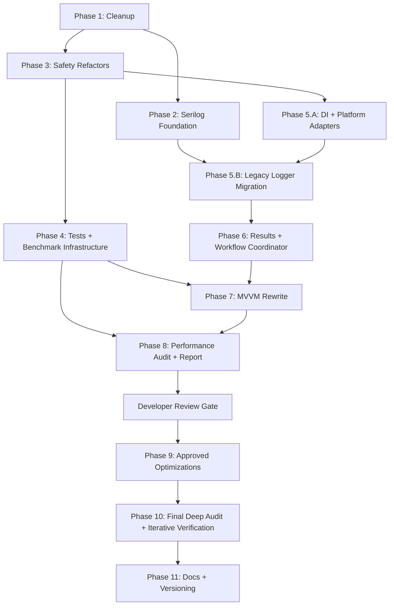

# CalradiaForge Refactor Master Plan

Status: planned
Scope: documentation and implementation planning only. This plan does not authorize source-code implementation by itself.

## Purpose

This document defines the phased refactor plan for the next CalradiaForge beta cycle. The goal is to reduce risk before larger architecture work by sequencing cleanup, logging, persistence safety, installer safety, behavioral tests, benchmark infrastructure, dependency injection, workflow coordination, MVVM extraction, report-first performance review, approved optimization, final verification, and version/documentation cleanup into controlled work orders.

## Source Of Truth

Use this priority when planning or implementing any phase:

1. Existing source code
2. Existing markdown documentation
3. Architecture documents in `docs/Architecture`
4. This refactor plan

If this plan conflicts with source code or locked architecture docs, stop and document the mismatch before editing code.

## Locked Decisions Summary

| Area | Locked decision |
|---|---|
| Layering | UI decides when. Core decides how. Nexus/Core decide how for Nexus-specific work. |
| Core boundary | `CalradiaForge.Core` must remain WPF-free. |
| Nexus boundary | Nexus auth, networking, API calls, downloader mechanics, and transport code belong in `CalradiaForge.Nexus`. |
| Nexus timing | Nexus remains a v1.0 target, but experimental or SSO-gated functionality may ship before full approval. |
| Nexus API strategy | Do not redesign Nexus API strategy here. Existing Nexus architecture docs remain source of truth. |
| AppConfig | `AppConfig` is ordinary JSON settings persistence, not a credential manager. Nexus credentials must remain in the Nexus credential boundary rather than in `AppConfig` or ordinary metadata. |
| Credentials | Nexus credentials must use DPAPI CurrentUser and be decrypted only during explicit Nexus operation scope. |
| Installer authority | `ModInstaller` and `ModExtractor` remain the authoritative archive install pipeline. Do not bypass them. |
| Archive safety | Add module identity preflight and grow toward fuller archive validation in phases. |
| BLSE safety | Use strict BLSE filename/folder allowlist validation; approved BLSE files may be overwritten directly. |
| Persistence | Use atomic writes, backup recovery for important JSON, and graceful corrupt-file handling. |
| Logging | Move to Serilog with structured templates, source context, a neutral presentation formatter, and one application-owned logger lifecycle. The logger performs no automatic secret or path filtering; callers must not intentionally supply credentials or authentication material. Current infrastructure uses an active `CalradiaForge_Latest.log` with `RollingInterval.Infinite` and custom cleanup; Phase 5.A owns construction, startup cleanup, quiescent shutdown, close, and archive sequencing; Phase 5.B owns legacy caller migration. |
| Testing | Add a tiered test strategy, starting with Core unit tests and file-system-heavy integration tests, then establish benchmark infrastructure and evidence rules before the final audit. |
| Platform APIs | Keep the app Windows-first, but isolate Windows-specific APIs behind explicit adapters where practical. |
| DI | Use `Microsoft.Extensions.DependencyInjection`; defer Host Builder unless later justified. |
| DI composition | Phase 5.A uses one `IServiceCollection`, one application-level `ServiceProvider`, separate Core/UI registration modules on the same collection, DI-resolved `MainWindow`, and provider disposal on shutdown. |
| Performance | Phase 4 establishes benchmark infrastructure and provisional baselines; Phase 8 audits without production edits; Phase 9 implements approved findings; Phase 10 performs bounded final verification; Phase 11 closes documentation/versioning. |
| Results | Start with workflow-specific result types; consider shared `Result<T>` only if repetition justifies it. |
| Workflow coordination | Use an install/workflow coordinator for progress, cancellation, completion, failure, cleanup, and UI-facing state. |
| UI state | Use shared `IsBusy`, `StatusMessage`, `ErrorMessage`, `CanCancel`, `CurrentOperation`, and result state patterns. |
| Toasts | Preserve the existing Toast System for user-visible operation notifications. |
| MVVM | Move toward a full shell/viewmodel rewrite, staged by dependency order and risk. |
| Versioning | Use `MAJOR.MINOR.PATCH[-prerelease]`; before v1.0 use `0.MILESTONE.PATCH[-prerelease]`. |
| Version source | `Directory.Build.props` should become the central public app version source of truth. |
| Excluded from this plan | New Nexus runtime implementation, v1.0 polish, unrelated feature work, automatic update checks, timed polling. |

## Locked Decision Details

These details are repeated here so the master plan can stand alone as the execution entry point.

### Nexus Timing And Feature Gating

- Nexus remains in v1.0 scope and is not deferred because SSO approval is pending.
- Experimental Nexus builds may exist before full approval.
- SSO/auth-dependent features must be disabled, mocked, gated, or clearly marked experimental until approval is complete.
- Nexus experimental features should be disabled by default unless intentionally enabled for beta/dev testing.
- Nexus UI may exist before full approval, but experimental actions must be clearly labeled.
- Auth-dependent Nexus gates must remain separate from non-auth planning or metadata features.
- Logs, status messages, and toasts should clearly mark Nexus actions as experimental, unavailable, or waiting on approval.
- Existing Nexus architecture/API strategy docs remain source of truth; this plan must not redesign REST/GraphQL/API abstraction decisions.

### Versioning Specifics

- Use `MAJOR.MINOR.PATCH[-prerelease]`.
- Do not use build metadata for now.
- Before v1.0, use `0.MILESTONE.PATCH[-prerelease]`.
- Patch numbers are intentional released revisions, not raw commit counters.
- Public app version is authoritative for GitHub releases, Nexus Mods releases, changelog entries, app UI display, release artifacts, and installer/package names when applicable.
- Experimental Nexus labels should follow the pattern `v0.13.0-experimental.nexus.1`.
- Experimental Nexus release titles should follow the pattern `CalradiaForge v0.13.0-experimental.nexus.1 - Nexus API Experimental Release`.

### Secret And Logging Specifics

- Automatic secret redaction, secret sanitization, path masking, and secret-pattern filtering are not part of the logging pipeline.
- The custom Serilog formatter is a presentation-format template, not a security component; it renders event values without rewriting them.
- Logging callers must supply appropriate diagnostic data and must not intentionally pass credentials, authentication material, or secret-bearing URLs to the logger.
- Full relevant local filesystem paths may appear in local logs. Any future log export, telemetry, or shared-diagnostic feature requires a separate approved data-handling policy.
- `AppConfig` is not a credential manager. Nexus credentials remain in a purpose-built Nexus credential component using DPAPI CurrentUser storage and operation-scoped decryption.
- The current factory exposes `Create()`, does not retain the created logger, uses the active `CalradiaForge_Latest.log` path, and performs custom cleanup. These are current observations, not the final Phase 5.A lifecycle contract.
- The current `RetainedFileCount` setting is named as a file count while `LogRetentionPolicy.Cleanup(...)` interprets it as an age in days. Count-versus-age semantics remain unresolved.
- `retainedFileCountLimit: default` currently passes a null Serilog file-count limit, and the active sink has no explicit file-size limit. Neither behavior is a locked retention decision.
- Approved Phase 2 Serilog packages are `Serilog`, `Serilog.Sinks.File`, `Serilog.Sinks.Async`, `Serilog.Exceptions`, and `Serilog.Enrichers.Thread`, with `Serilog.Sinks.Debug` referenced only in Debug builds using a conditional `PackageReference` and `#if DEBUG` sink configuration.
- `Serilog.Sinks.Debug` is not required for Debug-level events; Release/Public Release builds may still write Debug-level events to rolling file logs when runtime DebugMode is enabled.
- Do not add `Serilog.Sinks.Console`, `Serilog.Settings.Configuration`, `Microsoft.Extensions.Configuration.Json`, `Serilog.Extensions.Logging`, or `Serilog.Extensions.Hosting` as part of Phase 2.

### Archive And Installer Safety Specifics

- Use a custom hybrid installer safety policy that preserves Bannerlord-specific mod-loading needs while improving safety.
- Exact overwrite, backup, validation, and confirmation rules are not fully locked and need later owner review.
- Module identity preflight should inspect archive openability, module folder name, `SubModule.xml`, mod id/name, version if available, valid Bannerlord module shape, and official/reserved target folders.
- BLSE install/update may directly overwrite approved BLSE files after strict filename/folder allowlist validation.
- BLSE logging should record accepted, skipped, blocked, and overwritten files.
- User-facing status/toast messages should clearly explain blocked unsafe BLSE files.

## Tracked Owner Additions

### Deferred UI Page Rename Review

Some current WPF page `.xaml` names may need to be renamed before broad MVVM extraction or future Nexus UI/API work. The exact rename targets are not approved yet. Before any page rename occurs, create an owner-review checklist that inventories current page names, code-behind classes, navigation references, proposed names, reasons, risks, and owner approval status. Do not rename UI pages without an explicit owner-approved rename map.

XAML page renames are high-risk because they can affect code-behind partial classes, `x:Class`, navigation references, resource dictionaries, bindings, design-time tooling, generated files, and documentation references. This plan records the checkpoint only; it does not define a rename map or authorize renames.

### Known Issue - Steam Workshop Mods Not Automatically Scanned

An end user reported that Bannerlord Steam Workshop mods were not automatically discovered. The report is not fully confirmed yet, but it is important enough to stage as a scanner/path-resolution risk item. The suspected area is Steam Workshop path resolution, especially setups where Bannerlord may be installed in a different Steam library from the main Steam client install.

The app already uses Bannerlord AppID `261550` as part of Workshop path composition, so the staged investigation should not treat the AppID string as the primary suspected issue. Focus planning on Steam client install path versus Steam library path versus Bannerlord install path, multi-library discovery, Workshop path candidates, diagnostics, tests, structured warnings, and UI surfacing. Do not mark this issue fixed until implementation and verification are complete.

### Documentation Alignment Report Integration

The owner has produced `docs/audits/calradiaforge_docs_alignment_report_07-08-26.md`, which recommends aligning CalradiaForge documentation with the OniForge documentation model at the organizational and decision-control level. Refactor documents remain active planning artifacts and must not become canonical architecture automatically.

As refactor phases produce accepted decisions, migrate only stable decisions into canonical architecture docs, application-system docs, data/persistence docs, development/testing docs, ADRs, changelog entries, or release notes. Do not copy speculative planning text into canonical architecture, and do not perform the full documentation rebuild from the report as part of this master-plan update.

### Serilog Logger Lifecycle Follow-Up - 2026-07-12

The current follow-up review records that `SerilogLoggerFactory` is an instance service whose current public method is `Create()`. It receives `AppConfigSettings`, uses `AppPaths.LogsFilePath` (`CalradiaForge_Latest.log`), performs custom cleanup, configures an infinite active file sink, and returns a logger without retaining it. The current source does not yet prove one application-owned logger instance or safe shutdown ownership.

Phase 5.A must establish one factory singleton and one shared logger instance, perform cleanup once before opening the active sink, and define startup/shutdown ownership. Shutdown must quiesce logging-producing work, await or confirm completion, close exactly once, release the active file handle, attempt collision-safe archive without overwriting, and preserve the active file when archive fails. Phase 5.B separately owns legacy call-site migration and caller review. The file-count-versus-age mismatch, active-file size-limit behavior, and global `Serilog.Log.Logger` versus direct DI ownership remain owner decisions. The named source-folder workflow guide is not present in the current package and is not treated as current guidance.

## Phase Order

| Phase | Name | Primary outcome |
|---:|---|---|
| 1 | Cleanup And Low-Risk Consistency Fixes | Reduce noise before deeper refactors. |
| 2 | Serilog Infrastructure Foundation | Establish structured logging and neutral formatting while keeping the legacy logger compatibility path in place; no application lifecycle ownership is claimed. The former redaction infrastructure is historical and superseded. |
| 3 | Small Safety Refactors | Harden compact high-risk areas: BLSE, archive preflight, persistence. |
| 4 | Initial Tests And Performance Benchmark Infrastructure Around Changed Risky Areas | Add behavioral protection plus reusable benchmark and measurement infrastructure. |
| 5.A | DI And Platform Adapter Foundation | Introduce service composition and isolate Windows-specific behavior; establish one logger owner, startup cleanup, quiescent shutdown, exact-once close, and collision-safe archive. |
| 5.B | Legacy Logger Call-Site Migration | Stage legacy logger callers onto the Serilog path after the foundation is verified, including caller review so credential-owning components do not intentionally pass credentials or authentication material to logs. |
| 6 | Result Types And Workflow Coordinator | Standardize operation outcomes and long-running workflow state. |
| 7 | Staged MVVM Shell/ViewModel Rewrite | Move WPF presentation toward consistent MVVM. |
| 8 | Performance Audit And Report Generation | Produce an evidence-backed post-refactor performance report without production-code edits. |
| 9 | Approved Performance Optimization Implementation | Implement only explicitly approved `PERF-NNN` findings and compare before/after evidence. |
| 10 | Final Post-Refactor Deep Audit And Iterative Verification | Complete bounded build/test/benchmark/analyzer/architecture/manual-smoke verification and justified corrections. |
| 11 | Final Documentation And Versioning Cleanup For Next Beta | Align release documentation with the final verified implementation. |

## Phase Overview Matrix

| Phase | Depends on | Main work slices | Deliverables | Verification |
|---:|---|---|---|---|
| 1 | None | Cleanup, naming, stale comments, low-risk warnings | Deferred-risk notes; clean build | `dotnet build source/CalradiaForge.slnx` |
| 2 | Phase 1 preferred | Serilog infrastructure, active-file configuration, custom cleanup, neutral formatting, source context, scanner diagnostics planning | Logging foundation implemented; no application lifecycle ownership claimed; legacy logger compatibility preserved; former redaction infrastructure superseded | Build; log creation; formatter output checks |
| 3 | Phase 1 preferred; Phase 2 helpful | BLSE allowlist, archive preflight, atomic JSON writes, scanner/path-resolution investigation | Safer install/persistence behavior; scanner issue confirmed, deferred, or fixed only by explicit scoped work | Build; BLSE/archive/persistence smoke checks |
| 4 | Phase 3 initial changes | Core tests, persistence tests, archive/BLSE tests, modpack workflow tests, fake Steam library scanner tests, benchmark fixtures/harness, measurement and analyzer readiness | Test project, benchmark infrastructure, isolated fixtures, and provisional baseline labels | Build; `dotnet test`; approved Release benchmark command |
| 5.A | Phases 1 and 3; Phase 4 preferred | DI setup, service lifetimes, platform adapters, path-resolution abstractions, logger ownership and lifecycle | Clear composition root; one logger owner; startup cleanup; quiescent close and archive contract | Build; startup/shutdown smoke tests; singleton identity; archive and disposal checks |
| 5.B | Phases 2 and 5.A | Legacy logger call-site batches, compatibility cleanup, staged Serilog caller migration, caller review for intentional credential logging | Legacy logger usage migrated in verified batches; compatibility path retired after verification | Build; staged logging smoke tests; formatter/minimum-level checks |
| 6 | Phases 2, 3, and 5.B | Workflow result types, install coordinator, progress/cancel/failure state, scanner warnings | Consistent workflow outcomes and UI state path | Build; workflow smoke tests; targeted tests |
| 7 | Phases 5.A, 5.B, and 6; Phase 4 preferred | MVVM conventions, shell/navigation, page ViewModels, command/state patterns, scanner status surfacing | Major UI workflows extracted to ViewModels | Build; ViewModel tests; UI smoke test |
| 8 | Phases 4-7 settled | Release benchmarks, allocations, analyzers, architecture/performance inspection, logger lifecycle evidence, SevenZipWrapper comparability, classified findings, dated audit report | Authoritative post-Phase-7 baseline and pending developer decisions | Build; tests; Release benchmarks; logger lifecycle checks; analyzers; report review |
| 9 | Phase 8 developer decisions | Approved finding IDs, small optimization batches, regression tests, comparable before/after benchmarks, logger performance changes only when approved, report updates | Approved changes and finding dispositions | Build; tests; benchmarks; allocation comparison; logger checks; reviewer pass; manual inspection |
| 10 | Phase 9 settled | Full verification loop, logger ownership/shutdown/archive inspection, architecture inspection, manual WPF smoke checks, narrowly scoped corrective changes | Final verification, limitations, and updated audit report | Build; tests; benchmarks; analyzers; logger lifecycle checks; architecture review; smoke tests |
| 11 | Phase 10 settled | Version source, changelog, release docs, final alignment, accepted performance handoff | Release-ready docs and version consistency | Build; UI version check; docs review |

## Phase Dependency Map



## Phase Deliverables Checklist

- [X] Phase 1: Low-risk cleanup completed or deferred with notes; build passes. (Completed)
- [X] Phase 2: Serilog infrastructure, retention, source context, neutral formatting, and approved package usage are implemented and documented inside the Core logging folder while the legacy logger compatibility path and all existing call sites remain in place. The original Phase 2 redaction infrastructure is retained as history only and was superseded by the 2026-07-12 owner decision. (Completed)
- [ ] Phase 3: The implementation/reviewer pass completed the decision-safe archive and persistence slices; owner-gated BLSE, reserved-folder, named-modpack recovery, normal-upgrade policy, flat-archive target naming/blocking, and Steam scanner choices remain explicitly deferred pending manual inspection and approval.
- [ ] Phase 4: Core tests and reusable performance benchmark infrastructure exist; correctness tests and benchmarks are separated; provisional baselines are labeled.
- [ ] Phase 5.A: One `IServiceCollection` and one application provider are used; Core/UI registrations are separated; `MainWindow` is DI-resolved without duplicate `StartupUri` construction; singleton identity, Serilog construction, and provider disposal are verified.
- [ ] Phase 5.B: Legacy logger call sites are migrated in verified batches and the compatibility path is retired only after verification.
- [ ] Phase 6: Workflow result contracts and coordinator state are implemented for selected high-risk workflows.
- [ ] Phase 7: Shell/navigation and major page workflows use consistent ViewModel patterns.
- [ ] Phase 8: A post-refactor performance audit report exists with authoritative baselines, classified findings, SevenZipWrapper comparability, and pending developer decisions; no production optimization was performed.
- [ ] Phase 8 developer gate: Every proposed optimization is approved, modified, rejected, deferred, marked needs-more-evidence, or out of scope before Phase 9 begins.
- [ ] Phase 9: Only approved performance findings are implemented; tests and comparable before/after benchmarks are recorded; ineffective or harmful changes are reverted or explicitly dispositioned.
- [ ] Phase 10: The full relevant test, benchmark, analyzer, architecture, and manual-smoke verification loop satisfies the practical stopping criteria.
- [ ] Phase 11: Versioning, changelog, release documentation, performance report status, and documentation-alignment handoff match the final verified implementation.
- [ ] Steam Workshop scanner/path-resolution issue is tracked across phases and is only marked fixed after implementation and verification.
- [ ] UI page rename review is completed only with an owner-approved rename map before any `.xaml` rename.
- [ ] Documentation alignment report decisions are handed off without making refactor plans canonical architecture by default.

## Global Codex Guardrails

- Do not implement source changes from this plan unless a later task explicitly asks for implementation.
- Keep each implementation task scoped to one phase or one clearly bounded slice of a phase.
- Do not bundle MVVM, DI, logging, persistence, and installer safety into one uncontrolled change set.
- Preserve `CalradiaForge.Core` as WPF-free.
- Preserve Nexus networking/auth/downloader ownership in `CalradiaForge.Nexus`.
- Keep secrets out of `AppConfig`.
- Do not store Nexus metadata in `ModuleModel`.
- Do not add startup update checks, timed polling, silent scans, or background Nexus polling.
- Do not bypass `ModInstaller` or `ModExtractor`.
- Do not rename UI page `.xaml` files unless the owner has provided an explicit approved rename map.
- Do not change major/minor versions without owner approval.
- Update relevant docs whenever architecture behavior changes.
- Do not migrate legacy logger call sites before Phase 5.B.
- Do not add unapproved Serilog packages or dev-only sinks to Release/Public Release artifacts.
- Do not create separate Core and UI service providers; preserve one collection and one application provider.
- Do not use the root provider as a hidden service locator or register WPF types from Core.
- Do not retain `StartupUri` when DI resolves and shows `MainWindow`.
- Do not alter DI lifetimes or duplicate Serilog construction solely to improve benchmark output.
- Do not create multiple logger instances, repeat factory creation, or introduce multiple logger disposal paths.
- Do not close or archive the logger while workflows can still emit events; do not rename the active file while its handle is held.
- Do not change retention semantics, active-file size behavior, or archive naming without explicit owner review.
 - Do not introduce automatic secret/path filtering or generic key-name blocking as part of a later phase.
- Do not rely on `Log.CloseAndFlush()` unless the shared logger is intentionally assigned to `Serilog.Log.Logger` and ownership has one global close path; do not assume the Serilog default file-count limit is 31 or that the current active file is size-unlimited.
- Do not perform production-code optimization during the Phase 8 performance audit/report phase.
- Do not implement a performance finding without explicit developer approval.
- Do not claim a performance improvement without comparable before/after evidence when measurement is practical.
 - Do not weaken correctness, validation, archive safety, persistence safety, logging, cancellation, cleanup, or architecture boundaries to improve a benchmark.
- Do not treat one stopwatch result, Debug execution, or an incomparable third-party baseline as proof.
- Do not add benchmark/analyzer packages, blocking thresholds, or large fixtures without explicit approval.
- Do not pursue theoretical micro-optimizations indefinitely; use Phase 10 practical stopping criteria.

## Phase 1 - Cleanup And Low-Risk Consistency Fixes

| Work-order field | Detail |
|---|---|
| Purpose | Reduce codebase noise before deeper refactors so later diffs are easier to review. |
| Included work | Naming and spelling cleanup; stale comments; low-risk warning cleanup; README/changelog/TODO consistency notes; safe dead-code review only where behavior is clearly unused; record the Steam Workshop scanner/path-resolution report as a known issue; add a deferred UI page rename review checkpoint. |
| Excluded work | MVVM rewrite, DI conversion, installer behavior changes, Nexus implementation, large file moves, ownership changes, or UI page `.xaml` renames. |
| Affected areas | `source/CalradiaForge.Core`, `source/CalradiaForge.UI`, `docs/`, and project metadata only when cleanup is low-risk. |
| Implementation notes | Prefer small mechanical changes. Avoid behavior changes unless the behavior is obviously broken and separately verified. For Steam Workshop scanning, identify current scanner/path-resolution classes and methods without changing behavior. For UI page names, create or update a review checklist only; do not invent rename targets. |
| Dependency ordering | Run before large refactors. Risky cleanup should wait until Phase 4 coverage exists. |
| Do before | Read current architecture docs and audit notes. Check build warnings and identify low-risk items. |
| Do after | Record deferred cleanup that requires tests or owner confirmation, including Steam Workshop path-resolution follow-up and any UI page rename candidates needing owner review. |
| Exit criteria | Obvious typo/stale-comment cleanup is complete or tracked; no architecture boundary changes were introduced; Steam Workshop scanner/path-resolution remains tracked as unresolved planning work unless a later scoped fix verifies it; build still succeeds. |
| Risk notes | Renames may affect XAML bindings or reflection-like usage. UI page `.xaml` renames are deferred until an owner-approved rename map exists. Small cleanup can still change install, launch, scanner, or persistence behavior. |
| Verification | `dotnet build source/CalradiaForge.slnx`; manual smoke check if UI-bound names or bindings change. |
| Codex guardrails | Do not refactor unrelated systems. Stop before behavior changes in high-risk workflows. |
| Documentation updates | Update architecture docs only if cleanup corrects stale documented names or responsibilities. Keep `docs/refactor/ui_page_rename_review_checklist.md` as a checklist/template, not a completed rename plan. |

### Deferred Owner Checkpoint - UI Page Rename Review

Before broad MVVM extraction or future Nexus UI work begins, create a short owner-review document that inventories current UI pages, current page names, code-behind names, navigation references, and proposed rename candidates. Do not perform any rename until the owner approves an explicit rename map.

### Known Issue Planning Note - Steam Workshop Scanner

Record the end-user Steam Workshop scanning report as a deferred-risk item. The app already uses Bannerlord AppID `261550`; Phase 1 should only identify current scanner/path-resolution ownership and preserve the likely investigation focus on Steam library discovery and Workshop path resolution.

## Phase 2 - Serilog Infrastructure Foundation

| Work-order field | Detail |
|---|---|
| Purpose | Build the Serilog infrastructure foundation inside the existing Core logging folder while keeping the current custom `Logger` class and all existing logger call sites in place for later migration. Phase 2 does not establish application startup or shutdown ownership. |
| Included work | New Serilog infrastructure files under `source/CalradiaForge.Core/Infra/Logging/`; setup/factory/configuration methods needed for later migration; rolling file sink using `Serilog.Sinks.File`; async sink using `Serilog.Sinks.Async`; thread enrichment using `Serilog.Enrichers.Thread`; exception enrichment using `Serilog.Exceptions`; Debug-build-only debug sink using conditional `Serilog.Sinks.Debug`; retention/archive helpers or planning; neutral text formatting; a short legacy/deprecated compatibility summary in the old `Logger` file. |
| Excluded work | Rewriting existing logger call sites; removing the old `Logger` file; routing existing Core/UI callers to the new Serilog caller methods; initializing the new logger service through WPF singleton startup before DI composition exists; injecting Serilog into every service; moving to `Microsoft.Extensions.Logging.ILogger<T>`; adding extra logging/configuration package dependencies; adding `Serilog.Sinks.Console`; replacing the existing custom app config JSON manager; full dependency injection conversion; Host Builder adoption; logging raw secrets; Nexus auth implementation; telemetry or remote logging. |
| Affected areas | New Serilog logging infrastructure in `source/CalradiaForge.Core/Infra/Logging/`, the existing legacy `Logger` file summary/comment only, future logging plumbing, approved package usage, and debug-mode settings. |
| Implementation notes | Keep the current custom `Logger` API working and leave all current `Logger.Instance` call sites in Core and UI untouched. Build the new Serilog foundation first so later call-site migration can happen in Phase 5.B. Do not initialize the new Serilog service through the WPF app service startup path until Phase 5.A establishes dependency-injection composition. Runtime DebugMode must still be able to write Debug-level events to production-approved file logs in Release/Public Release builds; `Serilog.Sinks.Debug` is only for Visual Studio/debugger output in Debug builds. Normal debug logs should call `logger.Debug(...)` after migration. Guard only expensive diagnostic construction. The formatter renders applicable event values and does not inspect, mask, redact, or sanitize them. The current factory uses an infinite active `CalradiaForge_Latest.log` and custom cleanup; Phase 2 records that fact but does not claim final retention or logger lifecycle ownership. Plan structured diagnostic events for Steam/Bannerlord path resolution: detected platform, detected Steam client path if available, discovered Steam library roots, Bannerlord install path, resolved Workshop path candidates, selected Workshop path, scanner result counts, and skipped/missing candidate reasons. |
| Dependency ordering | Should precede Nexus auth implementation and broader result/workflow logging. Must be complete before Phase 5.B call-site migration. |
| Do before | Confirm the approved package set already added to `CalradiaForge.Core`. Identify current logger behavior that must be preserved. Identify the existing Core logging folder as the only location for new Serilog infrastructure files. |
| Do after | Keep the legacy logger compatibility path and all current call sites in place until Phase 5.B verification confirms equivalent Serilog behavior, then remove obsolete custom logger paths only as part of the staged call-site migration. |
| Exit criteria | Serilog infrastructure exists in the Core logging folder, approved package usage is respected, Release/Public Release builds exclude the Debug sink package/configuration, and the current custom logger plus all existing call sites still function as the compatibility path. No Phase 5.A startup, ownership, close, or archive behavior is implied. |
| Risk notes | Broad call-site changes can obscure failures. Caller-supplied credentials or authentication material could still be written if a caller intentionally supplies them, so credential-owning components must keep those values out of ordinary logging. |
| Verification | Build succeeds; Release/Public Release build does not reference/configure `Serilog.Sinks.Debug`; Debug build conditionally compiles the Debug sink; any isolated Serilog factory/configuration smoke checks pass where practical; formatter output is inspected without requiring WPF UI navigation. |
| Codex guardrails | Do not add Nexus credentials or auth flow. Do not store logging secrets in `AppConfig`. Do not add unapproved logging packages. Do not add `Serilog.Sinks.Console`. Do not migrate existing logger call sites in Phase 2. Do not remove the legacy `Logger` file. |
| Documentation updates | Update `docs/Architecture/Systems/Logging.md`, `docs/refactor/logging_policy.md`, and cross-reference the secret-boundary policy. |

### Approved Phase 2 Package Set

Phase 2 must use the package set already added to `CalradiaForge.Core`:

```xml
<ItemGroup>
    <PackageReference Include="Serilog" Version="4.3.1" />
    <PackageReference Include="Serilog.Sinks.File" Version="7.0.0" />
    <PackageReference Include="Serilog.Sinks.Async" Version="2.1.0" />
    <PackageReference Include="Serilog.Exceptions" Version="8.4.0" />
    <PackageReference Include="Serilog.Enrichers.Thread" Version="4.0.0" />
</ItemGroup>

<ItemGroup Condition="'$(Configuration)' == 'Debug'">
    <PackageReference Include="Serilog.Sinks.Debug" Version="3.0.0" PrivateAssets="all" />
</ItemGroup>
```

`Serilog.Sinks.Debug` is a development-only sink for Visual Studio/debugger output. It must not be referenced or configured in Release/Public Release artifacts. It is not required for Debug-level log events; runtime DebugMode in Release/Public Release builds must still write Debug-level events to production-approved sinks such as rolling file logs.

Do not add `Serilog.Sinks.Console`, `Serilog.Settings.Configuration`, `Microsoft.Extensions.Configuration.Json`, `Serilog.Extensions.Logging`, or `Serilog.Extensions.Hosting` in Phase 2.

### Phase 2 Legacy Logger Preservation Rule

Phase 2 must preserve the old logger implementation as a compatibility path. Codex may add a short legacy/deprecated compatibility summary to the existing `Logger` file, but must not remove that file and must not alter existing logger call sites across Core or UI. Those call sites are intentionally preserved so Phase 5.B can inventory and migrate them after dependency injection is established.

### Steam Workshop Scanner Diagnostics Planning

When logging work begins, add or plan structured diagnostics around Steam library and Workshop path resolution. Diagnostics must help distinguish Steam client install path, Steam library roots, Bannerlord install path, Workshop path candidates, selected path, and scanner result counts. Do not log secrets or unrelated personal filesystem data.

## Phase 3 - Small Safety Refactors

| Work-order field | Detail |
|---|---|
| Purpose | Improve compact, high-value safety areas before larger architecture changes. |
| Included work | BLSE allowlist validation; module identity preflight; simple archive containment planning; atomic JSON writes; backup recovery for important JSON; reserved/official module folder protection planning; targeted Steam Workshop scanner/path-resolution stabilization if scoped and verifiable. |
| Excluded work | Full installer policy finalization if Bannerlord-specific constraints need owner review; full archive security scanner; full persistence migration framework; Nexus download implementation. |
| Affected areas | `ModInstaller`, `ModExtractor`, `BLSEInstaller`, `ModsData`, `ModpackData`, `AppConfig`, last-used load order persistence, and future Nexus metadata policy. |
| Implementation notes | Keep install authority in `ModInstaller`/`ModExtractor`. Preflight reports archive openability, module folder name, `SubModule.xml`, mod id/name, version when available, valid module shape, and reserved/official folder targeting before destructive install steps. BLSE may overwrite approved files after allowlist validation; accepted, skipped, blocked, and overwritten files must be logged and blocked files must be surfaced through status/toasts. For Steam Workshop scanning, do not assume Workshop content is under the main Steam client install folder; prefer resolving Steam library roots first, then checking valid `steamapps/workshop/content/261550` candidates. |
| Dependency ordering | Precedes Nexus downloads and broad MVVM work. Should precede or pair with tests for changed areas. |
| Do before | Identify official/reserved module folders. Confirm current persistence ownership. Document Bannerlord-specific installer constraints needing review. Confirm whether end-user Steam Workshop setup details are known before treating scanner work as a fix. |
| Do after | Add tests in Phase 4 and update archive/persistence docs. Preserve existing successful scanner behavior for users whose current setup works. |
| Exit criteria | Safety rules are implemented or explicitly deferred; `AppConfig` remains non-secret; targeted persistence writes are safer; installer authority remains unchanged. |
| Risk notes | Overly strict preflight can block valid mod layouts. Persistence recovery can prefer stale data if ordering is wrong. Steam Workshop path changes can regress users whose current library layout already scans successfully. |
| Verification | Build succeeds; manual normal archive and BLSE smoke tests; corrupt JSON recovery behavior verified; blocked unsafe inputs produce user-visible status/logs; scanner/path behavior is verified only if this phase explicitly implements a scoped fix. |
| Codex guardrails | Do not bypass `ModInstaller` or `ModExtractor`. Stop and ask if overwrite policy would alter expected Bannerlord mod loading behavior. |
| Documentation updates | Update `archive_installer_safety_policy.md`, `persistence_policy.md`, `docs/Architecture/Systems/ModManagement.md`, and `docs/Architecture/Systems/Configuration.md`. |

### Steam Workshop Scanner Safety Candidate

Investigate Steam Workshop path detection and Bannerlord Workshop mod discovery as a targeted safety/bugfix candidate. If the bug cannot be confirmed yet, keep the work documented and deferred until end-user setup details are known. Do not describe this issue as fixed unless implementation and verification happened.

The Phase 3 investigation confirmed that current auto-detection checks only the Steam client library and can misclassify a valid Steam install when its Workshop directory is absent. It also found competing scanner-layout limitations and no checked-in fake-root fixtures. Implementation remains deferred: library-candidate precedence, manual-override behavior, and representative verification must be approved before changing source, and the reported end-user issue must not be described as fixed.

## Phase 4 - Initial Tests And Performance Benchmark Infrastructure Around Changed Risky Areas

| Work-order field | Detail |
|---|---|
| Purpose | Add focused behavioral protection for high-risk Core workflows and establish reusable benchmark, analyzer, fixture, allocation, and baseline infrastructure for later performance phases. |
| Included work | Core unit/regression tests; persistence, parser, archive, BLSE, modpack, logging, scanner/path, result, and integration-style filesystem tests; approved benchmark project or harness; representative datasets; Release benchmark commands; allocation and environment reporting; provisional baseline capture; SevenZipWrapper source/methodology review. |
| Excluded work | Final performance conclusions against code that later phases will change; speculative production optimization; fragile exact-duration unit tests; broad WPF UI automation; unapproved analyzer/benchmark packages; real Steam or Bannerlord dependencies. |
| Affected areas | Test and benchmark projects, solution/build documentation, fixture data, test helpers, result conventions, and performance-sensitive Core workflows. |
| Implementation notes | Separate correctness tests from benchmarks. Use Release builds, warmup, repeated iterations, isolated temporary directories, controlled fixtures, environment metadata, and explicit provisional-baseline labels. The authoritative post-refactor baseline is captured in Phase 8 after Phase 7 settles. |
| Dependency ordering | Follows initial Phase 3 changes. Creates infrastructure before DI, logger migration, workflow coordination, and MVVM work; it does not perform the decisive final audit. |
| Do before | Select test and benchmark frameworks only with approval; inspect solution/project naming; identify legal fixtures; locate existing SevenZipWrapper benchmark evidence and metadata. |
| Do after | Expand tests and benchmarks as Phases 5-7 change workflows while preserving comparability and methodology records. |
| Exit criteria | Meaningful tests run; approved benchmark infrastructure runs representative Release cases; fixtures are deterministic and isolated; analyzer/measurement commands are documented; provisional baselines are clearly labeled; no production optimization was performed merely to improve Phase 4 results. |
| Risk notes | Filesystem and startup timings are environment-sensitive. Large fixtures can increase repository cost. Poor thresholds can create flaky CI. Benchmark scaffolding can encode unstable implementation details. |
| Verification | `dotnet build source/CalradiaForge.slnx`; `dotnet test source/CalradiaForge.slnx`; approved Release benchmark command; clean-workspace fixture validation. |
| Codex guardrails | Do not require real user paths, Steam, Bannerlord, Nexus credentials, or network access. Do not add timing assertions to normal tests. Do not add packages, analyzers, blocking thresholds, or speculative production optimizations without approval. |
| Documentation updates | Expand `testing_strategy.md`; add and cross-reference `performance_audit_and_optimization_policy.md`; update contributor/build docs only when commands or CI change. |

### Steam Workshop Scanner Test Scenarios

Use fake temp directories to cover Steam client installed on one root while Bannerlord is under another Steam library root, multiple Steam library roots, Workshop content under the Bannerlord library root, missing Workshop content, Workshop content with no valid modules, and manual override behavior if supported.

## Phase 5 - Dependency Injection And Logger Migration

Phase 5 is split into 5.A and 5.B. Phase 5.A establishes DI and platform adapters. Phase 5.B migrates legacy logger call sites after the Serilog foundation from Phase 2 is in place and verified.

### Phase 5.A - DI And Platform Adapter Foundation

| Work-order field | Detail |
|---|---|
| Purpose | Establish one explicit application composition root, one shared `ServiceProvider`, separate Core/UI registration modules, constructor injection, test-replaceable platform boundaries, and stable service lifetimes without changing externally observable behavior. |
| Included work | Add the approved DI package; create Core and UI registration modules; create one `IServiceCollection` in `App.xaml.cs`; register configuration, one Serilog factory and one shared logger, Core services, app-wide UI services, windows, pages, and ViewModels with explicit lifetimes; build one provider; resolve `MainWindow`; replace `StartupUri` when DI startup becomes active; establish cleanup-before-open and shutdown quiescence, exact-once logger close, active-handle release, collision-safe archive, provider disposal, and archive-failure preservation; introduce approved platform/path adapters. |
| Excluded work | Separate Core/UI providers; Host Builder adoption; broad service rewrites solely for DI style; full MVVM conversion; Phase 5.B logger call-site migration; new Nexus runtime/network/auth implementation; behavior-changing lifetime redesign without approval. |
| Affected areas | `App.xaml`, `App.xaml.cs`, Core and UI registration modules, startup/bootstrap code, service constructors, selected windows/pages/ViewModels, logging construction, platform adapters, and tests. |
| Implementation notes | `App.xaml.cs` remains the composition root. `AddCoreServices(...)` and `AddUiServices(...)` extend the same collection. Core registration remains WPF-free. The current source exposes non-retaining `Create()`, not `Build()`; the final factory-owned versus DI-owned logger decision remains open, but Phase 5.A must produce exactly one shared instance and prohibit double disposal. Cleanup must occur once at startup before opening the active file. Shutdown must stop new logging-producing work, cancel and await or confirm active work, close the logger exactly once, release the file handle, attempt a no-overwrite collision-safe archive, and then dispose remaining resources according to the selected ownership order. Windows/pages/ViewModels default to transient unless state preservation justifies a documented exception. Constructor injection replaces static `App.*` access as consumers migrate. |
| Dependency ordering | Follows Phases 1 and 3; Phase 4 is preferred so singleton identity, adapter substitution, and startup behavior can be protected. Precedes Phase 5.B, Phase 6, and Phase 7. |
| Do before | Inventory static `App.*` access, startup construction order, `StartupUri`, disposable services, state ownership, and UI/Core boundaries. Confirm the exact registration filenames during implementation without inventing package or project choices here. |
| Do after | Verify one provider and one instance of every intended singleton; verify DI-resolved `MainWindow`; verify cleanup once before open; verify shutdown quiescence, logger close exactly once, active-handle release, archive collision/failure behavior, and provider disposal; migrate logger callers only in Phase 5.B; use the DI graph for later workflow and ViewModel construction. |
| Exit criteria | One collection and one provider are used; Core/UI registrations are separated; Core remains WPF-free; `MainWindow` is DI-resolved without duplicate `StartupUri` construction; singleton identity and startup behavior match expectations; logger ownership and disposal are unambiguous; cleanup occurs once; shutdown cannot close while logging work remains; archive does not overwrite and preserves the active file on failure; provider disposal is verified; key services/adapters can be replaced in tests. DI is still planned until these implementation criteria are actually met. |
| Risk notes | Multiple providers or repeated factory creation duplicate singletons; incorrect lifetimes lose or retain state; premature disposal breaks workflows; static access can survive as a hidden service locator; retained `StartupUri` can create duplicate windows; closing while work logs can lose events; renaming while a non-shared file handle is held can fail; archive collisions can overwrite evidence unless rejected or renamed safely. |
| Verification | Build; targeted registration tests; singleton identity; factory invocation count; cleanup-once and cleanup-before-open checks; constructor resolution; startup smoke test; duplicate-window check; shutdown quiescence and exact-once close/disposal check; handle-release-before-archive check; no-overwrite collision tests; archive failure preservation; Core reference-boundary check; adapter-substitution tests. |
| Codex guardrails | Do not create separate providers. Do not resolve services from the provider inside arbitrary pages/controls. Do not register WPF types in Core. Do not add Host Builder without approval. Do not move Nexus runtime concerns into Core. Do not perform Phase 5.B logger migration here. |
| Documentation updates | Update `dependency_injection_plan.md`; update canonical architecture docs only for accepted implemented composition decisions; record lifetime exceptions, unresolved static access, or deferred adapters explicitly. |

### Phase 5.B - Legacy Logger Call-Site Migration

| Work-order field | Detail |
|---|---|
| Purpose | Convert legacy `Logger.Instance` usage to the approved Serilog logging caller methods or logging abstraction in controlled batches after the DI foundation is in place and the Phase 2 Serilog foundation is verified. |
| Included work | App-wide logger call-site migration in staged batches; preserving behavior while improving structured logging; keeping minimum-level behavior intact; reviewing migrated callers so credential-owning components do not intentionally pass credentials or authentication material to the logger; retiring the legacy logger compatibility path only after equivalent Serilog behavior is verified. |
| Excluded work | One uncontrolled pass over all call sites; new logging packages or Host Builder adoption; changing app configuration architecture; adding `ILogger<T>` as the target for this phase. |
| Affected areas | Existing logger call sites, shared logging call patterns, and compatibility cleanup after verification. |
| Implementation notes | Keep the migration staged so failures stay reviewable. Preserve existing behavior while moving callers onto the new Serilog foundation. Remove the old logger compatibility path only after verification shows the Serilog path is equivalent for the migrated call sites. |
| Dependency ordering | Follows Phase 5.A and Phase 2. Completes before later workflow/UI phases depend on the updated logging shape. |
| Do before | Verify the Phase 2 Serilog foundation is stable and Phase 5.A dependency-injection composition is usable. Inventory the legacy logger call sites preserved from Phase 2 and group them into manageable batches. |
| Do after | Remove obsolete custom logger paths only after equivalent Serilog behavior is verified. |
| Exit criteria | Legacy logger call sites are migrated in verified batches; the compatibility path is no longer needed; minimum-level and formatter behavior remain intact. |
| Risk notes | Batch migration can expose hidden logger assumptions. Removing the compatibility path too early can break behavior. Caller review must still keep credentials out of ordinary logs. |
| Verification | Build succeeds; migrated scenarios log through Serilog; structured-property and exception-data behavior is reviewed; minimum-level and formatter checks pass; legacy logger removal is deferred until verification is complete. |
| Codex guardrails | Do not bypass the staged migration sequence. Do not add unrelated logging architecture changes. |
| Documentation updates | Update `docs/refactor/logging_policy.md` and `docs/refactor/dependency_injection_plan.md` if the broader refactor plan is later allowed to change them. |

### Steam Workshop Path Adapter Planning

Move Steam library discovery, Bannerlord install detection, and Workshop path resolution behind explicit platform/path-resolution abstractions when this phase reaches scanner work. Manual override behavior, if present, should remain supported unless explicitly removed later.

### Performance Planning Cross-References

- Phase 2: Later audit logging allocations, disabled-level work, neutral formatting, enrichment, and sink behavior without weakening required diagnostics.
- Phase 3: Preserve stable archive, persistence, configuration, and scanner boundaries and fixtures for Phase 4 measurement; do not add instrumentation that changes safety behavior.
- Phase 5.B: Later audit disabled-level work, message templates, enrichment, async sink behavior, caller-supplied property construction, and expensive diagnostic construction.
- Phase 6: Preserve progress, cancellation, result construction, cleanup, and coordinator semantics while allowing workflow overhead to be measured.
- Phase 7: Include UI-thread responsiveness and startup/manual smoke observations in later audit scope; do not create fragile wall-clock UI unit tests.

## Phase 6 - Result Types And Workflow Coordinator

| Work-order field | Detail |
|---|---|
| Purpose | Make important workflows report success, failure, warnings, and user-facing messages consistently, and give long-running install operations one clear coordination layer. |
| Included work | Workflow-specific result types; install workflow coordinator; progress/cancellation/completion/failure/cleanup ownership; scanner/path-resolution warnings; UI-facing status/error messages; toast integration; future Nexus download-to-install handoff planning. |
| Excluded work | App-wide generic `Result<T>` unless repetition justifies it; WPF dependencies in Core; duplicate installer logic; Nexus download implementation. |
| Affected areas | Install workflow, archive validation, BLSE validation/install, persistence save/load/recovery, mod scan/refresh, Steam Workshop path detection, modpack import/export, future Nexus auth/download workflows, and toast/status state. |
| Implementation notes | Result objects should support success/failure, code, user-facing message, technical/log message, warnings, and affected path/mod where useful. Coordinator may initially wrap current installer/event flow. Mod scan/refresh should distinguish "no Workshop mods installed," "Workshop path could not be resolved," and "Workshop path exists but scan failed." |
| Dependency ordering | Follows logging and safety foundations. Works best after Phase 5.B. Should precede or coordinate with MVVM extraction. |
| Do before | Identify current mixed result styles. Decide first workflows to standardize. |
| Do after | Use coordinator state in ViewModels during Phase 7. Add or update tests for result-producing workflows. |
| Exit criteria | High-risk workflows have clearer result contracts; install completion/failure/cancellation paths are observable; scanner/path warnings have a structured result path when scanner work is implemented; UI can show busy/status/error/result state consistently. |
| Risk notes | Over-standardizing too early can add ceremony. Coordinator may duplicate service responsibilities if boundaries are unclear. |
| Verification | Build succeeds; tests cover result mapping where practical; manual install success/failure/cancel/cleanup paths; logs and toasts match outcomes. |
| Codex guardrails | Keep Core WPF-free. Keep installer authority in Core services. Do not add broad generic result abstractions unless proven useful. |
| Documentation updates | Update `result_and_workflow_policy.md` and architecture docs when coordinator behavior is implemented. |

### Steam Workshop Scanner Result Planning

Mod scan/refresh should report structured warnings when Workshop path detection fails, when no Workshop path candidates exist, or when Workshop mods are not found. User-facing messages should be concise; technical details should go to logs.

## Phase 7 - Staged MVVM Shell/ViewModel Rewrite

| Work-order field | Detail |
|---|---|
| Purpose | Move WPF presentation toward consistent MVVM across shell, navigation, pages, commands, workflow state, dialogs, and user-visible feedback. |
| Included work | MVVM conventions; base ViewModel patterns; command patterns; shared UI operation state; shell/navigation refactor; high-risk workflow ViewModels for install, scan/refresh, BLSE, and modpacks; Steam Workshop scan warning surfacing; deferred UI page rename checkpoint before page extraction; remaining page ViewModels; ViewModel tests. |
| Excluded work | One-pass full UI rewrite; unrelated visual redesign; unrelated new features; business logic in ViewModels that belongs in Core; Nexus networking in UI. |
| Affected areas | `MainWindow`, `ModsPage`, `ModpacksPage`, `SettingsPage`, `FaqPage`, dialogs/windows, Toast/status state, and ViewModel registrations. |
| Implementation notes | Start with conventions before extraction. Extract highest-risk workflows first. Keep code-behind for view-only behavior where appropriate. Before page ViewModel extraction, revisit the UI page rename review checklist and obtain an owner-approved rename map if any `.xaml` page rename is desired. |
| Dependency ordering | Follows Phase 5.B and Phase 6. Uses result/coordinator patterns from Phase 6 where available. |
| Do before | Freeze expected behavior for target pages. Ensure high-risk Core workflows have tests where practical. Define command and state conventions. Complete the deferred UI page rename review checkpoint before broad page extraction or future Nexus UI work. |
| Do after | Remove obsolete code-behind only after equivalent ViewModel behavior is verified. Add ViewModel tests for extracted workflows. |
| Exit criteria | Shell/navigation and major pages use consistent ViewModel patterns; high-risk workflow logic is not buried in code-behind; operation state is visible and testable; scanner status can explain whether local modules were scanned, Workshop modules were scanned, or Workshop scanning was skipped due to path detection when scanner work is implemented. |
| Risk notes | Binding regressions, navigation state drift, large diffs, accidental movement of business logic into UI. UI page `.xaml` renames can break generated partials, `x:Class`, navigation, bindings, resources, design-time tooling, and documentation links. |
| Verification | Build succeeds; ViewModel tests pass where present; manual smoke test for navigation, mod scan, Workshop scan status, install, BLSE, modpack workflows, settings, and toasts. |
| Codex guardrails | Stage page rewrites individually. Do not mix visual redesign with architecture extraction. Do not move Core logic into ViewModels. Do not add unrelated Nexus UI in this phase slice. |
| Documentation updates | Update `mvvm_refactor_plan.md` and `docs/Architecture/Projects/CalradiaForge.UI.md`. |

### Deferred Owner Checkpoint - UI Page Rename Review

Immediately before broad page ViewModel extraction, review `docs/refactor/ui_page_rename_review_checklist.md` with the owner. Do not rename any UI page `.xaml` file unless the owner approves an explicit rename map.

### Steam Workshop Scan Status Planning

Surface Steam Workshop scan warnings in the relevant page/ViewModel without burying them in logs only. The user should be able to understand whether local modules were scanned, Workshop modules were scanned, or Workshop scanning was skipped due to path detection.

## Phase 8 - Performance Audit And Report Generation

| Work-order field | Detail |
|---|---|
| Purpose | Audit the completed substantive refactor for measurable and plausible performance inefficiencies and produce a prioritized evidence-backed report before production optimization. |
| Included work | Release benchmarks; allocation measurements; approved analyzers; startup and one-provider DI composition review; singleton identity/lifetime/disposal checks; logger factory count, active-sink startup, cleanup scaling, neutral formatter cost, async sink behavior, flush/close, archive rename, shutdown-race, file-size, retention, and allocation review; filesystem, scanning, parsing, modpack, extraction, persistence, logging, async/concurrency, collection, and memory review; controlled SevenZipWrapper comparison; finding classification; dated report generation; focused test/benchmark additions needed to gather evidence. |
| Excluded work | Production-code optimization; behavior changes; validation removal; speculative refactors presented as performance fixes; automatic transition into Phase 9. |
| Affected areas | Completed Core and UI-sensitive workflows, test/benchmark projects, analyzer configuration, and `docs/audits/calradiaforge_performance_audit_YYYY-MM-DD.md`. |
| Implementation notes | Run correctness verification before profiling conclusions. Record environment, build, commit, branch, fixture identity, cache conditions, warmup, iterations, variance, and allocations where supported. Treat named implementation examples as hypotheses, not presumed defects. |
| Dependency ordering | Follows Phase 7 and depends on Phase 4 infrastructure. The audited code must be settled or explicitly deferred. Precedes Phase 9. |
| Do before | Confirm Phase 2-7 status; run applicable correctness tests; select the exact dated report path; record environment; validate SevenZipWrapper comparability. |
| Do after | Stop for developer review. Record approval, rejection, deferral, modification, out-of-scope, or evidence requests for every proposed production optimization. |
| Exit criteria | The report and authoritative post-Phase-7 baselines are complete; findings are classified and prioritized; no production code was changed; every proposed production change remains pending an explicit developer decision. |
| Risk notes | Filesystem and startup results are noisy; correlation can be mistaken for causation; third-party benchmark values can be incomparable; audit scope can expand into endless micro-optimization without stopping criteria. |
| Verification | Build; applicable tests; approved Release benchmarks; analyzer execution; report cross-check against raw results and source inspection. |
| Codex guardrails | Do not edit production code. Do not claim speedups without evidence. Do not subtract unrelated SevenZipWrapper values. Do not weaken safety or logging. Stop for developer review after the report. |
| Documentation updates | Create or update the exact dated audit report and methodology documentation only as needed; do not update the migration map for documentation-only audit work. |

### Phase 8 Developer Decision Gate

Every proposed finding must receive an explicit owner status before Phase 9 begins: `Approved`, `Approved With Modification`, `Rejected`, `Deferred`, `Needs More Evidence`, or `Out Of Scope`. Findings remain `Pending Developer Review` until decided. Phase 8 must not silently transition into production-code changes.

## Phase 9 - Approved Performance Optimization Implementation

| Work-order field | Detail |
|---|---|
| Purpose | Implement only explicitly approved performance finding IDs, preserve behavior and safety, and verify each change with tests and comparable before/after measurements. |
| Included work | Approved `PERF-NNN` findings; small production-change batches; affected regression tests and benchmarks; before/after comparisons; allocation results; audit-report status updates; reversion or disposition of ineffective, harmful, inconclusive, blocked, rejected, or deferred work; reviewer/fix passes. Logger lifecycle or sink changes require finding-specific approval. |
| Excluded work | Unapproved findings; speculative cleanup; unrelated architecture changes; validation removal; safety weakening; benchmark-only changes presented as user-visible gains; changelog or migration-map work before owner inspection. |
| Affected areas | Only source, test, benchmark, fixture, and documentation files required by approved finding IDs. |
| Implementation notes | Create an explicit approved-finding scope before editing. Preserve behavior unless a separate change is approved. Compare against the Phase 8 baseline under comparable archive, dataset, machine, runtime, build, warmup, iteration, cache, and destination conditions. |
| Dependency ordering | Follows the Phase 8 developer decision gate. Precedes Phase 10. |
| Do before | Read the approved report and feedback; validate baselines and verification methods; assign small non-overlapping batches. |
| Do after | Update finding outcomes; run reviewer/fix passes; stop for manual owner inspection before changelog and migration-map workflows. |
| Exit criteria | Only approved findings were implemented; affected tests pass; benchmarks were rerun; outcomes and limitations are documented; harmful changes are reverted or escalated; owner inspection gate is reached. |
| Risk notes | Multiple changes can invalidate attribution; environment variance can hide effects; micro-optimizations can obscure clear code or trade correctness for speed. |
| Verification | Build; applicable unit/integration/ViewModel tests; affected Release benchmarks; allocation comparison; manual smoke tests for affected UI-sensitive workflows; report cross-check. |
| Codex guardrails | Do not implement unapproved findings. Do not change behavior, safety, validation, logging, or ownership boundaries without approval. Do not keep complexity without evidence. Stop before changelog and migration-map work. |
| Documentation updates | Update the same audit report with implementation status, measured outcomes, reverts, unresolved findings, and limitations. Follow the shared closeout workflow after owner approval. |

## Phase 10 - Final Post-Refactor Deep Audit And Iterative Verification

| Work-order field | Detail |
|---|---|
| Purpose | Verify the complete refactor and approved optimization implementation through the relevant build, test, benchmark, analyzer, architecture, and manual-smoke workflow, then correct only justified failures or regressions. |
| Included work | Full relevant solution builds and tests; Release benchmarks; allocation/scaling review; approved analyzers; logger ownership, shutdown, close, handle-release, and archive inspection; architecture and ownership inspection; manual WPF smoke checks; root-cause investigation; narrowly scoped corrective changes; repeated verification; final report completion. |
| Excluded work | Endless theoretical optimization; unrelated feature work; unapproved architecture redesign; broad cleanup not required by a verified issue; silently expanding Phase 9 scope. |
| Affected areas | Finalized solution, tests, benchmarks, analyzers, architecture documentation, and the same performance audit report. |
| Implementation notes | Use the loop: run, record, investigate, correct, rerun, compare, repeat. Completion is practical and evidence-based, not mathematical perfection. New opportunities outside approved scope become deferred findings. |
| Dependency ordering | Follows Phase 9 and precedes Phase 11. |
| Do before | Confirm report statuses, baseline references, commands, environment, and approved scope. |
| Do after | Finalize report outcomes and limitations; hand the verified implementation state to Phase 11. |
| Exit criteria | Required tests pass or accepted exceptions are documented; no approved finding remains unresolved without disposition; benchmark regressions are explained; architecture boundaries remain intact; practical stopping criteria are satisfied. |
| Risk notes | Final audit scope can expand indefinitely; environment noise can create false regressions; corrective changes can create new interactions unless narrow and rerun. |
| Verification | Complete relevant build/test suite; approved full Release benchmark suite; analyzers; architecture review; manual UI-sensitive smoke tests. |
| Codex guardrails | Do not chase theoretical micro-optimizations indefinitely. Do not add unrelated work. Do not weaken behavior or safety. Require evidence and scope justification for each correction. |
| Documentation updates | Complete final verification, limitations, rejected/deferred findings, and benchmark outcome sections in the same audit report; prepare accepted decisions for Phase 11. |

### Phase 10 Practical Stopping Criteria

Phase 10 is complete when required tests pass or approved exceptions are documented, externally observable behavior is preserved unless approved otherwise, no approved finding remains unresolved without disposition, no benchmark regression remains unexplained, approved analyzer findings are resolved or documented, architecture boundaries remain intact, and remaining theoretical micro-optimizations do not justify additional complexity, risk, or audit time.

“Complete” does not mean mathematically optimal code or zero possible micro-optimizations.

## Phase 11 - Final Documentation And Versioning Cleanup For Next Beta

| Work-order field | Detail |
|---|---|
| Purpose | Prepare the next beta release from the final verified implementation by aligning documentation, version source of truth, changelog, release title patterns, user-facing version display, and performance handoff. |
| Included work | Documentation updates from completed phases; final audit status; accepted optimization summary; final benchmark and verification summary; remaining performance limitations; documentation alignment handoff; `Directory.Build.props` planning/implementation when explicitly requested; remove conflicting project versions; UI version display from assembly metadata; changelog/release-note alignment; experimental Nexus prerelease label guidance; Steam Workshop scanner known-issue/release-note status. |
| Excluded work | v1.0 release polish; new Nexus implementation; major/minor version bump without owner approval; rewriting old changelog history unless approved. |
| Affected areas | `Directory.Build.props`, `.csproj` files, UI version display code, `docs/CHANGELOG.md`, release notes drafts, GitHub/Nexus release title conventions, and refactor docs. |
| Implementation notes | Public app version is authoritative. Assembly versions should inherit the app version by default. Docs/internal-only changes usually do not require app version bumps. Treat refactor docs as planning artifacts; migrate only accepted stable decisions into canonical docs, ADRs, changelog entries, or release notes. If the Steam Workshop scanner bug is fixed before the next beta, mention it in changelog/release notes; if it remains deferred, keep it listed as a known issue or tracked follow-up. |
| Dependency ordering | Runs after Phase 10 technical verification. May be drafted earlier, but final alignment belongs after the final verified state. |
| Do before | Confirm Phase 10 completion, final audit outcomes, approved target version, and current version values across docs, project files, UI, and release notes. |
| Do after | Verify displayed version and release artifacts use the same value. Mark deferred topics clearly. Complete documentation handoff for accepted decisions only. |
| Exit criteria | Version source of truth is documented and consistent; changelog and release documentation describe only implemented and verified changes; rejected/deferred/inconclusive/reverted findings remain accurately classified; accepted decisions have canonical handoff targets. |
| Risk notes | Accidental public version bump; changelog/project metadata drift; describing planned work as shipped; letting planning or audit text become canonical architecture without owner acceptance. |
| Verification | Build succeeds; UI displays expected version; project metadata and changelog agree; release title follows approved pattern. |
| Codex guardrails | Ask before changing major/minor version values. Do not describe unimplemented Nexus features, unresolved Steam Workshop scanner work, or unverified performance findings as shipped. |
| Documentation updates | Update `versioning_policy.md`; update `docs/CHANGELOG.md` only when release scope is confirmed; update architecture docs for implemented changes; use `docs/refactor/documentation_alignment_handoff_checklist.md` to track future documentation migration. |

#### Documentation Alignment Handoff

At the end of each refactor phase, identify which decisions are now accepted behavior and need migration into the future CalradiaForge documentation structure recommended by `docs/audits/calradiaforge_docs_alignment_report_07-08-26.md`. Do not copy full planning text into canonical docs. Convert final decisions into concise architecture, system, data/persistence, testing, ADR, changelog, or release-note updates.

#### Steam Workshop Scanner Release Documentation

Do not describe the Steam Workshop scanner/path-resolution issue as fixed unless implementation and verification happened. If it remains deferred, keep it listed as a known issue or tracked follow-up. If it is fixed by a later scoped task, document that the investigation focused on Steam library discovery/path resolution, not the Bannerlord AppID string, because AppID `261550` was already in use.

## Out Of Scope For This Master Plan

- New Nexus runtime implementation.
- Nexus GraphQL/API v2 foundation.
- Startup update checks.
- Timed Nexus polling.
- Silent background scans.
- Storing credentials in `AppConfig`.
- Moving WPF references into Core.
- Replacing `ModInstaller` or `ModExtractor` as the install authority.
- v1.0 final polish.

## Supporting Documents

| Document | Purpose |
|---|---|
| `docs/refactor/testing_strategy.md` | Tiered testing, benchmark infrastructure, fixture, baseline, measurement, and verification strategy. |
| `docs/refactor/persistence_policy.md` | Atomic writes, backups, recovery, schema/version guidance. |
| `docs/refactor/security_and_secret_boundary.md` | Secret handling, DPAPI, AppConfig non-secret boundary, and caller credential responsibility. |
| `docs/refactor/archive_installer_safety_policy.md` | Archive preflight, overwrite safety, BLSE allowlist, reserved folders. |
| `docs/refactor/versioning_policy.md` | Public app version policy and release title conventions. |
| `docs/refactor/logging_policy.md` | Serilog, retention, structured logging, neutral formatting, and caller credential responsibility. |
| `docs/refactor/dependency_injection_plan.md` | DI registration, lifetimes, adapters, test replacement. |
| `docs/refactor/performance_audit_and_optimization_policy.md` | Performance evidence rules, benchmark methodology, SevenZipWrapper comparison, finding lifecycle, optimization guardrails, report structure, and reusable audit/implementation prompts. |
| `docs/refactor/task_execution_optimization_policy.md` | Reusable task execution guidance for capability selection, reasoning effort, parallelization, task scope, and runtime compatibility. |
| `docs/audits/calradiaforge_performance_audit_YYYY-MM-DD.md` | Dated Phase 8 audit report, developer decisions, Phase 9 outcomes, and Phase 10 final verification results. |
| `docs/refactor/result_and_workflow_policy.md` | Workflow-specific result types and coordinator model. |
| `docs/refactor/mvvm_refactor_plan.md` | Shell/ViewModel extraction sequence and UI state conventions. |
| `docs/refactor/ui_page_rename_review_checklist.md` | Owner-review template for possible future UI page `.xaml` renames. |
| `docs/refactor/documentation_alignment_handoff_checklist.md` | Checklist for migrating accepted refactor decisions into canonical docs, ADRs, changelog entries, or release notes. |

## Shared Implementation Phase Closeout Workflow

Unless a phase-specific instruction or the owner explicitly changes the sequence:

1. Complete implementation within the approved phase scope.
2. Run required build, test, benchmark, analyzer, and smoke verification.
3. Complete reviewer and correction passes.
4. Report changed files, completed work, deferred items, risks, and verification results.
5. Stop for manual developer inspection and approval before changelog or migration-map work.
6. After developer approval, update `docs/CHANGELOG.md` unless the owner instructs otherwise. The accepted build-version entry must cover every completed source-code change in that build, including phase work and manually made source changes.
7. The owner manually commits and pushes the accepted source and changelog changes to `origin`.
8. Update `docs/MIGRATION_MAP.md` only when the owner explicitly requests that workflow and only after its changelog and commit prerequisites are satisfied. Map every committed source-code change in the comparison range under its build version; do not omit a change because it was outside the named phase or made manually.
9. Stop on any mismatch between the relevant Git diff and the build-version changelog section, including a source-code change that lacks build-version documentation.

Documentation-only planning or audit work does not receive a migration-map source section under the current code-only policy.

## Pasteable Codex Implementation Prompt

Use these prompts when starting a later implementation task for one phase or a clearly bounded phase slice:

```text
Implement Phase x from `docs/refactor/refactor_master_plan.md` for CalradiaForge.

This workflow is for source implementation, supporting documentation changes, verification, and implementation closeout only.

Do not update `docs/CHANGELOG.md` or `docs/MIGRATION_MAP.md` during this workflow.

Before editing:
- Read the Phase x section in `docs/refactor/refactor_master_plan.md`.
- Read the supporting documents in `docs/refactor` that apply to Phase x.
- Read and follow `docs/refactor/task_execution_optimization_policy.md`.
- Read the relevant files under `docs/Architecture`.
- Read the existing source files named by the phase and supporting documentation.
- Treat the current source codebase as the implementation source of truth where it conflicts with stale assumptions in planning documents.
- Use the phase requirements, accepted architecture rules, and current implementation together to determine the exact required source changes.
- For Phase x logging work:
  - inspect the current logger source under `source/CalradiaForge.Core/Infra/Logging/` before editing,
  - inspect all existing logger initialization and call sites that could be affected,
  - account for the fact that the previously named follow-up summary is not present in this package.

Scope determination:
- Build a concrete implementation checklist from the Phase x section, applicable supporting documents, architecture constraints, and current source.
- Identify:
  - required deliverables,
  - explicitly excluded work,
  - dependencies,
  - affected source files,
  - affected supporting documentation,
  - required verification commands,
  - owner decisions or approvals already recorded in the documentation.
- Do not expand the phase merely because adjacent work would be convenient.
- When documentation is ambiguous, prefer the narrowest interpretation consistent with the accepted architecture and current user instructions.
- Report material contradictions before implementing a change that would require guessing an architectural decision.

Subagent workflow:
- The main agent may use subagents only when the phase is large enough, risky enough, or parallel enough to justify decomposition.
- If subagents are used:
  - assign each subagent a clear, non-overlapping scope,
  - identify the exact files or concerns owned by each assignment,
  - instruct each subagent not to revert, overwrite, or modify unrelated work,
  - instruct each subagent to preserve changes made by other agents or by the owner,
  - require each subagent to report files reviewed, files changed, verification performed, unresolved concerns, and any detected scope conflicts.
- Wait for all implementation subagents to finish before finalizing the phase.
- After implementation subagents finish, create a reviewer subagent to compare the completed implementation against:
  - the current Phase x requirements,
  - supporting refactor documentation,
  - applicable architecture rules,
  - current user instructions,
  - the approved scope,
  - current project constraints,
  - the actual source diff.
- The reviewer must look for:
  - missing required work,
  - regressions,
  - incomplete integrations,
  - stale or contradictory documentation,
  - temporary implementation artifacts,
  - accidental unrelated edits,
  - scope drift,
  - unverified behavior,
  - unsupported completion claims.
- If the reviewer finds issues:
  - record each finding,
  - assign narrowly scoped follow-up work to an appropriate subagent, or
  - complete the fix locally when the change is small, isolated, and low risk.
- Repeat reviewer and fix passes until:
  - no required findings remain, or
  - remaining items are explicitly documented as deferred, blocked, excluded, or requiring owner approval.
- Include all subagent assignments, reviewer findings, follow-up work, deferred items, and verification outcomes in the final implementation report.

Task execution optimization:
- Follow `docs/refactor/task_execution_optimization_policy.md` throughout:
  - planning,
  - file discovery,
  - task decomposition,
  - implementation,
  - verification,
  - reviewer workflows,
  - final reporting.
- When runtime capabilities differ from the policy, preserve the intent of the policy using the closest supported behavior.
- Do not skip required review or verification merely because an exact workflow mechanism is unavailable.

Implementation constraints:
- Keep all changes scoped to Phase 2 or an explicitly requested Phase 2 slice.
- Do not implement excluded, deferred, or future-phase work.
- Preserve UI/Core/Nexus layering.
- Keep `CalradiaForge.Core` free of WPF references.
- Keep Nexus authentication, networking, API calls, downloader mechanics, and transport inside `CalradiaForge.Nexus`.
- Do not use `AppConfig` as a credential manager.
- Do not persist Nexus credentials through `AppConfig`.
- Do not add startup update checks, timed polling, silent scans, or background Nexus polling.
- Do not store Nexus metadata in `ModuleModel`.
- Do not bypass `ModInstaller` or `ModExtractor`.
- Do not rename UI page `.xaml` files without an owner-approved rename map.
- Do not claim the Steam Workshop scanner or path-resolution issue is fixed unless this phase both implements and verifies that fix.
- Keep refactor plans as planning artifacts until accepted decisions are migrated into canonical documentation or ADRs.
- Do not change major or minor application version numbers without owner approval.
- Update supporting documentation only when the implemented behavior or architecture changes require it.
- Do not update `docs/CHANGELOG.md` during this implementation workflow.
- Do not update `docs/MIGRATION_MAP.md` during this implementation workflow.

Phase 2 logging constraints:
- Create new Serilog infrastructure only under:
  - `source/CalradiaForge.Core/Infra/Logging/`
- Preserve the existing `Logger` file unless the phase explicitly identifies an owner-approved modification.
- Preserve all existing logger call sites.
- Do not perform a broad logger-call-site migration as part of this phase unless explicitly required.
- Do not initialize the new Serilog service through WPF singleton startup before the dependency-injection composition phase.
- Use only the approved Serilog package set listed in `docs/refactor/logging_policy.md`.
- Keep `Serilog.Sinks.Debug` limited to Debug builds.
- Do not add `Serilog.Sinks.Console`.
- Do not introduce secret-redaction or sanitization infrastructure unless a current owner instruction explicitly restores that requirement.
- Keep any approved logger text-format template isolated and manually editable as required by the current logging documentation.

Source-editing discipline:
- Preserve unrelated owner changes already present in the working tree.
- Do not revert files merely to simplify the implementation diff.
- Do not perform broad formatting, renaming, namespace cleanup, or modernization unrelated to Phase 2.
- Do not leave placeholder code, commented-out replacement implementations, temporary debug output, or abandoned experimental files.
- Do not suppress warnings merely to make verification pass unless suppression is explicitly justified by project policy.
- Do not fabricate missing APIs, requirements, test results, or architectural decisions.

Verification:
- Run every verification command listed for Phase 2 whenever practical.
- Run additional targeted verification when required by the actual changes.
- At minimum, evaluate:
  - project or solution restore,
  - compilation,
  - relevant automated tests,
  - architecture or dependency constraints,
  - package references,
  - Debug and Release configuration differences where applicable,
  - affected logger initialization and disposal behavior,
  - any phase-specific manual inspection requirements.
- Verify the actual diff for unintended files or scope drift.
- If a verification command cannot be run:
  - identify the exact command,
  - explain why it could not be run,
  - state what alternative validation was performed,
  - do not report the unavailable verification as passed.
- Do not claim behavior was verified through runtime execution when only static inspection or compilation was performed.

Implementation closeout:
- Follow the `Shared Implementation Phase Closeout Workflow` defined in the current refactor documentation.
- Complete all implementation verification and reviewer/fix passes before preparing the final report.
- Do not perform changelog work as part of this closeout.
- Do not perform migration-map work as part of this closeout.
- Leave source commit and push decisions to the owner unless the user explicitly requests Git publication in the current task.

Final implementation report:
- Report:
  - completed deliverables,
  - exact source files changed,
  - supporting documentation changed,
  - source files reviewed,
  - documentation reviewed,
  - verification commands and outcomes,
  - reviewer findings,
  - fixes made after review,
  - deferred or excluded items,
  - unresolved risks,
  - owner actions still required.
- Clearly identify every accepted source-code change that the later changelog workflow must document.
- Provide a concise implementation summary suitable for comparison against the Git diff during changelog and migration-map closeout.
- State explicitly that:
  - `docs/CHANGELOG.md` was not updated,
  - `docs/MIGRATION_MAP.md` was not updated,
  - the owner must manually inspect and approve the implementation,
  - accepted source changes must be committed and pushed to `origin` before running the separate changelog and migration-map workflow.
```

### Phase X Changelog and Migration-Map Closeout Workflow

```text
Complete the Phase x changelog and migration-map closeout workflow for CalradiaForge.

This workflow is documentation-only.

The accepted Phase x source-code changes have already been:
- manually inspected by the owner,
- approved by the owner,
- committed to Git,
- pushed to `origin`.

Update `docs/CHANGELOG.md` first.

Immediately after the changelog update is complete and validated, update `docs/MIGRATION_MAP.md`.

Do not require the changelog to be committed or pushed before compiling the migration map. The changelog and migration-map changes may remain together in the working tree so the owner can review, commit, and push both documentation files afterward.

Source-code read-only rule:
- Treat all source-code files as read-only throughout this workflow.
- Do not modify implementation files.
- Do not fix implementation defects during this workflow.
- Do not modify project files, package references, tests, configuration files, or generated source.
- The only files that may be edited are:
  - `docs/CHANGELOG.md`,
  - `docs/MIGRATION_MAP.md`.
- Other documentation may be read for context but must not be edited unless the user explicitly expands the scope.

Before editing:
- Read the Phase x section in `docs/refactor/refactor_master_plan.md`.
- Read the supporting Phase x documents under `docs/refactor`.
- Read `docs/refactor/versioning_policy.md`.
- Read `docs/refactor/task_execution_optimization_policy.md`.
- Read the `Shared Implementation Phase Closeout Workflow`.
- Read the relevant files under `docs/Architecture`.
- Read the current `docs/CHANGELOG.md`.
- Read the metadata block and latest version section in `docs/MIGRATION_MAP.md`.
- Read the final Phase x implementation report when it is available.
- Inspect the committed Git history and source-code diff needed to reconstruct the accepted implementation.
- Read affected source files only as necessary to accurately document committed changes.

Repository preflight:
- Record:
  - the current branch,
  - the current `HEAD` commit ID,
  - the configured upstream branch,
  - the upstream commit ID,
  - the working-tree status.
- Verify that the accepted source-code changes are committed.
- Verify that the accepted source-code commits have been pushed to `origin`.
- Verify that the current `HEAD` is the accepted source state that will be documented.
- Do not pull, merge, rebase, reset, amend, cherry-pick, or otherwise alter Git history.
- Documentation changes already present in the working tree may be preserved when they are part of this requested workflow.
- If uncommitted source-code changes are present:
  - report them,
  - do not include them in the changelog or migration map,
  - stop the workflow before editing either documentation file unless the owner explicitly instructs otherwise.
- If local `HEAD` contains accepted source commits that have not been pushed to the configured `origin` branch:
  - report the discrepancy,
  - stop before editing,
  - do not push automatically unless the owner explicitly requests it.

Task execution optimization:
- Follow `docs/refactor/task_execution_optimization_policy.md` throughout:
  - documentation review,
  - Git diff analysis,
  - changelog compilation,
  - migration-map compilation,
  - verification,
  - final reporting.
- When runtime capabilities differ from the policy, follow its intent using the closest supported behavior.

Subagent workflow:
- The main agent may use subagents when the Git comparison range or source-change set is large enough to justify parallel analysis.
- If subagents are used:
  - assign non-overlapping file groups or implementation areas,
  - keep all source files read-only,
  - instruct subagents not to modify any files,
  - require structured reports identifying changed files, symbols, behavior, and corresponding changelog or migration-map coverage.
- After the changelog and migration map are drafted, use a reviewer subagent when practical to compare:
  - the committed source diff,
  - the target changelog section,
  - the new migration-map section,
  - the migration-map metadata,
  - the Phase 2 documentation and constraints.
- Resolve documentation omissions or inaccuracies before finalizing.
- Do not use reviewer findings as permission to change source code.

Changelog workflow:
- Complete the changelog update before beginning migration-map edits.
- Use the following as evidence:
  - the committed source-code diff,
  - the final implementation report,
  - Phase x requirements,
  - applicable supporting documentation,
  - affected source files,
  - verification results recorded during implementation.
- Git history and the committed source state are authoritative for what was actually implemented.
- Do not document planned, deferred, experimental, rejected, or incomplete work as completed.
- Never guess, fabricate, or infer implementation details that cannot be verified from the committed source, implementation report, or accepted documentation.

Changelog heading and tag rules:
- Preserve the existing heading format:
  - `## VERSION - TAG | YYYY-MM-DD`
- Default newly created changelog sections to:
  - `Internal`
- Use `Public Release` only when the owner explicitly instructs you to do so.
- Follow `docs/refactor/versioning_policy.md` when determining:
  - the application version,
  - patch or prerelease increments,
  - prerelease labels,
  - release wording,
  - whether documentation-only or internal-only work receives an application-version entry.
- Do not change major or minor version numbers without owner approval.

Changelog section-selection rules:
- Create a new changelog section only when:
  - the completed accepted work justifies a new build or release summary,
  - the current task date is newer than the latest changelog section date,
  - the accepted source state corresponds to a new build version,
  - or the user explicitly requests a new section.
- Otherwise append to the latest existing section when:
  - the user explicitly requests it,
  - the latest section already matches the current date and build context,
  - or the completed work is too small to justify a separate version section.
- Do not create multiple sections for the same accepted build merely to separate phase work from manually implemented work.

Changelog coverage requirements:
- Document every completed and accepted source-code change included in the target build scope.
- Include Phase x changes and manually made source changes alike.
- Do not use phase boundaries to omit accepted source changes from the build record.
- Each build-version entry must accurately describe the full accepted source-code state represented by that build.
- Keep descriptions user-relevant and implementation-accurate.
- Do not overstate verification or describe static inspection as runtime validation.
- Include fixed defects only when the committed source actually contains and verifies the fix.
- Do not claim the Steam Workshop scanner or path-resolution issue is fixed unless the committed implementation both contains and verifies the fix.

Changelog validation:
- After editing `docs/CHANGELOG.md`, verify:
  - heading format,
  - version-policy compliance,
  - tag correctness,
  - date correctness,
  - coverage of all accepted source changes,
  - absence of planned or deferred work presented as shipped,
  - consistency with the committed Git diff,
  - consistency with the final implementation report.
- Record the exact changelog version and section that will be used for the migration map.
- Do not commit or push the changelog before proceeding to migration-map work.
- Continue directly into migration-map compilation using the newly updated changelog content from the working tree.

Migration-map workflow:
- Begin migration-map work immediately after the changelog update has been completed and validated.
- An intermediate changelog commit or push is not required.
- The migration map must analyze committed source-code changes only.
- The uncommitted changelog edit is an intentional documentation input and must not be treated as part of the source-code Git comparison range.

Migration-map preflight:
- Read the metadata block at the top of `docs/MIGRATION_MAP.md`.
- Record the existing metadata values for:
  - **Last Changelog Version**,
  - **Last Git Commit ID**,
  - **Compile Date**,
  - **Branch**.
- Verify that the latest existing migration-map section matches the metadata value for **Last Changelog Version**.
- Verify that the metadata value for **Last Git Commit ID** identifies a valid commit reachable from the current branch.
- Use the metadata value for **Last Git Commit ID** as the exclusive comparison starting point.
- Use the current accepted source `HEAD` as the comparison endpoint.
- Analyze the Git comparison range:
  - `LastGitCommitID...HEAD`
- Do not change the comparison endpoint merely because `docs/CHANGELOG.md` is currently modified in the working tree.
- The source comparison must remain anchored to the committed accepted source `HEAD`.

Git diff analysis:
- Inspect every committed file change in `LastGitCommitID...HEAD`.
- Separate:
  - source-code changes,
  - project or build-system changes that affect source implementation,
  - tests,
  - documentation-only changes.
- Exclude documentation-only files from the migration map unless the owner explicitly changes that policy.
- Include every source-code file in the comparison range, regardless of:
  - phase association,
  - whether the change was made manually,
  - whether the file was named in the original Phase 2 plan.
- Do not omit accepted non-phase changes from the build-version migration section.

Changelog-to-diff reconciliation:
- Compare the committed source-code diff against the newly updated target changelog section.
- Verify that every committed source-code change in the comparison range has appropriate build-version documentation.
- Verify that every source-code claim in the changelog is supported by the comparison range or accepted implementation evidence.
- The changelog does not need to enumerate every symbol, but it must accurately cover every material accepted source change.
- The migration map must provide the detailed source-level mapping.

Mismatch handling:
- If the changelog and committed Git diff do not align:
  - report the exact mismatch in the CLI or terminal output,
  - identify the affected files and missing, unsupported, or inaccurate changelog coverage,
  - do not edit `docs/MIGRATION_MAP.md`,
  - preserve the completed changelog draft for owner review,
  - stop the migration-map portion of the workflow,
  - do not guess or silently repair ambiguous implementation history.
- Resume migration-map work only after the discrepancy has been resolved through explicit owner instruction or a corrected changelog.
- A changelog correction may be made within this workflow when the correct wording is unambiguous and fully supported by the committed diff.
- Do not modify source code to force alignment.

Migration-section creation:
- Add one new version-scoped migration section using the exact target changelog version.
- Follow the established structure and formatting conventions already present in `docs/MIGRATION_MAP.md`.
- Map every included source-code change.
- For each affected area, document as applicable:
  - file path,
  - namespace,
  - class,
  - interface,
  - record,
  - enum,
  - method,
  - constructor,
  - property,
  - field,
  - variable,
  - event,
  - dependency,
  - package or project reference,
  - call-site relationship,
  - concise implementation summary,
  - migration or compatibility significance.
- Include renamed, added, removed, and materially modified symbols.
- Include manually made and non-phase source changes that are part of the build comparison range.
- Do not invent symbol-level details not present in the committed source.
- Do not include documentation-only files unless explicitly instructed.
- Do not describe planned follow-up work as part of the completed migration.

Migration-map metadata update:
- After completing and validating the new migration section, update the metadata block with:
  - **Last Changelog Version**: the exact changelog version documented by the new migration section,
  - **Last Git Commit ID**: the current accepted source `HEAD` commit ID used as the comparison endpoint,
  - **Compile Date**: the current date in `YYYY-MM-DD` format,
  - **Branch**: the current branch formatted as `BranchName(HEAD)`.
- The **Last Git Commit ID** must remain the accepted committed source `HEAD`.
- Do not replace it with a future documentation commit ID.
- Do not predict the commit ID that will later contain the changelog and migration-map edits.

Final reconciliation:
- Compare:
  - `LastGitCommitID...HEAD`,
  - the target changelog section,
  - the new migration-map section,
  - the updated migration-map metadata.
- Verify:
  - every committed source file is represented,
  - every material source change has changelog coverage,
  - symbol-level migration details are accurate,
  - no documentation-only files were incorrectly mapped,
  - no uncommitted source changes were included,
  - no planned or deferred work is represented as completed,
  - the changelog version matches the migration-section version,
  - the migration metadata references the correct source `HEAD`,
  - the branch metadata uses `BranchName(HEAD)`,
  - both edited documentation files are internally consistent.

Final repository state:
- Do not commit or push automatically unless the user explicitly requests Git publication.
- Leave `docs/CHANGELOG.md` and `docs/MIGRATION_MAP.md` together in the working tree for owner review.
- The owner may commit and push both documentation updates together after manual verification.
- Do not require or recommend an intermediate changelog-only commit.
- Do not modify the already accepted source-code commit.

Final report:
- Report:
  - the changelog version created or updated,
  - whether a new section was created or an existing section was appended,
  - the changelog tag and date,
  - the previous migration-map commit ID,
  - the accepted source `HEAD` used as the comparison endpoint,
  - the exact Git comparison range,
  - the current branch,
  - all source files included in the migration map,
  - documentation-only files excluded,
  - changelog-to-diff reconciliation results,
  - migration-map metadata changes,
  - reviewer findings and corrections,
  - unresolved mismatches or risks,
  - verification performed.
- State explicitly that:
  - source files remained read-only,
  - accepted source changes were already committed and pushed before this workflow,
  - the changelog was updated before the migration map,
  - no intermediate changelog commit or push was required,
  - the changelog and migration-map edits remain ready for the owner to review, commit, and push together.
```

## Open Questions Before Implementation

- Exact reserved/official module folder list.
- Final overwrite/backup/confirmation behavior for normal mod upgrades.
- Exact BLSE allowlist filenames and folder structure.
- Whether Core remains `net10.0` with platform adapters or later uses a Windows-specific target.
- Test framework choice.
- Whether Host Builder becomes worthwhile after initial DI.
- Owner-approved next beta version number.
- Which UI page `.xaml` files should be considered for rename later.
- Whether the UI page rename review should happen during Phase 1 cleanup or immediately before Phase 7 MVVM extraction.
- Whether Workshop scanning should check all Steam libraries by default or prefer the Bannerlord install library first.
- Whether a manual Workshop path override should be exposed or preserved in Settings.
- Whether the documentation alignment report should be moved into `docs/reviews/` in a separate documentation-rebuild task.
- Whether the full numbered documentation structure from the alignment report should be created before, during, or after the active refactor phases.
- Benchmark framework, project path, target framework, package approvals, and raw-result storage path.
- Allocation-measurement and additional analyzer/tool selection.
- Which performance thresholds, if any, should become blocking after stability is demonstrated.
- Which fixtures can be checked in legally and without unreasonable repository cost.
- Original SevenZipWrapper benchmark source, environment, and methodology.
- Exact dated performance audit report path selected when Phase 8 begins.
- Manual WPF startup and responsiveness measurement method.
- Whether logger lifetime is owned by `SerilogLoggerFactory` or the DI provider, and whether global `Serilog.Log.Logger` is used.
- The exact logger/provider disposal order after workflow quiescence and the exact archive collision-safe naming contract.
- Whether `RetainedFileCount` means file count or file age, and which active-file size-limit/roll policy is intended.
- The original SevenZipWrapper benchmark source, environment, and methodology if it is not present in the repository.
