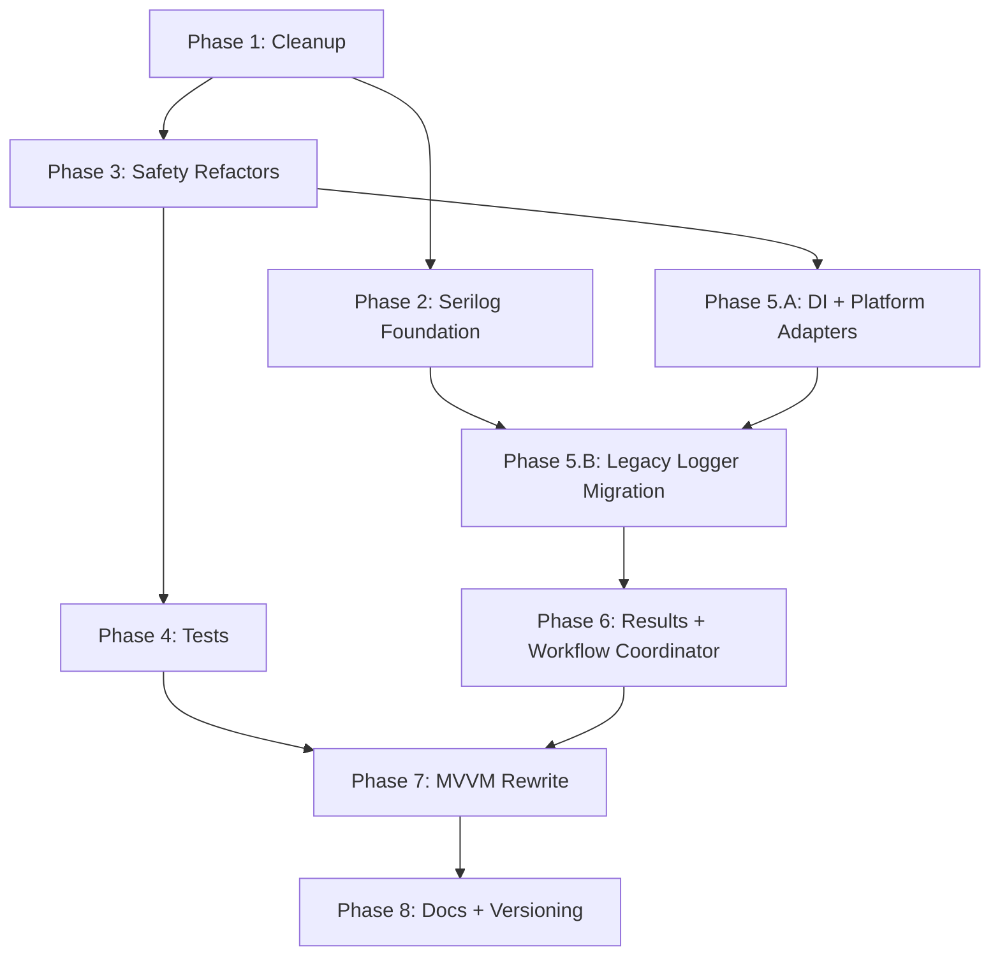

# CalradiaForge Refactor Master Plan

Status: planned
Scope: documentation and implementation planning only. This plan does not authorize source-code implementation by itself.

## Purpose

This document defines the phased refactor plan for the next CalradiaForge beta cycle. The goal is to reduce risk before larger architecture work by sequencing cleanup, logging, persistence safety, installer safety, tests, dependency injection, workflow coordination, MVVM extraction, and version/documentation cleanup into controlled work orders.

## Source Of Truth

Use this priority when planning or implementing any phase:

1. Existing source code
2. Existing markdown documentation
3. Architecture documents in `docs/Architecture`
4. This refactor plan

If this plan conflicts with source code or locked architecture docs, stop and document the mismatch before editing code.

## Locked Decisions Summary

| Area | Locked decision |
|---|---|
| Layering | UI decides when. Core decides how. Nexus/Core decide how for Nexus-specific work. |
| Core boundary | `CalradiaForge.Core` must remain WPF-free. |
| Nexus boundary | Nexus auth, networking, API calls, downloader mechanics, and transport code belong in `CalradiaForge.Nexus`. |
| Nexus timing | Nexus remains a v1.0 target, but experimental or SSO-gated functionality may ship before full approval. |
| Nexus API strategy | Do not redesign Nexus API strategy here. Existing Nexus architecture docs remain source of truth. |
| AppConfig | `AppConfig` is non-secret JSON settings persistence. It must never store credentials or secret-like values. |
| Credentials | Nexus credentials must use DPAPI CurrentUser and be decrypted only during explicit Nexus operation scope. |
| Installer authority | `ModInstaller` and `ModExtractor` remain the authoritative archive install pipeline. Do not bypass them. |
| Archive safety | Add module identity preflight and grow toward fuller archive validation in phases. |
| BLSE safety | Use strict BLSE filename/folder allowlist validation; approved BLSE files may be overwritten directly. |
| Persistence | Use atomic writes, backup recovery for important JSON, and graceful corrupt-file handling. |
| Logging | Move to Serilog with rolling file logs, retention limits, structured templates, source context, and central redaction. Phase 2 creates the Serilog infrastructure inside `source/CalradiaForge.Core/Infra/Logging/` while preserving the legacy logger and all current call sites until the post-DI migration phase. |
| Testing | Add a tiered test strategy, starting with Core unit tests and file-system-heavy integration tests. |
| Platform APIs | Keep the app Windows-first, but isolate Windows-specific APIs behind explicit adapters where practical. |
| DI | Use `Microsoft.Extensions.DependencyInjection`; defer Host Builder unless later justified. |
| Results | Start with workflow-specific result types; consider shared `Result<T>` only if repetition justifies it. |
| Workflow coordination | Use an install/workflow coordinator for progress, cancellation, completion, failure, cleanup, and UI-facing state. |
| UI state | Use shared `IsBusy`, `StatusMessage`, `ErrorMessage`, `CanCancel`, `CurrentOperation`, and result state patterns. |
| Toasts | Preserve the existing Toast System for user-visible operation notifications. |
| MVVM | Move toward a full shell/viewmodel rewrite, staged by dependency order and risk. |
| Versioning | Use `MAJOR.MINOR.PATCH[-prerelease]`; before v1.0 use `0.MILESTONE.PATCH[-prerelease]`. |
| Version source | `Directory.Build.props` should become the central public app version source of truth. |
| Excluded from this plan | New Nexus runtime implementation, v1.0 polish, unrelated feature work, automatic update checks, timed polling. |

## Locked Decision Details

These details are repeated here so the master plan can stand alone as the execution entry point.

### Nexus Timing And Feature Gating

- Nexus remains in v1.0 scope and is not deferred because SSO approval is pending.
- Experimental Nexus builds may exist before full approval.
- SSO/auth-dependent features must be disabled, mocked, gated, or clearly marked experimental until approval is complete.
- Nexus experimental features should be disabled by default unless intentionally enabled for beta/dev testing.
- Nexus UI may exist before full approval, but experimental actions must be clearly labeled.
- Auth-dependent Nexus gates must remain separate from non-auth planning or metadata features.
- Logs, status messages, and toasts should clearly mark Nexus actions as experimental, unavailable, or waiting on approval.
- Existing Nexus architecture/API strategy docs remain source of truth; this plan must not redesign REST/GraphQL/API abstraction decisions.

### Versioning Specifics

- Use `MAJOR.MINOR.PATCH[-prerelease]`.
- Do not use build metadata for now.
- Before v1.0, use `0.MILESTONE.PATCH[-prerelease]`.
- Patch numbers are intentional released revisions, not raw commit counters.
- Public app version is authoritative for GitHub releases, Nexus Mods releases, changelog entries, app UI display, release artifacts, and installer/package names when applicable.
- Experimental Nexus labels should follow the pattern `v0.13.0-experimental.nexus.1`.
- Experimental Nexus release titles should follow the pattern `CalradiaForge v0.13.0-experimental.nexus.1 - Nexus API Experimental Release`.

### Secret And Logging Specifics

- A central redaction layer must exist before Nexus authentication is implemented.
- Logger output must pass through redaction before writing sensitive or user-provided runtime values.
- Debug logs follow the same redaction rules as normal logs.
- `AppConfig` must reject or block secret-like keys.
- Tests should verify common secret patterns are redacted or blocked.
- Auth headers, bearer tokens, API keys, credential objects, and secret-bearing URLs must never be logged raw.
- Approved Phase 2 Serilog packages are `Serilog`, `Serilog.Sinks.File`, `Serilog.Sinks.Async`, `Serilog.Exceptions`, and `Serilog.Enrichers.Thread`, with `Serilog.Sinks.Debug` referenced only in Debug builds using a conditional `PackageReference` and `#if DEBUG` sink configuration.
- `Serilog.Sinks.Debug` is not required for Debug-level events; Release/Public Release builds may still write Debug-level events to rolling file logs when runtime DebugMode is enabled.
- Do not add `Serilog.Sinks.Console`, `Serilog.Settings.Configuration`, `Microsoft.Extensions.Configuration.Json`, `Serilog.Extensions.Logging`, or `Serilog.Extensions.Hosting` as part of Phase 2.

### Archive And Installer Safety Specifics

- Use a custom hybrid installer safety policy that preserves Bannerlord-specific mod-loading needs while improving safety.
- Exact overwrite, backup, validation, and confirmation rules are not fully locked and need later owner review.
- Module identity preflight should inspect archive openability, module folder name, `SubModule.xml`, mod id/name, version if available, valid Bannerlord module shape, and official/reserved target folders.
- BLSE install/update may directly overwrite approved BLSE files after strict filename/folder allowlist validation.
- BLSE logging should record accepted, skipped, blocked, and overwritten files.
- User-facing status/toast messages should clearly explain blocked unsafe BLSE files.

## Tracked Owner Additions

### Deferred UI Page Rename Review

Some current WPF page `.xaml` names may need to be renamed before broad MVVM extraction or future Nexus UI/API work. The exact rename targets are not approved yet. Before any page rename occurs, create an owner-review checklist that inventories current page names, code-behind classes, navigation references, proposed names, reasons, risks, and owner approval status. Do not rename UI pages without an explicit owner-approved rename map.

XAML page renames are high-risk because they can affect code-behind partial classes, `x:Class`, navigation references, resource dictionaries, bindings, design-time tooling, generated files, and documentation references. This plan records the checkpoint only; it does not define a rename map or authorize renames.

### Known Issue - Steam Workshop Mods Not Automatically Scanned

An end user reported that Bannerlord Steam Workshop mods were not automatically discovered. The report is not fully confirmed yet, but it is important enough to stage as a scanner/path-resolution risk item. The suspected area is Steam Workshop path resolution, especially setups where Bannerlord may be installed in a different Steam library from the main Steam client install.

The app already uses Bannerlord AppID `261550` as part of Workshop path composition, so the staged investigation should not treat the AppID string as the primary suspected issue. Focus planning on Steam client install path versus Steam library path versus Bannerlord install path, multi-library discovery, Workshop path candidates, diagnostics, tests, structured warnings, and UI surfacing. Do not mark this issue fixed until implementation and verification are complete.

### Documentation Alignment Report Integration

The owner has produced `docs/audits/calradiaforge_docs_alignment_report_07-08-26.md`, which recommends aligning CalradiaForge documentation with the OniForge documentation model at the organizational and decision-control level. Refactor documents remain active planning artifacts and must not become canonical architecture automatically.

As refactor phases produce accepted decisions, migrate only stable decisions into canonical architecture docs, application-system docs, data/persistence docs, development/testing docs, ADRs, changelog entries, or release notes. Do not copy speculative planning text into canonical architecture, and do not perform the full documentation rebuild from the report as part of this master-plan update.

## Phase Order

| Phase | Name | Primary outcome |
|---:|---|---|
| 1 | Cleanup And Low-Risk Consistency Fixes | Reduce noise before deeper refactors. |
| 2 | Serilog Infrastructure Foundation | Establish structured logging and redaction foundation while keeping the legacy logger compatibility path in place. |
| 3 | Small Safety Refactors | Harden compact high-risk areas: BLSE, archive preflight, persistence. |
| 4 | Initial Tests Around Changed Risky Areas | Add regression coverage around changed safety and persistence behavior. |
| 5.A | DI And Platform Adapter Foundation | Introduce service composition and isolate Windows-specific behavior. |
| 5.B | Legacy Logger Call-Site Migration | Stage legacy logger callers onto the Serilog path after the foundation is verified. |
| 6 | Result Types And Workflow Coordinator | Standardize operation outcomes and long-running workflow state. |
| 7 | Staged MVVM Shell/ViewModel Rewrite | Move WPF presentation toward consistent MVVM. |
| 8 | Final Documentation And Versioning Cleanup | Prepare next beta docs, changelog, and version consistency. |

## Phase Overview Matrix

| Phase | Depends on | Main work slices | Deliverables | Verification |
|---:|---|---|---|---|
| 1 | None | Cleanup, naming, stale comments, low-risk warnings | Deferred-risk notes; clean build | `dotnet build source/CalradiaForge.slnx` |
| 2 | Phase 1 preferred | Serilog infrastructure, rolling logs, retention, redaction, source context, scanner diagnostics planning | Logging foundation implemented; secret-safe logs; legacy logger compatibility preserved | Build; log creation; redaction checks |
| 3 | Phase 1 preferred; Phase 2 helpful | BLSE allowlist, archive preflight, atomic JSON writes, `AppConfig` secret blocking, scanner/path-resolution investigation | Safer install/persistence behavior; scanner issue confirmed, deferred, or fixed only by explicit scoped work | Build; BLSE/archive/persistence smoke checks |
| 4 | Phase 3 initial changes | Core tests, persistence tests, archive/BLSE tests, modpack workflow tests, fake Steam library scanner tests | Test project and meaningful regression coverage | `dotnet test source/CalradiaForge.slnx` |
| 5.A | Phases 1 and 3; Phase 4 preferred | DI setup, service lifetimes, platform adapters, path-resolution abstractions | Clear composition root and adapter targets | Build; startup smoke test |
| 5.B | Phases 2 and 5.A | Legacy logger call-site batches, compatibility cleanup, staged Serilog caller migration | Legacy logger usage migrated in verified batches; compatibility path retired after verification | Build; staged logging smoke tests; redaction checks |
| 6 | Phases 2, 3, and 5.B | Workflow result types, install coordinator, progress/cancel/failure state, scanner warnings | Consistent workflow outcomes and UI state path | Build; workflow smoke tests; targeted tests |
| 7 | Phases 5.A, 5.B, and 6; Phase 4 preferred | MVVM conventions, shell/navigation, page ViewModels, command/state patterns, scanner status surfacing | Major UI workflows extracted to ViewModels | Build; ViewModel tests; UI smoke test |
| 8 | Prior implementation phases settled | Version source, changelog, release docs, final doc alignment, documentation alignment handoff | Release-ready docs and version consistency | Build; UI version check; docs review |

## Phase Dependency Map



## Phase Deliverables Checklist

- [X] Phase 1: Low-risk cleanup completed or deferred with notes; build passes. (Completed)
- [ ] Phase 2: Serilog infrastructure, retention, source context, redaction, and approved package usage are implemented and documented inside the Core logging folder while the legacy logger compatibility path and all existing call sites remain in place.
- [ ] Phase 3: BLSE/archive/persistence/`AppConfig` safety changes are implemented or explicitly deferred.
- [ ] Phase 4: Core test project exists and covers changed risky behavior.
- [ ] Phase 5.A: DI composition root, lifetimes, and platform adapter boundaries are documented and usable.
- [ ] Phase 5.B: Legacy logger call sites are migrated in verified batches and the compatibility path is retired only after verification.
- [ ] Phase 6: Workflow result contracts and coordinator state are implemented for selected high-risk workflows.
- [ ] Phase 7: Shell/navigation and major page workflows use consistent ViewModel patterns.
- [ ] Phase 8: Versioning, changelog, release notes, and refactor docs match shipped reality.
- [ ] Steam Workshop scanner/path-resolution issue is tracked across phases and is only marked fixed after implementation and verification.
- [ ] UI page rename review is completed only with an owner-approved rename map before any `.xaml` rename.
- [ ] Documentation alignment report decisions are handed off without making refactor plans canonical architecture by default.

## Global Codex Guardrails

- Do not implement source changes from this plan unless a later task explicitly asks for implementation.
- Keep each implementation task scoped to one phase or one clearly bounded slice of a phase.
- Do not bundle MVVM, DI, logging, persistence, and installer safety into one uncontrolled change set.
- Preserve `CalradiaForge.Core` as WPF-free.
- Preserve Nexus networking/auth/downloader ownership in `CalradiaForge.Nexus`.
- Keep secrets out of `AppConfig`.
- Do not store Nexus metadata in `ModuleModel`.
- Do not add startup update checks, timed polling, silent scans, or background Nexus polling.
- Do not bypass `ModInstaller` or `ModExtractor`.
- Do not rename UI page `.xaml` files unless the owner has provided an explicit approved rename map.
- Do not change major/minor versions without owner approval.
- Update relevant docs whenever architecture behavior changes.
- Do not migrate legacy logger call sites before Phase 5.B.
- Do not add unapproved Serilog packages or dev-only sinks to Release/Public Release artifacts.

## Phase 1 - Cleanup And Low-Risk Consistency Fixes

| Work-order field | Detail |
|---|---|
| Purpose | Reduce codebase noise before deeper refactors so later diffs are easier to review. |
| Included work | Naming and spelling cleanup; stale comments; low-risk warning cleanup; README/changelog/TODO consistency notes; safe dead-code review only where behavior is clearly unused; record the Steam Workshop scanner/path-resolution report as a known issue; add a deferred UI page rename review checkpoint. |
| Excluded work | MVVM rewrite, DI conversion, installer behavior changes, Nexus implementation, large file moves, ownership changes, or UI page `.xaml` renames. |
| Affected areas | `source/CalradiaForge.Core`, `source/CalradiaForge.UI`, `docs/`, and project metadata only when cleanup is low-risk. |
| Implementation notes | Prefer small mechanical changes. Avoid behavior changes unless the behavior is obviously broken and separately verified. For Steam Workshop scanning, identify current scanner/path-resolution classes and methods without changing behavior. For UI page names, create or update a review checklist only; do not invent rename targets. |
| Dependency ordering | Run before large refactors. Risky cleanup should wait until Phase 4 coverage exists. |
| Do before | Read current architecture docs and audit notes. Check build warnings and identify low-risk items. |
| Do after | Record deferred cleanup that requires tests or owner confirmation, including Steam Workshop path-resolution follow-up and any UI page rename candidates needing owner review. |
| Exit criteria | Obvious typo/stale-comment cleanup is complete or tracked; no architecture boundary changes were introduced; Steam Workshop scanner/path-resolution remains tracked as unresolved planning work unless a later scoped fix verifies it; build still succeeds. |
| Risk notes | Renames may affect XAML bindings or reflection-like usage. UI page `.xaml` renames are deferred until an owner-approved rename map exists. Small cleanup can still change install, launch, scanner, or persistence behavior. |
| Verification | `dotnet build source/CalradiaForge.slnx`; manual smoke check if UI-bound names or bindings change. |
| Codex guardrails | Do not refactor unrelated systems. Stop before behavior changes in high-risk workflows. |
| Documentation updates | Update architecture docs only if cleanup corrects stale documented names or responsibilities. Keep `docs/refactor/ui_page_rename_review_checklist.md` as a checklist/template, not a completed rename plan. |

### Deferred Owner Checkpoint - UI Page Rename Review

Before broad MVVM extraction or future Nexus UI work begins, create a short owner-review document that inventories current UI pages, current page names, code-behind names, navigation references, and proposed rename candidates. Do not perform any rename until the owner approves an explicit rename map.

### Known Issue Planning Note - Steam Workshop Scanner

Record the end-user Steam Workshop scanning report as a deferred-risk item. The app already uses Bannerlord AppID `261550`; Phase 1 should only identify current scanner/path-resolution ownership and preserve the likely investigation focus on Steam library discovery and Workshop path resolution.

## Phase 2 - Serilog Infrastructure Foundation

| Work-order field | Detail |
|---|---|
| Purpose | Build the Serilog infrastructure foundation inside the existing Core logging folder while keeping the current custom `Logger` class and all existing logger call sites in place for later migration. |
| Included work | New Serilog infrastructure files under `source/CalradiaForge.Core/Infra/Logging/`; setup/factory/configuration methods needed for later migration; rolling file sink using `Serilog.Sinks.File`; async sink using `Serilog.Sinks.Async`; thread enrichment using `Serilog.Enrichers.Thread`; exception enrichment using `Serilog.Exceptions`; Debug-build-only debug sink using conditional `Serilog.Sinks.Debug`; retention/archive helpers or planning; central redaction support or planning; a short legacy/deprecated compatibility summary in the old `Logger` file. |
| Excluded work | Rewriting existing logger call sites; removing the old `Logger` file; routing existing Core/UI callers to the new Serilog caller methods; initializing the new logger service through WPF singleton startup before DI composition exists; injecting Serilog into every service; moving to `Microsoft.Extensions.Logging.ILogger<T>`; adding extra logging/configuration package dependencies; adding `Serilog.Sinks.Console`; replacing the existing custom app config JSON manager; full dependency injection conversion; Host Builder adoption; logging raw secrets; Nexus auth implementation; telemetry or remote logging. |
| Affected areas | New Serilog logging infrastructure in `source/CalradiaForge.Core/Infra/Logging/`, the existing legacy `Logger` file summary/comment only, future logging plumbing, approved package usage, and debug-mode settings. |
| Implementation notes | Keep the current custom `Logger` API working and leave all current `Logger.Instance` call sites in Core and UI untouched. Build the new Serilog foundation first so later call-site migration can happen in Phase 5.B. Do not initialize the new Serilog service through the WPF app service startup path until Phase 5.A establishes dependency-injection composition. Runtime DebugMode must still be able to write Debug-level events to production-approved rolling file logs in Release/Public Release builds; `Serilog.Sinks.Debug` is only for Visual Studio/debugger output in Debug builds. Normal debug logs should call `logger.Debug(...)` after migration. Guard only expensive diagnostic construction. Redaction applies to debug and normal logs. Plan structured diagnostic events for Steam/Bannerlord path resolution: detected platform, detected Steam client path if available, discovered Steam library roots, Bannerlord install path, resolved Workshop path candidates, selected Workshop path, scanner result counts, and skipped/missing candidate reasons. |
| Dependency ordering | Should precede Nexus auth implementation and broader result/workflow logging. Must be complete before Phase 5.B call-site migration. |
| Do before | Confirm the approved package set already added to `CalradiaForge.Core`. Define redaction rules and secret-like patterns. Identify current logger behavior that must be preserved. Identify the existing Core logging folder as the only location for new Serilog infrastructure files. |
| Do after | Keep the legacy logger compatibility path and all current call sites in place until Phase 5.B verification confirms equivalent Serilog behavior, then remove obsolete custom logger paths only as part of the staged call-site migration. |
| Exit criteria | Serilog infrastructure exists in the Core logging folder, approved package usage is respected, Release/Public Release builds exclude the Debug sink package/configuration, and the current custom logger plus all existing call sites still function as the compatibility path. |
| Risk notes | Broad call-site changes can obscure failures. Redaction that is too aggressive can reduce diagnostic value. Path diagnostics can expose user-specific filesystem details unless shared bundles/log exports sanitize path segments according to policy. |
| Verification | Build succeeds; Release/Public Release build does not reference/configure `Serilog.Sinks.Debug`; Debug build conditionally compiles the Debug sink; any isolated Serilog factory/configuration smoke checks pass where practical; redaction examples are verified without requiring WPF UI navigation. |
| Codex guardrails | Do not add Nexus credentials or auth flow. Do not store logging secrets in `AppConfig`. Do not add unapproved logging packages. Do not add `Serilog.Sinks.Console`. Do not migrate existing logger call sites in Phase 2. Do not remove the legacy `Logger` file. |
| Documentation updates | Update `docs/Architecture/Systems/Logging.md`, `docs/refactor/logging_policy.md`, and cross-reference the secret-boundary policy. |

### Approved Phase 2 Package Set

Phase 2 must use the package set already added to `CalradiaForge.Core`:

```xml
<ItemGroup>
	<PackageReference Include="Serilog" Version="4.3.1" />
	<PackageReference Include="Serilog.Sinks.File" Version="7.0.0" />
	<PackageReference Include="Serilog.Sinks.Async" Version="2.1.0" />
	<PackageReference Include="Serilog.Exceptions" Version="8.4.0" />
	<PackageReference Include="Serilog.Enrichers.Thread" Version="4.0.0" />
</ItemGroup>

<ItemGroup Condition="'$(Configuration)' == 'Debug'">
	<PackageReference Include="Serilog.Sinks.Debug" Version="3.0.0" PrivateAssets="all" />
</ItemGroup>
```

`Serilog.Sinks.Debug` is a development-only sink for Visual Studio/debugger output. It must not be referenced or configured in Release/Public Release artifacts. It is not required for Debug-level log events; runtime DebugMode in Release/Public Release builds must still write Debug-level events to production-approved sinks such as rolling file logs.

Do not add `Serilog.Sinks.Console`, `Serilog.Settings.Configuration`, `Microsoft.Extensions.Configuration.Json`, `Serilog.Extensions.Logging`, or `Serilog.Extensions.Hosting` in Phase 2.

### Phase 2 Legacy Logger Preservation Rule

Phase 2 must preserve the old logger implementation as a compatibility path. Codex may add a short legacy/deprecated compatibility summary to the existing `Logger` file, but must not remove that file and must not alter existing logger call sites across Core or UI. Those call sites are intentionally preserved so Phase 5.B can inventory and migrate them after dependency injection is established.

### Steam Workshop Scanner Diagnostics Planning

When logging work begins, add or plan structured diagnostics around Steam library and Workshop path resolution. Diagnostics must help distinguish Steam client install path, Steam library roots, Bannerlord install path, Workshop path candidates, selected path, and scanner result counts. Do not log secrets or unrelated personal filesystem data.

## Phase 3 - Small Safety Refactors

| Work-order field | Detail |
|---|---|
| Purpose | Improve compact, high-value safety areas before larger architecture changes. |
| Included work | BLSE allowlist validation; module identity preflight; simple archive containment planning; atomic JSON writes; backup recovery for important JSON; `AppConfig` secret-like key blocking; reserved/official module folder protection planning; targeted Steam Workshop scanner/path-resolution stabilization if scoped and verifiable. |
| Excluded work | Full installer policy finalization if Bannerlord-specific constraints need owner review; full archive security scanner; full persistence migration framework; Nexus download implementation. |
| Affected areas | `ModInstaller`, `ModExtractor`, `BLSEInstaller`, `ModsData`, `ModpackData`, `AppConfig`, last-used load order persistence, and future Nexus metadata policy. |
| Implementation notes | Keep install authority in `ModInstaller`/`ModExtractor`. Preflight reports archive openability, module folder name, `SubModule.xml`, mod id/name, version when available, valid module shape, and reserved/official folder targeting before destructive install steps. BLSE may overwrite approved files after allowlist validation; accepted, skipped, blocked, and overwritten files must be logged and blocked files must be surfaced through status/toasts. For Steam Workshop scanning, do not assume Workshop content is under the main Steam client install folder; prefer resolving Steam library roots first, then checking valid `steamapps/workshop/content/261550` candidates. |
| Dependency ordering | Precedes Nexus downloads and broad MVVM work. Should precede or pair with tests for changed areas. |
| Do before | Identify official/reserved module folders. Confirm current persistence ownership. Document Bannerlord-specific installer constraints needing review. Confirm whether end-user Steam Workshop setup details are known before treating scanner work as a fix. |
| Do after | Add tests in Phase 4 and update archive/persistence docs. Preserve existing successful scanner behavior for users whose current setup works. |
| Exit criteria | Safety rules are implemented or explicitly deferred; `AppConfig` remains non-secret; targeted persistence writes are safer; installer authority remains unchanged. |
| Risk notes | Overly strict preflight can block valid mod layouts. Persistence recovery can prefer stale data if ordering is wrong. Steam Workshop path changes can regress users whose current library layout already scans successfully. |
| Verification | Build succeeds; manual normal archive and BLSE smoke tests; corrupt JSON recovery behavior verified; blocked unsafe inputs produce user-visible status/logs; scanner/path behavior is verified only if this phase explicitly implements a scoped fix. |
| Codex guardrails | Do not bypass `ModInstaller` or `ModExtractor`. Stop and ask if overwrite policy would alter expected Bannerlord mod loading behavior. |
| Documentation updates | Update `archive_installer_safety_policy.md`, `persistence_policy.md`, `docs/Architecture/Systems/ModManagement.md`, and `docs/Architecture/Systems/Configuration.md`. |

### Steam Workshop Scanner Safety Candidate

Investigate Steam Workshop path detection and Bannerlord Workshop mod discovery as a targeted safety/bugfix candidate. If the bug cannot be confirmed yet, keep the work documented and deferred until end-user setup details are known. Do not describe this issue as fixed unless implementation and verification happened.

## Phase 4 - Initial Tests Around Changed Risky Areas

| Work-order field | Detail |
|---|---|
| Purpose | Add focused regression coverage for high-risk Core workflows touched by cleanup and safety phases. |
| Included work | Core unit test project; parser tests; persistence save/load/recovery tests; BLSE allowlist tests; archive/module preflight tests; modpack workflow tests; fake Steam library and Workshop scanner/path-resolution tests; integration-style tests for file-system-heavy workflows; CI test execution after tests exist. |
| Excluded work | Full WPF UI automation, exhaustive test rewrite, ViewModel tests before ViewModels exist, and Nexus integration tests before Nexus implementation exists. |
| Affected areas | Core test project, test data fixtures, build/CI docs, installer/parser/persistence/modpack workflows. |
| Implementation notes | Keep tests deterministic and isolated from the real user game install. Use temp directories and fixture archives. Scanner/path tests must use fake Steam roots only; no test should require a real Steam install or a real Bannerlord install. |
| Dependency ordering | Follows first safety changes. Tests are preferred before broad DI migration and required before high-blast-radius MVVM rewrites where practical. |
| Do before | Choose test framework and naming conventions. Confirm no checked-in test project exists today. |
| Do after | Add CI build/test validation if approved. Expand tests when future phases touch workflows. |
| Exit criteria | Test project exists; key changed safety/persistence behaviors have coverage; Steam Workshop path-resolution scenarios are covered when scanner work is implemented; `dotnet test source/CalradiaForge.slnx` runs meaningful tests. |
| Risk notes | Tests can become coupled to local paths; archive fixtures can be brittle. Scanner tests can accidentally encode one-machine Steam assumptions unless all roots are fake. |
| Verification | `dotnet test source/CalradiaForge.slnx`; `dotnet build source/CalradiaForge.slnx`; tests pass on a clean workspace. |
| Codex guardrails | Do not require a real Bannerlord install. Do not add UI automation unless explicitly requested. |
| Documentation updates | Update `testing_strategy.md` and contributor/build docs if CI or test commands change. |

### Steam Workshop Scanner Test Scenarios

Use fake temp directories to cover Steam client installed on one root while Bannerlord is under another Steam library root, multiple Steam library roots, Workshop content under the Bannerlord library root, missing Workshop content, Workshop content with no valid modules, and manual override behavior if supported.

## Phase 5 - DI And Platform Adapter Foundation

Phase 5 is split into 5.A and 5.B. Phase 5.A establishes DI and platform adapters. Phase 5.B migrates legacy logger call sites after the Serilog foundation from Phase 2 is in place and verified.

### Phase 5.A - DI And Platform Adapter Foundation

| Work-order field | Detail |
|---|---|
| Purpose | Introduce a cleaner composition model and isolate Windows-specific APIs behind explicit boundaries. |
| Included work | `Microsoft.Extensions.DependencyInjection`; service registration conventions; lifetime rules; Core service registration; platform adapter interfaces and Windows implementations; Steam library discovery/Bannerlord install detection/Workshop path-resolution abstractions; ViewModel/workflow/future Nexus registration planning; test-friendly replacements. |
| Excluded work | Full Host Builder unless later justified; service locator misuse; cross-platform UI rewrite; moving WPF into Core; moving Nexus networking into Core. |
| Affected areas | UI startup/composition, Core service construction, paths, Registry access, Steam library discovery, Bannerlord install detection, Workshop path resolution, process launching, URL/file explorer launching, archive extraction details, and future NXM handler registration. |
| Implementation notes | Prefer explicit constructor dependencies. Keep adapter interfaces near the owning layer. Do not make DI a hidden global service locator. Keep Windows-specific registry/file-system probing behind adapters and make scanner/path resolution testable with fake path providers and fake filesystem roots. |
| Dependency ordering | Follows cleanup and initial safety work. Precedes Phase 5.B and broad MVVM rewrite. Can precede workflow coordinator registration. |
| Do before | Inventory current static `App.*` service access. Define lifetime rules for config, logging, services, pages, ViewModels, and coordinators. |
| Do after | Migrate consumers gradually. Add test replacements for adapter-driven services. |
| Exit criteria | Composition root is clear; new services can be registered consistently; Windows-specific behavior has adapter targets or a documented path; scanner/path-resolution boundaries are explicit or documented for follow-up; Core remains WPF-free. |
| Risk notes | Partial DI can create two construction paths. Incorrect lifetimes can break shared state. |
| Verification | Build succeeds; startup smoke test succeeds; existing workflows resolve services; tests can substitute key services/adapters. |
| Codex guardrails | Do not introduce a global service locator. Do not retarget Core or add WPF references without explicit approval. |
| Documentation updates | Update `dependency_injection_plan.md` and project architecture docs for composition, adapter ownership, and future platform/path-detection documentation. |

### Phase 5.B - Legacy Logger Call-Site Migration

| Work-order field | Detail |
|---|---|
| Purpose | Convert legacy `Logger.Instance` usage to the approved Serilog logging caller methods or logging abstraction in controlled batches after the DI foundation is in place and the Phase 2 Serilog foundation is verified. |
| Included work | App-wide logger call-site migration in staged batches; preserving behavior while improving structured logging; keeping redaction and minimum-level behavior intact; retiring the legacy logger compatibility path only after equivalent Serilog behavior is verified. |
| Excluded work | One uncontrolled pass over all call sites; new logging packages or Host Builder adoption; changing app configuration architecture; adding `ILogger<T>` as the target for this phase. |
| Affected areas | Existing logger call sites, shared logging call patterns, and compatibility cleanup after verification. |
| Implementation notes | Keep the migration staged so failures stay reviewable. Preserve existing behavior while moving callers onto the new Serilog foundation. Remove the old logger compatibility path only after verification shows the Serilog path is equivalent for the migrated call sites. |
| Dependency ordering | Follows Phase 5.A and Phase 2. Completes before later workflow/UI phases depend on the updated logging shape. |
| Do before | Verify the Phase 2 Serilog foundation is stable and Phase 5.A dependency-injection composition is usable. Inventory the legacy logger call sites preserved from Phase 2 and group them into manageable batches. |
| Do after | Remove obsolete custom logger paths only after equivalent Serilog behavior is verified. |
| Exit criteria | Legacy logger call sites are migrated in verified batches; the compatibility path is no longer needed; redaction and minimum-level behavior remain intact. |
| Risk notes | Batch migration can expose hidden logger assumptions. Removing the compatibility path too early can break behavior. |
| Verification | Build succeeds; migrated scenarios log through Serilog; redaction and minimum-level checks still pass; legacy logger removal is deferred until verification is complete. |
| Codex guardrails | Do not bypass the staged migration sequence. Do not add unrelated logging architecture changes. |
| Documentation updates | Update `docs/refactor/logging_policy.md` and `docs/refactor/dependency_injection_plan.md` if the broader refactor plan is later allowed to change them. |

### Steam Workshop Path Adapter Planning

Move Steam library discovery, Bannerlord install detection, and Workshop path resolution behind explicit platform/path-resolution abstractions when this phase reaches scanner work. Manual override behavior, if present, should remain supported unless explicitly removed later.

## Phase 6 - Result Types And Workflow Coordinator

| Work-order field | Detail |
|---|---|
| Purpose | Make important workflows report success, failure, warnings, and user-facing messages consistently, and give long-running install operations one clear coordination layer. |
| Included work | Workflow-specific result types; install workflow coordinator; progress/cancellation/completion/failure/cleanup ownership; scanner/path-resolution warnings; UI-facing status/error messages; toast integration; future Nexus download-to-install handoff planning. |
| Excluded work | App-wide generic `Result<T>` unless repetition justifies it; WPF dependencies in Core; duplicate installer logic; Nexus download implementation. |
| Affected areas | Install workflow, archive validation, BLSE validation/install, persistence save/load/recovery, mod scan/refresh, Steam Workshop path detection, modpack import/export, future Nexus auth/download workflows, and toast/status state. |
| Implementation notes | Result objects should support success/failure, code, user-facing message, technical/log message, warnings, and affected path/mod where useful. Coordinator may initially wrap current installer/event flow. Mod scan/refresh should distinguish "no Workshop mods installed," "Workshop path could not be resolved," and "Workshop path exists but scan failed." |
| Dependency ordering | Follows logging and safety foundations. Works best after Phase 5.B. Should precede or coordinate with MVVM extraction. |
| Do before | Identify current mixed result styles. Decide first workflows to standardize. |
| Do after | Use coordinator state in ViewModels during Phase 7. Add or update tests for result-producing workflows. |
| Exit criteria | High-risk workflows have clearer result contracts; install completion/failure/cancellation paths are observable; scanner/path warnings have a structured result path when scanner work is implemented; UI can show busy/status/error/result state consistently. |
| Risk notes | Over-standardizing too early can add ceremony. Coordinator may duplicate service responsibilities if boundaries are unclear. |
| Verification | Build succeeds; tests cover result mapping where practical; manual install success/failure/cancel/cleanup paths; logs and toasts match outcomes. |
| Codex guardrails | Keep Core WPF-free. Keep installer authority in Core services. Do not add broad generic result abstractions unless proven useful. |
| Documentation updates | Update `result_and_workflow_policy.md` and architecture docs when coordinator behavior is implemented. |

### Steam Workshop Scanner Result Planning

Mod scan/refresh should report structured warnings when Workshop path detection fails, when no Workshop path candidates exist, or when Workshop mods are not found. User-facing messages should be concise; technical details should go to logs.

## Phase 7 - Staged MVVM Shell/ViewModel Rewrite

| Work-order field | Detail |
|---|---|
| Purpose | Move WPF presentation toward consistent MVVM across shell, navigation, pages, commands, workflow state, dialogs, and user-visible feedback. |
| Included work | MVVM conventions; base ViewModel patterns; command patterns; shared UI operation state; shell/navigation refactor; high-risk workflow ViewModels for install, scan/refresh, BLSE, and modpacks; Steam Workshop scan warning surfacing; deferred UI page rename checkpoint before page extraction; remaining page ViewModels; ViewModel tests. |
| Excluded work | One-pass full UI rewrite; unrelated visual redesign; unrelated new features; business logic in ViewModels that belongs in Core; Nexus networking in UI. |
| Affected areas | `MainWindow`, `ModsPage`, `ModpacksPage`, `SettingsPage`, `FaqPage`, dialogs/windows, Toast/status state, and ViewModel registrations. |
| Implementation notes | Start with conventions before extraction. Extract highest-risk workflows first. Keep code-behind for view-only behavior where appropriate. Before page ViewModel extraction, revisit the UI page rename review checklist and obtain an owner-approved rename map if any `.xaml` page rename is desired. |
| Dependency ordering | Follows Phase 5.B and Phase 6. Uses result/coordinator patterns from Phase 6 where available. |
| Do before | Freeze expected behavior for target pages. Ensure high-risk Core workflows have tests where practical. Define command and state conventions. Complete the deferred UI page rename review checkpoint before broad page extraction or future Nexus UI work. |
| Do after | Remove obsolete code-behind only after equivalent ViewModel behavior is verified. Add ViewModel tests for extracted workflows. |
| Exit criteria | Shell/navigation and major pages use consistent ViewModel patterns; high-risk workflow logic is not buried in code-behind; operation state is visible and testable; scanner status can explain whether local modules were scanned, Workshop modules were scanned, or Workshop scanning was skipped due to path detection when scanner work is implemented. |
| Risk notes | Binding regressions, navigation state drift, large diffs, accidental movement of business logic into UI. UI page `.xaml` renames can break generated partials, `x:Class`, navigation, bindings, resources, design-time tooling, and documentation links. |
| Verification | Build succeeds; ViewModel tests pass where present; manual smoke test for navigation, mod scan, Workshop scan status, install, BLSE, modpack workflows, settings, and toasts. |
| Codex guardrails | Stage page rewrites individually. Do not mix visual redesign with architecture extraction. Do not move Core logic into ViewModels. Do not add unrelated Nexus UI in this phase slice. |
| Documentation updates | Update `mvvm_refactor_plan.md` and `docs/Architecture/Projects/CalradiaForge.UI.md`. |

### Deferred Owner Checkpoint - UI Page Rename Review

Immediately before broad page ViewModel extraction, review `docs/refactor/ui_page_rename_review_checklist.md` with the owner. Do not rename any UI page `.xaml` file unless the owner approves an explicit rename map.

### Steam Workshop Scan Status Planning

Surface Steam Workshop scan warnings in the relevant page/ViewModel without burying them in logs only. The user should be able to understand whether local modules were scanned, Workshop modules were scanned, or Workshop scanning was skipped due to path detection.

## Phase 8 - Final Documentation And Versioning Cleanup For Next Beta

| Work-order field | Detail |
|---|---|
| Purpose | Prepare the next beta release by aligning documentation, version source of truth, changelog, release title patterns, and user-facing version display. |
| Included work | Documentation updates from completed phases; documentation alignment handoff; `Directory.Build.props` planning/implementation when explicitly requested; remove conflicting project versions; UI version display from assembly metadata; changelog/release-note alignment; experimental Nexus prerelease label guidance; Steam Workshop scanner known-issue/release-note status. |
| Excluded work | v1.0 release polish; new Nexus implementation; major/minor version bump without owner approval; rewriting old changelog history unless approved. |
| Affected areas | `Directory.Build.props`, `.csproj` files, UI version display code, `docs/CHANGELOG.md`, release notes drafts, GitHub/Nexus release title conventions, and refactor docs. |
| Implementation notes | Public app version is authoritative. Assembly versions should inherit the app version by default. Docs/internal-only changes usually do not require app version bumps. Treat refactor docs as planning artifacts; migrate only accepted stable decisions into canonical docs, ADRs, changelog entries, or release notes. If the Steam Workshop scanner bug is fixed before the next beta, mention it in changelog/release notes; if it remains deferred, keep it listed as a known issue or tracked follow-up. |
| Dependency ordering | Runs after implementation phases settle. May be drafted earlier, but final alignment belongs at release prep. |
| Do before | Confirm owner-approved target version. Inventory current version values across docs, project files, UI, and release notes. |
| Do after | Verify displayed version and release artifacts use the same value. Mark deferred topics clearly. Complete the documentation alignment handoff for accepted decisions only. |
| Exit criteria | Version source of truth is documented and consistent; changelog matches release intent; refactor docs accurately reflect completed, deferred, and future work; accepted refactor decisions have handoff targets for future canonical docs/ADRs/release notes. |
| Risk notes | Accidental public version bump; changelog/project metadata drift; describing planned work as shipped; letting planning or audit text become canonical architecture without owner acceptance. |
| Verification | Build succeeds; UI displays expected version; project metadata and changelog agree; release title follows approved pattern. |
| Codex guardrails | Ask before changing major/minor version values. Do not describe unimplemented Nexus features or unresolved Steam Workshop scanner work as shipped. |
| Documentation updates | Update `versioning_policy.md`; update `docs/CHANGELOG.md` only when release scope is confirmed; update architecture docs for implemented changes; use `docs/refactor/documentation_alignment_handoff_checklist.md` to track future documentation migration. |

#### Documentation Alignment Handoff

At the end of each refactor phase, identify which decisions are now accepted behavior and need migration into the future CalradiaForge documentation structure recommended by `docs/audits/calradiaforge_docs_alignment_report_07-08-26.md`. Do not copy full planning text into canonical docs. Convert final decisions into concise architecture, system, data/persistence, testing, ADR, changelog, or release-note updates.

#### Steam Workshop Scanner Release Documentation

Do not describe the Steam Workshop scanner/path-resolution issue as fixed unless implementation and verification happened. If it remains deferred, keep it listed as a known issue or tracked follow-up. If it is fixed by a later scoped task, document that the investigation focused on Steam library discovery/path resolution, not the Bannerlord AppID string, because AppID `261550` was already in use.

## Out Of Scope For This Master Plan

- New Nexus runtime implementation.
- Nexus GraphQL/API v2 foundation.
- Startup update checks.
- Timed Nexus polling.
- Silent background scans.
- Storing credentials in `AppConfig`.
- Moving WPF references into Core.
- Replacing `ModInstaller` or `ModExtractor` as the install authority.
- v1.0 final polish.

## Supporting Documents

| Document | Purpose |
|---|---|
| `docs/refactor/testing_strategy.md` | Tiered testing plan and implementation order. |
| `docs/refactor/persistence_policy.md` | Atomic writes, backups, recovery, schema/version guidance. |
| `docs/refactor/security_and_secret_boundary.md` | Secret handling, DPAPI, AppConfig non-secret boundary, redaction. |
| `docs/refactor/archive_installer_safety_policy.md` | Archive preflight, overwrite safety, BLSE allowlist, reserved folders. |
| `docs/refactor/versioning_policy.md` | Public app version policy and release title conventions. |
| `docs/refactor/logging_policy.md` | Serilog, retention, structured logging, redaction rules. |
| `docs/refactor/dependency_injection_plan.md` | DI registration, lifetimes, adapters, test replacement. |
| `docs/refactor/result_and_workflow_policy.md` | Workflow-specific result types and coordinator model. |
| `docs/refactor/mvvm_refactor_plan.md` | Shell/ViewModel extraction sequence and UI state conventions. |
| `docs/refactor/ui_page_rename_review_checklist.md` | Owner-review template for possible future UI page `.xaml` renames. |
| `docs/refactor/documentation_alignment_handoff_checklist.md` | Checklist for migrating accepted refactor decisions into canonical docs, ADRs, changelog entries, or release notes. |

## Pasteable Codex Implementation Prompt

Use this prompt when starting a later implementation task for one phase or a clearly bounded phase slice:

```text
Implement Phase N from `docs/refactor/refactor_master_plan.md` for CalradiaForge.

Before editing:
- Read the Phase N section in `docs/refactor/refactor_master_plan.md`.
- Read the supporting docs in `docs/refactor` that apply to Phase N.
- Read the relevant `docs/Architecture` files.
- Read the existing source files named by the phase and supporting docs.

Subagent workflow:
- The main agent may use subagents to split the workflow only when the phase is large enough, risky enough, or parallel enough to justify it.
- If subagents are used, assign each subagent a clear, non-overlapping scope and instruct them not to revert, overwrite, or modify unrelated work.
- Wait for all implementation subagents to finish before finalizing the phase.
- After implementation subagents finish, create a reviewer subagent to compare the completed implementation against the current phase, supporting documentation, architecture rules, requested scope, and project constraints.
- If the reviewer finds missing work, regressions, implementation artifacts, documentation inconsistencies, or scope drift, record the findings and either:
  - assign narrowly scoped follow-up work to additional subagents, or
  - complete the fix locally if the required change is small, isolated, and low risk.
- Repeat reviewer/fix passes until the reviewer finds no remaining required changes or the remaining items are explicitly documented as deferred, blocked, or requiring owner approval.
- Include all subagent assignments, reviewer findings, follow-up work, deferred items, and verification outcomes in the final report.

Task Execution Optimization Policy:
- Before delegating work, evaluate the assigned task across four independent optimization dimensions:
  - Capability Selection (model capability)
  - Reasoning Effort
  - Parallelization
  - Scope
- Treat each optimization dimension as an independent decision. Optimize each according to the assigned work rather than applying the same settings to every task or subagent.

Capability Selection:
- Prefer the lowest-capability model capable of reliably completing the assigned task.
- When the runtime supports per-subagent model selection, apply capability- and cost-aware task triage before delegation.
- Keep routine, deterministic, localized, documentation, validation, read-heavy, and mechanical implementation work on the lowest-capability suitable model (for example, Luna).
- Escalate individual subagents to higher-capability models available in the current runtime (for example, Terra or Sol) only when their assigned work materially benefits from stronger reasoning, including:
  - Cross-cutting architectural analysis.
  - Ambiguous implementation decisions.
  - Complex debugging or root-cause analysis.
  - Security-sensitive reviews.
  - Concurrency or threading analysis.
  - Large multi-file reasoning.
  - Reviewer findings requiring significant engineering judgment.
- Do not escalate simply because a higher-capability model is available.

Reasoning Effort:
- When the runtime supports configurable reasoning effort, choose the lowest reasoning level capable of reliably completing the assigned task.
- Increase reasoning effort only when additional analysis is expected to materially improve correctness, confidence, or engineering quality.
- Use higher reasoning effort for tasks involving architecture, complex debugging, reviewer analysis, cross-component interactions, concurrency, security, performance analysis, or other high-risk engineering work.
- Do not automatically increase reasoning effort when using a higher-capability model. Treat model capability and reasoning effort as independent optimization decisions.

Parallelization:
- Only create subagents when doing so is expected to improve overall efficiency, reduce implementation risk, or allow safe parallel execution.
- Avoid unnecessary subagent creation for small, tightly coupled, or sequential work where orchestration overhead outweighs the benefit.
- When using subagents, keep assignments independent whenever practical to minimize merge conflicts and unnecessary coordination.

Scope:
- Assign each subagent a clear, well-defined, non-overlapping responsibility.
- Prefer small, cohesive scopes over broad implementation assignments.
- Avoid assigning multiple subagents responsibility for the same files, components, or architectural concern unless explicitly required.
- Keep each assignment focused enough that the assigned agent can reason about the entire scope without unnecessary context switching.

General Policy:
- Treat model capability, reasoning effort, parallelization, and task scope as optimization mechanisms rather than functional requirements.
- The workflow must remain correct even if runtime limitations prevent model selection, reasoning adjustment, or subagent creation.
- Favor correctness, maintainability, architectural consistency, and verification quality over maximizing model capability or reasoning effort.

Constraints:
- Keep the change scoped to Phase N or the explicitly requested phase slice.
- Do not implement excluded work.
- Preserve UI/Core/Nexus layering.
- Keep `CalradiaForge.Core` free of WPF references.
- Keep Nexus authentication, networking, API calls, downloader mechanics, and transport inside `CalradiaForge.Nexus`.
- Do not store credentials or secret-like values in `AppConfig`.
- Do not add startup update checks, timed polling, silent scans, or background Nexus polling.
- Do not store Nexus metadata in `ModuleModel`.
- Do not bypass `ModInstaller` or `ModExtractor`.
- Do not rename UI page `.xaml` files without an owner-approved rename map.
- Do not claim the Steam Workshop scanner/path-resolution issue is fixed unless that phase both implements and verifies the fix.
- Keep refactor plans as planning artifacts until accepted decisions are migrated into canonical documentation or ADRs.
- Do not change major or minor version numbers without owner approval.
- Update relevant documentation only when behavior or architecture changes.
- For Phase 2 logging work, create new Serilog infrastructure only under `source/CalradiaForge.Core/Infra/Logging/`, preserve the old `Logger` file, preserve all existing logger call sites, and do not initialize the new Serilog service through WPF singleton startup before the DI composition phase.
- For Phase 2 logging work, use only the approved Serilog package set listed in `docs/refactor/logging_policy.md`; keep `Serilog.Sinks.Debug` Debug-build-only and do not add `Serilog.Sinks.Console`.

Verification:
- Run the verification commands listed for the phase whenever practical.
- If a verification command cannot be run, explain why.
- Report completed deliverables, deferred items, risks, documentation reviewed, source files reviewed, and verification results.

Changelog update:
- After verifying the requested changes are implemented, update `docs/CHANGELOG.md` unless the user explicitly instructs otherwise.
- If the user provides changelog-specific instructions, follow those instructions first.
- Preserve the existing heading format: `## VERSION - TAG | YYYY-MM-DD`.
- Default newly created sections to the `Internal` tag. Use `Public Release` only when the owner explicitly instructs you to do so.
- Follow `docs/refactor/versioning_policy.md` when determining the version, prerelease label, release wording, and whether documentation-only or internal-only work should receive an application version entry.
- Create a new changelog section only when:
  - the completed work justifies a new build or release summary,
  - the task date is newer than the latest changelog section date, or
  - the user explicitly requests a new section.
- Otherwise append to the latest existing section when:
  - the user explicitly requests it,
  - the latest section already matches the current date and build context, or
  - the completed work is too small to justify a separate section.
- Do not change major or minor version numbers without owner approval.
- Do not describe planned, deferred, experimental, or incomplete work as shipped.
- Always document completed changes in `docs/CHANGELOG.md`, even when the application is not being published as a release build.

Migration map update:
- Do not update `docs/refactor/refactor_migration_map.md` until after the changelog has been updated and the owner has manually verified and committed the source changes to `origin`.
- Update the migration map only when the owner explicitly requests the migration-map workflow.
- Before updating the migration map, read the metadata block at the top of `docs/refactor/refactor_migration_map.md`.
- Verify that the latest migration-map section matches the metadata value for **Last Changelog Version**.
- Use the metadata value for **Last Git Commit ID** as the starting point for Git diff analysis using `LastGitCommitID...HEAD`.
- Compare the Git diff against the latest changelog section and verify that the implementation reasonably matches the documented changes.
- If the changelog and Git diff do not align:
  - report the mismatch in the CLI/terminal,
  - pause the migration-map workflow,
  - wait for owner instructions,
  - continue only after those instructions are received.
- Never guess, fabricate, or infer undocumented implementation details.
- Add a new version-scoped migration section using the changelog version.
- Map source-code changes including affected files, classes, methods, properties, fields, variables, references, and a concise summary of the implementation.
- Exclude documentation-only files from the migration map unless the owner explicitly changes that policy.
- After completing the migration section, update the metadata block with:
  - the newest changelog version,
  - the latest `HEAD` commit ID used to compile the migration map,
  - the compile date in `YYYY-MM-DD` format,
  - the current branch formatted as `BranchName(HEAD)`.
```

## Open Questions Before Implementation

- Exact reserved/official module folder list.
- Final overwrite/backup/confirmation behavior for normal mod upgrades.
- Exact BLSE allowlist filenames and folder structure.
- Whether Core remains `net10.0` with platform adapters or later uses a Windows-specific target.
- Test framework choice.
- Whether Host Builder becomes worthwhile after initial DI.
- Owner-approved next beta version number.
- Which UI page `.xaml` files should be considered for rename later.
- Whether the UI page rename review should happen during Phase 1 cleanup or immediately before Phase 7 MVVM extraction.
- Whether Workshop scanning should check all Steam libraries by default or prefer the Bannerlord install library first.
- Whether a manual Workshop path override should be exposed or preserved in Settings.
- Whether the documentation alignment report should be moved into `docs/reviews/` in a separate documentation-rebuild task.
- Whether the full numbered documentation structure from the alignment report should be created before, during, or after the active refactor phases.
